# 🏗️ System Architecture

This document provides a high-level overview of the **ecommerce-store-api** architecture, design decisions, and system flows.

## 📐 High-Level Architecture

The system is built as a modular monolith using **NestJS**, designed for scalability and maintainability. It uses **PostgreSQL** as the primary data store and **Redis Stack** for high-performance caching, search, and message brokering.

> **Key Strength**: This system implements a **Hybrid Payment Architecture**, orchestrating both synchronous online payments (Stripe/PayPal imitation) and asynchronous manual confirmations (Cash on Delivery) via unified SAGA flows.

## 🧩 DDD Module Structure

The application is structured into **Bounded Contexts** (Modules), each with its own Domain, Application, and Infrastructure layers.

## 🛒 Checkout Sequence Diagram (Online Flow)

The standard flow for online payments (Credit Card, PayPal) where strict SAGA coordination is required ensuring payment is only captured if stock is reserved.

## 🔄 SAGA Compensation Flow (Failure Handling)

If any step in the checkout process fails (e.g., payment declined), the system triggers a **Compensation SAGA** to rollback previous changes and ensure consistency.

```mermaid
sequenceDiagram
    participant Job as Checkout Job
    participant Listener as CheckoutFailureListener
    participant Payment as Payment Module
    participant Order as Order Module
    participant Inventory as Inventory Module

    Note over Job: Checkout Job Fails ❌
    Job->>Listener: Emits 'failed' event

    Listener->>Listener: Analyze Failure Reason

    par Compensation Steps
        Listener->>Payment: Process Refund (if paid)
        Listener->>Order: Cancel Order Entity
        Listener->>Inventory: Release Stock Reservation
    end

    Listener-->>Listener: Log Compensation Success
```

## 🛡️ Key Patterns Implemented

### 1. Domain-Driven Design (DDD)

- **Rich Domain Models**: Business logic resides in entities, not services.
- **Value Objects**: Immutable objects for things like `Money`, `Address`.
- **Repositories**: Interfaces defined in Domain, implemented in Infrastructure.

### 2. Result Pattern

We use a functional `Result<T, E>` type instead of throwing exceptions for business logic flow. This makes error handling explicit and type-safe.

### 3. Idempotency

Critical endpoints (like Checkout) are protected by a custom `@Idempotent()` decorator backed by Redis, preventing double-charging or duplicate orders during network retries.

### 4. Background Processing

Long-running tasks are offloaded to **BullMQ** to keep the API responsive.

## 🔀 Online vs COD Checkout Logic

A unified view of how the system handles different payment flows, including **Failure & Compensation** paths.

```mermaid
flowchart TD
    Start((Start)) --> Validate[Validate Cart & User]
    Validate --> CreateOrder[Create Order]

    CreateOrder --> CheckMethod{Payment Method?}

    %% Online Flow
    CheckMethod -->|Online| AssignPending[Status: PENDING_PAYMENT]
    AssignPending --> ScheduleOnline[Schedule SAGA: Online Flow]
    ScheduleOnline --> ReturnOnline[Return 201: Created]

    ScheduleOnline -.-> WorkerOnline[Worker Processing]
    WorkerOnline --> ValidateCart[Validate Cart]
    ValidateCart -->|Fail| FailSAGA[❌ Compensation SAGA]
    ValidateCart --> ReserveStock[Reserve Stock]

    ReserveStock -->|Fail| FailSAGA
    ReserveStock --> ProcessPayment[Process Payment]

    ProcessPayment -->|Fail| FailSAGA
    ProcessPayment --> PaymentSuccess{Success?}
    PaymentSuccess -- Yes --> ConfirmOnline[Status: CONFIRMED]
    PaymentSuccess -- No --> FailSAGA

    ConfirmOnline --> ConfirmResOnline[Confirm Reservation]
    ConfirmResOnline --> ClearCartOnline[Clear Cart]
    ClearCartOnline --> FinalizeOnline[Finalize Order]

    %% COD Flow
    CheckMethod -->|COD| AssignConfirm[Status: PENDING_CONFIRMATION]
    AssignConfirm --> ScheduleCOD[Schedule SAGA: COD Flow]
    ScheduleCOD --> ReturnCOD[Return 201: Action Required]

    ScheduleCOD -.-> WorkerCOD[Worker Processing]
    WorkerCOD --> ValidateCartCOD[Validate Cart]
    ValidateCartCOD -->|Fail| FailSAGA
    ValidateCartCOD --> ReserveStockCOD[Reserve Stock]

    ReserveStockCOD -->|Fail| FailSAGA
    ReserveStockCOD --> Stop[🛑 Stop & Wait]
    Stop --> ManualCall[📞 Manual Confirmation Call]
    ManualCall --> AdminConfirm[Admin Clicks 'Confirm']

    AdminConfirm --> UpdateStatus[Status: CONFIRMED]
    UpdateStatus --> ScheduleFinalizeCOD[Schedule Finalization]
    ScheduleFinalizeCOD --> ConfirmResCOD[Confirm Reservation]
    ConfirmResCOD --> ClearCartCOD[Clear Cart]
    ClearCartCOD --> FinalizeCOD[Finalize Order]

    %% Shared Compensation Logic (Handles both Online & COD)
    FailSAGA --> Refund["Refund Payment<br/>(If Paid)"]
    Refund --> ReleaseStock["Release Stock<br/>(If Reserved)"]
    ReleaseStock --> CancelOrder[Status: CANCELLED]
```

## 💸 Payment Event Handling (Async)

While checkout initiates payment, the final confirmation often happens asynchronously (e.g., via webhooks or delayed processing).

## 🔒 Idempotency Logic

We prevent duplicate operations using a custom interceptor backed by Redis.

