# 🏗️ System Architecture

This document provides a high-level overview of the **ecommerce-store-api** architecture, design decisions, and system flows.

## 📋 Table of Contents

- [System Context](#-system-context-c4-level-1)
- [High-Level Architecture](#-high-level-architecture)
- [Component Dependencies](#-component-dependencies-c4-level-2)
- [Checkout Sequence Diagram](#-checkout-sequence-diagram-online-flow)
- [SAGA Compensation Flow](#-saga-compensation-flow-failure-handling)
- [Key Patterns Implemented](#key-patterns-implemented)
- [Online vs COD Checkout Logic](#-online-vs-cod-checkout-logic)
- [Payment Event Handling](#-payment-event-handling-async)
- [Idempotency Logic](#-idempotency-logic)
- [Notification System Architecture](#-notification-system-architecture)

## 🌍 System Context (C4 Level 1)

A high-level view of how the E-commerce API fits into the existing landscape.

## 📐 High-Level Architecture

The system is built as a modular monolith using **NestJS**, designed for scalability and maintainability. It uses **PostgreSQL** as the primary data store and **Redis Stack** for high-performance caching, search, and message brokering.

```mermaid
graph TD
    Client["📱 Client App (Web/Mobile)"] -->|HTTP/REST| API["🛡️ NestJS API Gateway"]
    Client -->|WebSocket| WS["🔌 WebSocket Gateway"]

    subgraph "Application Core (Modular Monolith)"
        API --> Auth["🔐 Auth Module"]
        API --> Orders["📦 Orders Module"]
        API --> Products["🏷️ Products Module"]
        API --> Carts["🛒 Carts Module"]
        API --> Payments["💳 Payments Module"]
        API --> Inventory["🏭 Inventory Module"]
        API --> Customers["👥 Customers Module"]

        WS --> Notifications["🔔 Notifications Module"]

        Orders -->|SAGA Orchestration| Inventory
        Orders -->|SAGA Orchestration| Payments
        Orders -->|Event| Notifications
    end

    subgraph "Infrastructure Layer"
        Auth -->|Persist| PG["🐘 PostgreSQL"]
        Orders -->|Persist| PG
        Products -->|Persist| PG

        Carts -->|Cache/Persist| Redis["⚡ Redis Stack"]
        Products -->|Search| Redis

        Orders -->|Async Jobs| BullMQ["🐂 BullMQ Job Queue"]
        Notifications -->|Async Jobs| BullMQ
    end

    subgraph "External Services"
        Payments <-->|Verify| Stripe["💳 Payment Gateway"]
    end
```

> **Key Strength**: This system implements a **Hybrid Payment Architecture**, orchestrating both synchronous online payments (Stripe/PayPal imitation) and asynchronous manual confirmations (Cash on Delivery) via unified SAGA flows.

## 🧩 Component Dependencies (C4 Level 2)

The application is structured into **Bounded Contexts** (Modules). This diagram shows the actual dependencies between modules, highlighting the orchestration role of the `Orders` module.

```mermaid
graph TD
    subgraph "Orchestration Layer"
        Orders["📦 Orders Module"]
    end

    subgraph "Core Domains"
        Inventory["🏭 Inventory Module"]
        Payments["💳 Payments Module"]
        Products["🏷️ Products Module"]
        Customers["👥 Customers Module"]
        Carts["🛒 Carts Module"]
    end

    subgraph "Support"
        Auth["🔐 Auth Module"]
        Notifications["🔔 Notifications Module"]
    end

    %% Orders Dependencies
    Orders -->|Reserves Stock| Inventory
    Orders -->|Processes Payment| Payments
    Orders -->|Validates User| Customers
    Orders -->|Retrieves Cart| Carts
    Orders -->|Triggers| Notifications

    %% Carts Dependencies
    Carts -->|Checks Stock| Inventory
    Carts -->|Validates Item| Products

    %% Auth Dependencies
    Auth -->|Manages| Customers
    Payments -->|Verifies| Auth
```

## 🛒 Checkout Sequence Diagram (Online Flow)

The standard flow for online payments (Credit Card, PayPal) where strict SAGA coordination is required ensuring payment is only captured if stock is reserved.

## 🔄 SAGA Compensation Flow (Failure Handling)

If any step in the checkout process fails (e.g., payment declined), the system triggers a **Compensation SAGA** to rollback previous changes and ensure consistency.

```mermaid
sequenceDiagram
    participant Job as Checkout Job
    participant Listener as CheckoutFailureListener
    participant Payment as Payment Module
    participant Order as Order Module
    participant Inventory as Inventory Module

    Note over Job: Checkout Job Fails ❌
    Job->>Listener: Emits 'failed' event

    Listener->>Listener: Analyze Failure Reason

    par Compensation Steps
        Listener->>Payment: Process Refund (if paid)
        Listener->>Order: Cancel Order Entity
        Listener->>Inventory: Release Stock Reservation
    end

    Listener-->>Listener: Log Compensation Success
```

## 🛡️ Key Patterns Implemented

### 1. Domain-Driven Design (DDD)

- **Rich Domain Models**: Business logic resides in entities, not services.
- **Value Objects**: Immutable objects for things like `Money`, `Address`.
- **Repositories**: Interfaces defined in Domain, implemented in Infrastructure.

### 2. Result Pattern

We use a functional `Result<T, E>` type instead of throwing exceptions for business logic flow. This makes error handling explicit and type-safe.

### 3. Idempotency

Critical endpoints (like Checkout) are protected by a custom `@Idempotent()` decorator backed by Redis, preventing double-charging or duplicate orders during network retries.

### 4. Background Processing

Long-running tasks are offloaded to **BullMQ** to keep the API responsive.

## 🔀 Online vs COD Checkout Logic

A unified view of how the system handles different payment flows, including **Failure & Compensation** paths.

```mermaid
flowchart TD
    Start((Start)) --> Validate[Validate Cart & User]
    Validate --> CreateOrder[Create Order]

    CreateOrder --> CheckMethod{Payment Method?}

    %% Online Flow
    CheckMethod -->|Online| AssignPending[Status: PENDING_PAYMENT]
    AssignPending --> ScheduleOnline[Schedule SAGA: Online Flow]
    ScheduleOnline --> ReturnOnline[Return 201: Created]

    ScheduleOnline -.-> WorkerOnline[Worker Processing]
    WorkerOnline --> ValidateCart[Validate Cart]
    ValidateCart -->|Fail| FailSAGA[❌ Compensation SAGA]
    ValidateCart --> ReserveStock[Reserve Stock]

    ReserveStock -->|Fail| FailSAGA
    ReserveStock --> ProcessPayment[Process Payment]

    ProcessPayment -->|Fail| FailSAGA
    ProcessPayment --> PaymentSuccess{Success?}
    PaymentSuccess -- Yes --> ConfirmOnline[Status: CONFIRMED]
    PaymentSuccess -- No --> FailSAGA

    ConfirmOnline --> ConfirmResOnline[Confirm Reservation]
    ConfirmResOnline --> ClearCartOnline[Clear Cart]
    ClearCartOnline --> FinalizeOnline[Finalize Order]

    %% COD Flow
    CheckMethod -->|COD| AssignConfirm[Status: PENDING_CONFIRMATION]
    AssignConfirm --> ScheduleCOD[Schedule SAGA: COD Flow]
    ScheduleCOD --> ReturnCOD[Return 201: Action Required]

    ScheduleCOD -.-> WorkerCOD[Worker Processing]
    WorkerCOD --> ValidateCartCOD[Validate Cart]
    ValidateCartCOD -->|Fail| FailSAGA
    ValidateCartCOD --> ReserveStockCOD[Reserve Stock]

    ReserveStockCOD -->|Fail| FailSAGA
    ReserveStockCOD --> Stop[🛑 Stop & Wait]
    Stop --> ManualCall[📞 Manual Confirmation Call]
    ManualCall --> AdminConfirm[Admin Clicks 'Confirm']

    AdminConfirm --> UpdateStatus[Status: CONFIRMED]
    UpdateStatus --> ScheduleFinalizeCOD[Schedule Finalization]
    ScheduleFinalizeCOD --> ConfirmResCOD[Confirm Reservation]
    ConfirmResCOD --> ClearCartCOD[Clear Cart]
    ClearCartCOD --> FinalizeCOD[Finalize Order]

    %% Shared Compensation Logic (Handles both Online & COD)
    FailSAGA --> Refund["Refund Payment<br/>(If Paid)"]
    Refund --> ReleaseStock["Release Stock<br/>(If Reserved)"]
    ReleaseStock --> CancelOrder[Status: CANCELLED]
```

## 💸 Payment Event Handling (Async)

While checkout initiates payment, the final confirmation often happens asynchronously (e.g., via webhooks or delayed processing).

## 🔒 Idempotency Logic

We prevent duplicate operations using a custom interceptor backed by Redis.

## 🔔 Notification System Architecture

The notification system is designed for **reliability** and **real-time delivery**, ensuring no notifications are lost even if the user is offline. It uses a **Nested BullMQ Flow** to guarantee the order of operations: `Save -> Send -> Update`.

### Module Structure (Layered Architecture)

The module follows strict DDD layering, separating business rules from technical implementation.

### Reliable Delivery Flow (BullMQ Nested Flow)

To prevent "lost notifications" (where a notification is sent but not saved, or vice versa), we use a strictly ordered job flow.

