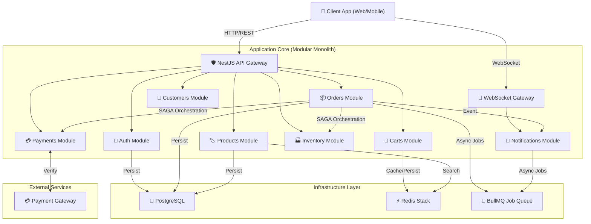

# 🛒 E-commerce Store API

<p align="center"> <a href="https://github.com/raouf-b-dev/ecommerce-store-api/actions"></a> <a href="https://www.typescriptlang.org/"></a> <a href="https://nestjs.com/"></a> <a href="https://www.postgresql.org/"></a> <a href="https://redis.io/"></a> <a href="https://bullmq.io/"></a> <a href="https://jestjs.io/"></a> <a href="https://www.docker.com/"></a> <a href="LICENSE"></a> <a href="https://nodejs.org/"></a>  </p>

> An enterprise-grade NestJS API for an e-commerce store built with **Domain-Driven Design**, **Hexagonal Architecture**, and modern best practices.

## 📋 Table of Contents

- [🌟 Key Features](#-key-features)
- [🚀 Advanced Engineering Features](#-advanced-engineering-features)
- [🚀 Quick Start](#-quick-start)
- [🧪 Testing](#-testing)
- [🗄️ Database Management](#database-management)
- [🐳 Docker & Infrastructure](#-docker--infrastructure)
- [🏗️ Project Architecture](#project-architecture)
- [🔧 Environment Configuration](#-environment-configuration)
- [📜 Available Scripts](#-available-scripts)
- [🚦 API Endpoints](#-api-endpoints)
- [🔐 Security & Best Practices](#-security--best-practices)
- [🛠️ Troubleshooting](#troubleshooting)
- [📖 Documentation Index](#-documentation-index)
- [🚧 Roadmap](#-roadmap)
- [📊 Project Statistics](#-project-statistics)
- [👋 Contributing](CONTRIBUTING.md)
- [📄 License](#-license)
- [🤝 Acknowledgments](#-acknowledgments)
- [📞 Support](#-support)

---

## What Is This?

A modular monolith e-commerce API built with NestJS and TypeScript, following Domain-Driven Design (Tactical and Strategic) and Hexagonal Architecture. Designed as a reference implementation for enterprise backend patterns, this project focuses on the hard parts that most tutorials skip: distributed transactions, partial failure handling, and strict module isolation.

**Core patterns implemented:**

- **SAGA orchestration with compensation.** The checkout flow reserves stock, processes payment, and confirms the order. If any step fails, the system automatically compensates: releases stock, issues refunds, cancels the order.
- **Redis-backed idempotency.** A custom `@Idempotent()` decorator with distributed locking ensures critical operations execute exactly once, even under network retries.
- **ACL Gateway isolation.** 8 bounded contexts communicate through 7 Gateway ports. Zero cross-module executable imports. Each module defines its own interface for what it needs from other modules.
- **Structured test infrastructure.** Each module has its own test factories and typed mock repositories. Factories generate domain objects for specific scenarios (e.g. `OrderTestFactory.createCashOnDeliveryOrder()`), and mocks implement the real repository interface with helper methods for common setups. Comprehensive test suites covering domain logic, use cases, compensation flows, SAGA job handlers, and cache decorator behavior.

Built with: NestJS, TypeScript, PostgreSQL, Redis Stack (RedisJSON + RedisSearch), BullMQ, Docker.

## What You'll Learn From This Codebase

If you're studying enterprise backend architecture, this repo covers:

| Pattern                                                             | Where to Find It                                  |
| ------------------------------------------------------------------- | ------------------------------------------------- |
| Strategic DDD (Subdomains, Bounded Contexts, Context Mapping)       | [ARCHITECTURE.md](docs/ARCHITECTURE.md)           |
| Tactical DDD (Entities, Value Objects, Aggregates, Domain Services) | `src/modules/*/core/domain/`                      |
| Hexagonal Architecture (Ports & Adapters)                           | [DDD-HEXAGONAL.md](docs/DDD-HEXAGONAL.md)         |
| SAGA Orchestration with Compensation                                | `src/modules/orders/primary-adapters/jobs/`       |
| Idempotency (Redis-backed)                                          | `src/infrastructure/idempotency/`                 |
| ACL Gateway Pattern                                                 | `src/modules/orders/secondary-adapters/gateways/` |
| Decorator-based Caching                                             | `src/modules/*/secondary-adapters/repositories/`  |
| Result Pattern (no exceptions)                                      | `src/shared-kernel/domain/`                       |
| BullMQ Nested Flows                                                 | `src/modules/notifications/`                      |
| Test Factories and Typed Mocks                                      | `src/modules/*/testing/`                          |

---

## 🌟 Key Features

### 🏗️ **Architecture & Design**

- **Domain-Driven Design (DDD)** with clear layer separation (Domain, Application, Infrastructure, Presentation)
- **Strategic DDD** with explicit Subdomains (Core, Generic, Supporting) and Bounded Contexts
- **Anti-Corruption Layer (ACL)** using Ports & Adapters to decouple modules
- **Clean Architecture** principles ensuring the core logic is independent of frameworks and external tools
- **Result Pattern** for consistent, type-safe error handling across the entire application
- **Hexagonal Architecture (Ports & Adapters)** for easy swapping of infrastructure components (e.g., switching between Postgres and Redis repositories)

### Architecture at a Glance


```mermaid
graph TD
    Client["📱 Client App (Web/Mobile)"] -->|HTTP/REST| API["🛡️ NestJS API Gateway"]
    Client -->|WebSocket| WS["🔌 WebSocket Gateway"]

    subgraph "Application Core (Modular Monolith)"
        API --> Auth["🔐 Auth Module"]
        API --> Orders["📦 Orders Module"]
        API --> Products["🏷️ Products Module"]
        API --> Carts["🛒 Carts Module"]
        API --> Payments["💳 Payments Module"]
        API --> Inventory["🏭 Inventory Module"]
        API --> Customers["👥 Customers Module"]

        WS --> Notifications["🔔 Notifications Module"]

        Orders -->|SAGA Orchestration| Inventory
        Orders -->|SAGA Orchestration| Payments
        Orders -->|Event| Notifications
    end

    subgraph "Infrastructure Layer"
        Auth -->|Persist| PG["🐘 PostgreSQL"]
        Orders -->|Persist| PG
        Products -->|Persist| PG

        Carts -->|Cache/Persist| Redis["⚡ Redis Stack"]
        Products -->|Search| Redis

        Orders -->|Async Jobs| BullMQ["🐂 BullMQ Job Queue"]
        Notifications -->|Async Jobs| BullMQ
    end

    subgraph "External Services"
        Payments <-->|Verify| Stripe["💳 Payment Gateway"]
    end
```

See the full [**System Architecture & Diagrams**](docs/ARCHITECTURE.md) for detailed Sequence and Class diagrams.

### 🛠️ **Technology Stack**

- **NestJS** - Enterprise-grade Node.js framework
- **PostgreSQL** with **TypeORM** - Relational data with automated migrations
- **Redis Stack** - Utilizing **RedisJSON** for document storage and **RedisSearch** for ultra-fast product indexing
- **BullMQ** - Robust message queue for handling asynchronous background jobs and distributed tasks
- **Docker Compose** - Fully containerized environment for consistent development and deployment

### 🧪 **Quality Assurance**

- **Comprehensive Unit Testing** with Jest
- **High Test Coverage** across all layers
- **GitHub Actions CI/CD** with automated testing
- **ESLint + Prettier** for code quality
- **Type-safe environment configuration**

### 📦 **Core Modules**

- **Order Processing** - Complex order lifecycle with SAGA orchestration and compensation logic
- **Product Catalog** - Advanced product management with RedisSearch indexing and filtering
- **Shopping Carts** - High-performance cart management with RedisJSON persistence
- **Inventory Management** - Real-time stock tracking and reservation system
- **Customer Profiles** - Management of user data, shipping addresses, and preferences
- **Payment Orchestration** - Strategy-based handling of Online and COD payment flows
- **Authentication** - Secure JWT-based identity and access management
- **Notifications** - Real-time WebSocket and background alert delivery system

---

## 🚀 Advanced Engineering Features

This project goes beyond a simple CRUD API by implementing complex distributed systems patterns:

### 🛡️ **Strict Idempotency**

- **Problem**: Network retries can lead to duplicate orders or payments.
- **Solution**: Implemented a custom `@Idempotent()` decorator and interceptor using Redis as a distributed lock and result cache. This ensures that critical operations (like checkout) are executed exactly once, even if the client retries the request.

### 🔄 **Event-Driven Compensation (SAGA Pattern)**

- **Problem**: In a distributed system, if one step of a multi-stage process (like checkout) fails, the system must revert previous successful steps.
- **Solution**: Implemented a `CheckoutFailureListener` that monitors BullMQ job failures. If a checkout fails after payment or stock reservation, it automatically triggers compensation logic:
  - Releasing stock reservations
  - Processing payment refunds
  - Cancelling the pending order

### ⚡ **Redis Stack Integration**

- **RedisJSON**: Stores complex product and cart data as JSON documents, reducing the need for expensive SQL joins for frequently accessed data.
- **RedisSearch**: Provides full-text search and advanced filtering on product data directly from Redis, significantly improving performance compared to traditional SQL `LIKE` queries.

### 💳 **Hybrid Payment Orchestration (COD + Online)**

- **Problem**: Real-world e-commerce systems need to handle both immediate payments (Credit Card) and deferred confirmations (Cash on Delivery) without duplicating business logic.
- **Solution**: Designed a unified **Strategy Pattern** for checkout flows.
  - **Online**: Full SAGA (Validate -> Reserve -> Pay -> Confirm).
  - **COD**: Async Pause (Validate -> Reserve -> **Stop & Wait** -> Manual Confirm).
  - Checks shared stock availability logic while respecting different lifecycle requirements.

---

---

## 🚀 Quick Start

### Prerequisites

Ensure you have the following installed:

- **Node.js** ≥ 22 (tested with v22.14.0)
- **npm** ≥ 11 (tested with v11.4.2)
- **Docker Desktop** ≥ 28 (tested with v28.3.2)
- **Docker Compose v2** (`docker compose` command)
- **Git** ≥ 2.49

### Installation

1.  **Clone the repository**

    ```bash
    git clone https://github.com/raouf-b-dev/ecommerce-store-api.git
    cd ecommerce-store-api

    ```

2.  **Install dependencies**

    ```bash
    npm install

    ```

3.  **Generate environment files**

    ```bash
    # Generate all environment files
    npm run env:init

    # Or generate specific environment
    npm run env:init:dev

    ```

4.  **Configure environment variables**

    Update the generated `.env.*` files with your secrets:
    - Database credentials
    - Redis configuration
    - JWT secrets
    - Other service configurations

5.  **Start infrastructure services**

    ```bash
    npm run d:up:dev

    ```

6.  **Run database migrations**

    ```bash
    npm run migration:run:dev

    ```

7.  **Start the development server**

    ```bash
    npm run start:dev

    ```

The API will be available at `http://localhost:3000` 🎉

📖 **API Documentation**: `http://localhost:3000/api` (Swagger UI)

---

## 🧪 Testing

Our testing strategy ensures high code quality and reliability:

```bash
# Run all tests
npm test

# Watch mode for development
npm run test:watch

# Generate coverage report
npm run test:cov

# Run E2E tests
npm run test:e2e

# CI mode (used in GitHub Actions)
npm run test:ci

```

### Test Coverage

- **Unit Tests**: Domain logic, services, and utilities
- **Integration Tests**: Database interactions and Redis caching
- **E2E Tests**: Complete API endpoint testing
- **Coverage Reporting**: Detailed coverage metrics with Jest

---

## Database Management

### Migrations with TypeORM

```bash
# Generate migration from entity changes
npm run migration:generate:dev -- CreateProductTable

# Create empty migration
npm run migration:create:dev -- AddProductIndex

# Run pending migrations
npm run migration:run:dev

# Revert last migration
npm run migration:revert:dev

# Show migration status
npm run migration:show:dev

```

### Multi-Environment Support

Replace `:dev` with `:prod`, `:staging`, or `:test` for different environments.

---

## 🐳 Docker & Infrastructure

### Docker Compose Commands

```bash
# Development environment
npm run d:up:dev      # Start services
npm run d:down:dev    # Stop services
npm run d:reset:dev   # Reset with fresh data

# Production environment
npm run d:up:prod
npm run d:down:prod
npm run d:reset:prod

# Other environments: staging, test
npm run d:up:staging
npm run d:up:test

```

### Services Included

- **PostgreSQL 16.3** - Primary database
- **Redis Stack 7.2** - Caching and search (includes RedisJSON & RedisSearch)
- **Custom networking** for service communication

---

## Project Architecture

### Clean Architecture Layers

```
src/
├── shared-kernel/           # True DDD Shared Kernel — pure domain building blocks
│   └── domain/              # Result pattern, base UseCase, Value Objects (Money, Quantity),
│                            # Error hierarchy, IdempotencyStore port
│
├── infrastructure/          # Global Secondary Adapters (driven side)
│   ├── database/            # TypeORM connection config
│   ├── redis/               # Redis Stack (RedisJSON, RediSearch, Cache)
│   ├── queue/               # BullMQ queue config, FlowProducer
│   ├── jobs/                # Base job handler, retry policies
│   ├── idempotency/         # Idempotency service (Redis-backed)
│   ├── interceptors/        # Idempotency interceptor
│   ├── decorators/          # @Idempotent() decorator
│   ├── mappers/             # Shared mapper utilities
│   ├── websocket/           # WebSocket gateway, Redis IO adapter
│   └── infrastructure.module.ts
│
├── interceptors/            # Global Result Interceptor (app-level primary adapter)
│
├── modules/                 # Feature Modules (Bounded Contexts)
│   ├── [module]/
│   │   ├── core/
│   │   │   ├── domain/      # Entities, Value Objects, Repository Interfaces
│   │   │   └── application/ # Use Cases & Application Services
│   │   ├── primary-adapters/
│   │   │   ├── dtos/        # Request/Response DTOs
│   │   │   ├── jobs/        # BullMQ job handlers
│   │   │   └── listeners/   # Event listeners
│   │   ├── secondary-adapters/
│   │   │   ├── repositories/  # PostgreSQL & Redis repository implementations
│   │   │   ├── persistence/   # ORM mappers
│   │   │   ├── gateways/      # External service implementations
│   │   │   └── schedulers/    # BullMQ scheduler implementations
│   │   ├── testing/         # Module-specific mocks & factories
│   │   └── [module].module.ts
│
├── config/                  # Global configuration & environment validation
├── testing/                 # Root-level testing utilities & E2E setup
└── main.ts                  # Application bootstrap
```

### Design Principles

- **Dependency Inversion**: High-level modules don't depend on low-level modules
- **Single Responsibility**: Each class has one reason to change
- **Open/Closed**: Open for extension, closed for modification
- **Interface Segregation**: Many client-specific interfaces

> For strict academic DDD and Hexagonal Architecture definitions, see [DDD-HEXAGONAL.md](docs/DDD-HEXAGONAL.md).

---

## 🔧 Environment Configuration

### Environment Files

- `.env.development` - Development settings
- `.env.staging` - Staging environment
- `.env.production` - Production configuration
- `.env.test` - Testing environment
- `.env.example` - Template with all required keys

### Key Configuration Areas

- **Database Connection** (PostgreSQL)
- **Redis Configuration** (connection, keyspace)
- **JWT Authentication** (secrets, expiration)
- **API Settings** (port, CORS, rate limiting)

---

## 📜 Available Scripts

### Development

- `start:dev` - Start in watch mode
- `start:debug` - Start with debugging
- `build` - Build for production
- `lint` - Run ESLint with auto-fix

### Testing

- `test` - Run unit tests
- `test:watch` - Run tests in watch mode
- `test:cov` - Generate coverage report
- `test:e2e` - Run end-to-end tests
- `test:ci` - Run tests in CI mode

### Database

- `migration:generate:*` - Generate new migration
- `migration:run:*` - Apply migrations
- `migration:revert:*` - Rollback migration

### Docker

- `d:up:*` - Start environment services
- `d:down:*` - Stop environment services
- `d:reset:*` - Reset environment with fresh data

### Utilities

- `env:init` - Generate all environment files
- `clean` - Remove build artifacts

---

## 🚦 API Endpoints

### Core Resources

| Module            | Method | Endpoint               | Description                             |
| :---------------- | :----- | :--------------------- | :-------------------------------------- |
| **Auth**          | `POST` | `/api/auth/register`   | Register a new user                     |
|                   | `POST` | `/api/auth/login`      | Authenticate and get JWT                |
| **Products**      | `GET`  | `/api/products`        | List products with filtering/pagination |
|                   | `GET`  | `/api/products/:id`    | Get detailed product information        |
| **Cart**          | `POST` | `/api/carts`           | Create or retrieve active cart          |
|                   | `POST` | `/api/carts/items`     | Add item to cart with stock check       |
| **Orders**        | `POST` | `/api/orders/checkout` | Process checkout (SAGA Pattern)         |
|                   | `GET`  | `/api/orders`          | List user order history                 |
| **Notifications** | `GET`  | `/api/notifications`   | Get real-time user notifications        |

### Documentation

The full API specification, including request/response schemas and authentication requirements, is available via Swagger UI:

👉 **`http://localhost:3000/api/docs`** (when running locally)

---

## 🔐 Security & Best Practices

### Security Features

- **JWT Authentication** with secure token handling
- **Input Validation** with class-validator decorators
- **SQL Injection Prevention** with TypeORM query builders
- **CORS Configuration** for cross-origin requests
- **Rate Limiting** (configurable per endpoint)

### Development Best Practices

- **TypeScript** for compile-time type checking
- **ESLint + Prettier** for consistent code style
- **Husky Git Hooks** for pre-commit validation
- **Environment-based Configuration** for different deployment stages
- **Comprehensive Error Handling** with custom exceptions

---

## Troubleshooting

### Common Issues

#### Docker Services Won't Start

```bash
# Check if ports are in use
lsof -i :5432  # PostgreSQL
lsof -i :6379  # Redis

# Reset Docker environment
npm run d:reset:dev

```

#### Migration Errors

```bash
# Ensure database is running
npm run d:up:dev

# Check connection with migration status
npm run migration:show:dev

# Reset database if needed (⚠️ DATA LOSS)
npm run d:reset:dev
npm run migration:run:dev

```

#### Test Failures

```bash
# Run tests in isolation
npm run test:ci

# Check for open handles
npm run test -- --detectOpenHandles

# Ensure test database is clean
npm run d:reset:test

```

### Environment Issues

- Verify all required environment variables are set
- Check `.env.example` for the complete list of required keys
- Ensure Docker services are healthy before running the application

---

## 📖 Documentation Index

| Document                                                    | Description                                                             |
| :---------------------------------------------------------- | :---------------------------------------------------------------------- |
| [**ARCHITECTURE.md**](docs/ARCHITECTURE.md)                 | System context (C4), domain flows, state machines, sequence diagrams    |
| [**DDD-HEXAGONAL.md**](docs/DDD-HEXAGONAL.md)               | Canonical DDD & Hexagonal Architecture rules, decision flowcharts       |
| [**INTEGRATION-PATTERNS.md**](docs/INTEGRATION-PATTERNS.md) | Cross-context communication: ACL Gateway, SAGA, Domain Events, Outbox   |
| [**ROADMAP.md**](docs/ROADMAP.md)                           | Production readiness checklist with prioritized tasks                   |
| [**SECRETS-MANAGEMENT.md**](docs/SECRETS-MANAGEMENT.md)     | Configuration taxonomy, injection patterns, and key rotation procedures |
| [**AGENT.md**](AGENT.md)                                    | Practical coding guidelines, conventions, and implementation patterns   |

---

## 🚧 Roadmap

This project is continuously evolving. We maintain a detailed, living roadmap tracking past accomplishments, deployment blockers, security hardening, and upcoming features.

👉 **View the full project roadmap:** [🛣️ ROADMAP.md](docs/ROADMAP.md)

---

## 📊 Project Statistics

- **Languages**: TypeScript 100%
- **Test Coverage**: High (run `npm run test:cov` for details)
- **Build Status**: Automated CI/CD with GitHub Actions
- **Dependencies**: Always up-to-date with security patches

---

## 📄 License

Released under the [MIT License](LICENSE). Feel free to use, modify, and distribute this code for personal or commercial projects.

---

## 🤝 Acknowledgments

- **NestJS Team** for the excellent framework
- **TypeORM** for robust database management
- **Redis** for high-performance caching
- **Jest** for comprehensive testing capabilities

---

## 📞 Support

For questions, issues, or contributions:

- **GitHub Issues**: [Report bugs or request features](https://github.com/raouf-b-dev/ecommerce-store-api/issues)
- **GitHub Repository**: [https://github.com/raouf-b-dev/ecommerce-store-api](https://github.com/raouf-b-dev/ecommerce-store-api)

---

**Built by [Abderaouf .B](https://github.com/raouf-b-dev)**
