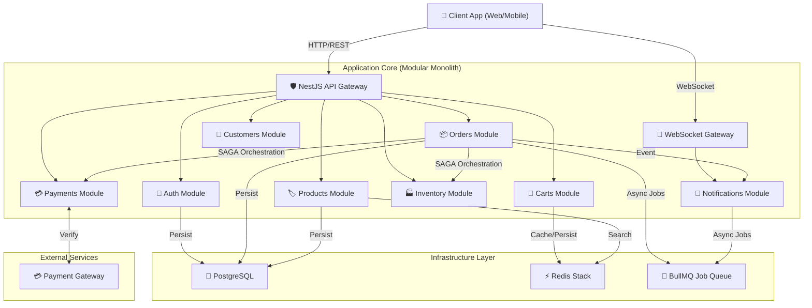

# 🛒 E-commerce Store API

<p align="center"> <a href="https://github.com/raouf-b-dev/ecommerce-store-api/actions"></a> <a href="https://www.typescriptlang.org/"></a> <a href="https://nestjs.com/"></a> <a href="https://www.postgresql.org/"></a> <a href="https://redis.io/"></a> <a href="https://bullmq.io/"></a> <a href="https://jestjs.io/"></a> <a href="https://www.docker.com/"></a> <a href="LICENSE"></a> <a href="https://nodejs.org/"></a>  </p>

> An enterprise-grade NestJS API for an e-commerce store built with **Domain-Driven Design**, **Hexagonal Architecture**, and modern best practices.

## 📋 Table of Contents

- [What Is This?](#what-is-this)
- [🚀 Quick Start](#quick-start)
- [Architecture at a Glance](#architecture-at-a-glance)
- [⭐ Feature Catalog](#feature-catalog)
- [📖 Documentation Index](#documentation-index)
- [🚧 Roadmap](#roadmap)
- [🧪 Testing](#testing)
- [🏗️ Project Structure](#project-structure)
- [📄 License](#license)

---

<a id="what-is-this"></a>

## What Is This?

A production-grade e-commerce API built as a **modular monolith** with NestJS and TypeScript. The codebase implements Domain-Driven Design (both Strategic and Tactical), Hexagonal Architecture, and the distributed systems patterns that most tutorials skip — SAGA orchestration with compensation, strict bounded context isolation via ACL Gateways, Redis-backed idempotency, structured observability, and a full RSA-based auth stack with refresh token rotation and RBAC.

Designed as a reference for how to build enterprise backend systems that are testable, maintainable, and production-ready from day one.

---

<a id="quick-start"></a>

## 🚀 Quick Start

### Prerequisites

- **Node.js** ≥ 22 · **npm** ≥ 11 · **Docker Desktop** ≥ 28 · **Git** ≥ 2.49

### Installation

```bash
# 1. Clone & install
git clone https://github.com/raouf-b-dev/ecommerce-store-api.git
cd ecommerce-store-api
npm install

# 2. Generate environment files
npm run env:init

# 3. Update .env.* files with your secrets (DB, Redis, JWT keys)

# 4. Start infrastructure & run migrations
npm run d:up:dev
npm run migration:run:dev

# 5. Start the API
npm run start:dev
```

The API will be available at `http://localhost:3000` 🎉

📡 **API Documentation** — full endpoint specs, schemas, and auth requirements via Swagger UI: **`http://localhost:3000/api`**

---

<a id="architecture-at-a-glance"></a>

## Architecture at a Glance


```mermaid
graph TD
    Client["📱 Client App (Web/Mobile)"] -->|HTTP/REST| API["🛡️ NestJS API Gateway"]
    Client -->|WebSocket| WS["🔌 WebSocket Gateway"]

    subgraph "Application Core (Modular Monolith)"
        API --> Auth["🔐 Auth Module"]
        API --> Orders["📦 Orders Module"]
        API --> Products["🏷️ Products Module"]
        API --> Carts["🛒 Carts Module"]
        API --> Payments["💳 Payments Module"]
        API --> Inventory["🏭 Inventory Module"]
        API --> Customers["👥 Customers Module"]

        WS --> Notifications["🔔 Notifications Module"]

        Orders -->|SAGA Orchestration| Inventory
        Orders -->|SAGA Orchestration| Payments
        Orders -->|Event| Notifications
    end

    subgraph "Infrastructure Layer"
        Auth -->|Persist| PG["🐘 PostgreSQL"]
        Orders -->|Persist| PG
        Products -->|Persist| PG

        Carts -->|Cache/Persist| Redis["⚡ Redis Stack"]
        Products -->|Search| Redis

        Orders -->|Async Jobs| BullMQ["🐂 BullMQ Job Queue"]
        Notifications -->|Async Jobs| BullMQ
    end

    subgraph "External Services"
        Payments <-->|Verify| Stripe["💳 Payment Gateway"]
    end
```

See the full [**System Architecture & Diagrams**](docs/ARCHITECTURE.md) for C4, sequence, and class diagrams.

---

<a id="feature-catalog"></a>

## ⭐ Feature Catalog

> Every feature links to detailed documentation in [`docs/FEATURES.md`](docs/FEATURES.md) and/or the relevant source code.

### 🏗️ Architecture

| Feature                | Description                                               | Location                                                |
| :--------------------- | :-------------------------------------------------------- | :------------------------------------------------------ |
| Strategic DDD          | Subdomains, Bounded Contexts, Context Mapping             | [ARCHITECTURE.md](docs/ARCHITECTURE.md)                 |
| Tactical DDD           | Entities, Value Objects, Aggregates, Domain Services      | `src/modules/*/core/domain/`                            |
| Hexagonal Architecture | Ports & Adapters — infrastructure-agnostic domain core    | [DDD-HEXAGONAL.md](docs/DDD-HEXAGONAL.md)               |
| ACL Gateway Pattern    | 7 gateway ports decoupling 8 bounded contexts             | [INTEGRATION-PATTERNS.md](docs/INTEGRATION-PATTERNS.md) |
| Modular Monolith       | 9 isolated modules, microservice-extraction ready         | `src/modules/`                                          |
| Result Pattern         | Functional `Result<T, E>` replacing exception-driven flow | `src/shared-kernel/domain/`                             |

### 🔄 Distributed Systems

| Feature                 | Description                                                   | Location                                    |
| :---------------------- | :------------------------------------------------------------ | :------------------------------------------ |
| SAGA Orchestration      | Multi-step checkout with automatic compensation on failure    | `src/modules/orders/primary-adapters/jobs/` |
| Idempotency             | Redis-backed `@Idempotent()` decorator — execute-exactly-once | `src/infrastructure/idempotency/`           |
| BullMQ Nested Flows     | Composed background job pipelines for notifications           | `src/modules/notifications/`                |
| Hybrid Payment Strategy | Unified COD + Online checkout via Strategy Pattern            | `src/modules/payments/`                     |

### ⚡ Data & Performance

| Feature               | Description                                                 | Location                                                  |
| :-------------------- | :---------------------------------------------------------- | :-------------------------------------------------------- |
| RedisJSON             | Cart storage as native JSON documents — no SQL joins        | `src/modules/carts/secondary-adapters/`                   |
| RedisSearch           | Full-text search and filtering from Redis                   | `src/modules/products/secondary-adapters/`                |
| Cache-Aside Decorator | Transparent `CachedRepository` wrapping Postgres with Redis | `src/modules/*/secondary-adapters/repositories/cached-*/` |

### 🔐 Security

| Feature                | Description                                                  | Location                                |
| :--------------------- | :----------------------------------------------------------- | :-------------------------------------- |
| RSA JWT (RS256 + JWKS) | Production-grade auth with public key distribution endpoint  | [JWT-RSA-JWKS.md](docs/JWT-RSA-JWKS.md) |
| Refresh Token Rotation | Session-based tokens with SHA-256 hashing + HttpOnly cookies | `src/modules/auth/`                     |
| Helmet Headers         | Standard security headers (HSTS, X-Frame-Options, etc.)      | `src/main.ts`                           |
| CORS Whitelist         | Environment-based origin restriction — no wildcards in prod  | `src/config/`                           |
| XSS Sanitization       | Global `sanitize-html` interceptor on all request bodies     | `src/interceptors/`                     |
| Pagination Safety      | `@Max(100)` on all query DTOs to prevent resource exhaustion | `src/modules/*/primary-adapters/dtos/`  |

### 📦 Infrastructure

| Feature            | Description                                                 | Location                                            |
| :----------------- | :---------------------------------------------------------- | :-------------------------------------------------- |
| Multi-Stage Docker | 4-stage build, Node.js 24 Alpine, tini PID 1, non-root user | `Dockerfile`                                        |
| Graceful Shutdown  | Signal handling, connection draining, worker cleanup        | [PROCESS-LIFECYCLE.md](docs/PROCESS-LIFECYCLE.md)   |
| Health Checks      | `GET /health` via @nestjs/terminus (Postgres + Redis)       | `src/modules/health/`                               |
| Multi-Env Config   | 4 profiles with type-safe validation + secrets separation   | [SECRETS-MANAGEMENT.md](docs/SECRETS-MANAGEMENT.md) |

### 🔭 Observability

| Feature            | Description                                                 | Location                      |
| :----------------- | :---------------------------------------------------------- | :---------------------------- |
| Structured Logging | Winston JSON logging for production log aggregators         | `src/infrastructure/logging/` |
| Correlation IDs    | `X-Request-Id` propagated through HTTP + all 18 BullMQ jobs | `src/infrastructure/logging/` |
| CI/CD Pipeline     | GitHub Actions: lint → build → test → publish               | `.github/workflows/`          |

### 🧪 Testing

| Feature                  | Description                                         | Location                 |
| :----------------------- | :-------------------------------------------------- | :----------------------- |
| Unit + Integration Suite | Domain logic, use cases, repositories, controllers  | `src/modules/*/`         |
| Test Factories           | Scenario-specific domain object builders per module | `src/modules/*/testing/` |
| Typed Mock Repos         | Interface-compliant mocks with test helper methods  | `src/modules/*/testing/` |

---

<a id="documentation-index"></a>

## 📖 Documentation Index

| Document                                                    | Description                                           |
| :---------------------------------------------------------- | :---------------------------------------------------- |
| [**FEATURES.md**](docs/FEATURES.md)                         | Detailed feature documentation with code locations    |
| [**ARCHITECTURE.md**](docs/ARCHITECTURE.md)                 | C4 system context, domain flows, sequence diagrams    |
| [**DDD-HEXAGONAL.md**](docs/DDD-HEXAGONAL.md)               | Canonical DDD & Hexagonal Architecture rules          |
| [**INTEGRATION-PATTERNS.md**](docs/INTEGRATION-PATTERNS.md) | ACL Gateway, SAGA, Domain Events, Outbox              |
| [**JWT-RSA-JWKS.md**](docs/JWT-RSA-JWKS.md)                 | RSA JWT implementation and JWKS endpoint details      |
| [**SECRETS-MANAGEMENT.md**](docs/SECRETS-MANAGEMENT.md)     | Configuration taxonomy and key rotation               |
| [**PROCESS-LIFECYCLE.md**](docs/PROCESS-LIFECYCLE.md)       | PIDs, signals, and graceful shutdown deep-dive        |
| [**ROADMAP.md**](docs/ROADMAP.md)                           | Production readiness checklist with prioritized tasks |
| [**TROUBLESHOOTING.md**](docs/TROUBLESHOOTING.md)           | Common issues and solutions                           |
| [**AGENT.md**](AGENT.md)                                    | Coding guidelines and conventions                     |

---

<a id="roadmap"></a>

## 🚧 Roadmap

This project is continuously evolving. See the full [**ROADMAP.md**](docs/ROADMAP.md) for completed phases, current work, and upcoming features.

---

<a id="testing"></a>

## 🧪 Testing

```bash
npm test              # Run all unit tests
npm run test:cov      # Generate coverage report
npm run test:e2e      # End-to-end tests
npm run test:ci       # CI mode (GitHub Actions)
```

---

<a id="project-structure"></a>

## 🏗️ Project Structure

```
src/
├── shared-kernel/           # Pure domain building blocks (Result, Value Objects, base UseCase)
├── infrastructure/          # Global secondary adapters (DB, Redis, BullMQ, JWT, logging, WebSocket)
├── interceptors/            # Global Result Interceptor
├── modules/                 # Feature Modules (Bounded Contexts)
│   └── [module]/
│       ├── core/domain/     # Entities, Value Objects, Repository Ports
│       ├── core/application/# Use Cases & Application Services
│       ├── primary-adapters/# DTOs, Controllers, Job Handlers, Listeners
│       ├── secondary-adapters/# Repositories, Gateways, Schedulers
│       └── testing/         # Module-specific mocks & factories
├── config/                  # Environment validation & configuration
└── main.ts                  # Application bootstrap
```

> For strict DDD and Hexagonal Architecture definitions, see [DDD-HEXAGONAL.md](docs/DDD-HEXAGONAL.md).

---

<a id="license"></a>

## 📄 License

Released under the [MIT License](LICENSE).

---

**Built by [Abderaouf .B](https://github.com/raouf-b-dev)** · [Issues](https://github.com/raouf-b-dev/ecommerce-store-api/issues) · [Repository](https://github.com/raouf-b-dev/ecommerce-store-api)
