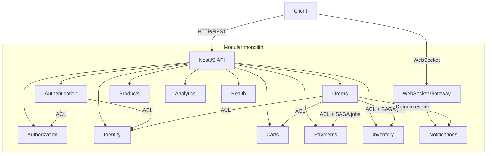

# E-commerce Store API

<p align="center">
  <a href="https://github.com/raouf-b-dev/ecommerce-store-api/actions"></a>
  <a href="https://www.typescriptlang.org/"></a>
  <a href="https://nestjs.com/"></a>
  <a href="https://www.postgresql.org/"></a>
  <a href="https://redis.io/"></a>
  <a href="https://bullmq.io/"></a>
  <a href="https://jestjs.io/"></a>
  <a href="https://www.docker.com/"></a>
  <a href="https://nodejs.org/"></a>
  <a href="LICENSE"></a>
</p>

> NestJS ecommerce API. Checkout, stock, and auth live here. Reference backend, not a hosted store.

## What this is

Eleven modules under `src/modules/` talk through ACL gateways and domain events, not by importing each other's internals. Checkout is a BullMQ SAGA with compensation. Inventory reservations take a row lock. Auth is RSA JWT plus RBAC. List/detail reads go through CQRS query adapters.

**Current limits**

| Topic | Status |
| :---- | :----- |
| Payments | Mock adapter. No live payment provider wired yet. |
| Deploy | Single-instance ops (migrations, health probes, backup/smoke). Not multi-instance yet. |
| Scope | Reference backend, not a hosted storefront. |
| Demo | No public staging. Run locally with Docker. |

Roadmap: [`docs/ROADMAP.md`](docs/ROADMAP.md).

## Where to look

| Topic | Code | Tests |
| :---- | :--- | :---- |
| Checkout SAGA | [`checkout.usecase.ts`](src/modules/orders/core/application/usecases/checkout/checkout.usecase.ts), [`checkout-failure.listener.ts`](src/modules/orders/primary-adapters/listeners/checkout-failure.listener.ts) | [`checkout-saga.e2e-spec.ts`](test/e2e/checkout/checkout-saga.e2e-spec.ts) |
| Inventory row lock | [`postgres.reservation-repository.ts`](src/modules/inventory/secondary-adapters/repositories/postgres-reservation-repository/postgres.reservation-repository.ts) | [`postgres.reservation-repository.integration.spec.ts`](src/modules/inventory/secondary-adapters/repositories/postgres-reservation-repository/postgres.reservation-repository.integration.spec.ts) |
| HTTP idempotency | [`idempotency.interceptor.ts`](src/infrastructure/interceptors/idempotency.interceptor.ts) | [`checkout-idempotency.e2e-spec.ts`](test/e2e/checkout/checkout-idempotency.e2e-spec.ts) |
| Module boundaries | [`hexagonal-architecture.spec.ts`](test/architecture/hexagonal-architecture.spec.ts) | same file |

## Quick start

Tested against Node.js 24, npm 11, and Docker Desktop 28.

### Bootstrap

```bash
git clone https://github.com/raouf-b-dev/ecommerce-store-api.git
cd ecommerce-store-api
npm install
npm run setup
npm run start:dev
```

`npm run setup` writes `.env.development`, starts Postgres and Redis, runs migrations, and seeds fixtures.

### Local endpoints

| Service       | URL                                                          |
| :------------ | :----------------------------------------------------------- |
| API           | `http://localhost:3000`                                      |
| Swagger       | `http://localhost:3000/api/docs`                             |
| Redis Insight | `http://localhost:8001`                                      |
| Accounts      | [`docs/development/SEEDING.md`](docs/development/SEEDING.md) |

If you remapped the API port, use the value in `.env.development`.

`npm run setup:down` stops containers and keeps data. `npm run setup:reset` wipes volumes and re-seeds.

### Step-by-step instead of `npm run setup`

```bash
npm run env:init
npm run d:up:dev
npm run migration:run:dev
npm run db:seed
npm run start:dev
```

Detail: [`docs/development/LOCAL-SETUP.md`](docs/development/LOCAL-SETUP.md).

### Optional monitoring stack

```bash
npm run d:up:obs:dev
```

Grafana is `http://localhost:<GRAFANA_HOST_PORT>`. Ports: [`docs/observability/MONITORING-STACK-GUIDE.md`](docs/observability/MONITORING-STACK-GUIDE.md).

## Architecture

Orders orchestrate checkout through ACL gateways and BullMQ. Auth reaches Identity and Authorization through ACL gateways. Analytics is read-only (no write aggregates).


```mermaid
graph TD
    Client["Client"] -->|HTTP/REST| API["NestJS API"]
    Client -->|WebSocket| WS["WebSocket Gateway"]

    subgraph Monolith["Modular monolith"]
        API --> Auth["Authentication"]
        API --> Authz["Authorization"]
        API --> Identity["Identity"]
        API --> Orders["Orders"]
        API --> Products["Products"]
        API --> Carts["Carts"]
        API --> Payments["Payments"]
        API --> Inventory["Inventory"]
        API --> Analytics["Analytics"]
        API --> Health["Health"]
        WS --> Notifications["Notifications"]
        Auth -->|ACL| Identity
        Auth -->|ACL| Authz
        Orders -->|ACL| Identity
        Orders -->|ACL| Carts
        Orders -->|"ACL + SAGA jobs"| Inventory
        Orders -->|"ACL + SAGA jobs"| Payments
        Orders -->|Domain events| Notifications
    end
```

C4, ACL maps, and SAGA sequences: [`docs/architecture/ARCHITECTURE.md`](docs/architecture/ARCHITECTURE.md).

```
src/
├── shared-kernel/      # Result, value objects, ports
├── infrastructure/     # DB, Redis, BullMQ, JWT, logging, WebSocket
├── modules/            # bounded contexts
│   └── [module]/
│       ├── core/domain/
│       ├── core/application/
│       ├── primary-adapters/
│       ├── secondary-adapters/
│       └── testing/
└── main.ts
```

## Verify

```bash
npm test                      # unit
npm run test:integration      # Postgres / Redis (Testcontainers)
npm run test:e2e              # HTTP: auth, checkout, IDOR, idempotency
npm run test:arch             # module boundary rules
npm run audit:openapi         # Swagger matches handlers
npm run test:redis:chaos      # Redis reconnect / degradation
npm run smoke-test            # live process: health, auth
```

| Layer        | What it proves                                                     |
| :----------- | :----------------------------------------------------------------- |
| Unit         | Domain rules and use cases in isolation                            |
| Integration  | Repositories and query adapters against real databases             |
| E2E          | Auth, checkout SAGA, HTTP contracts, idempotency replay            |
| Architecture | No illegal imports across modules                                  |
| OpenAPI      | Published spec matches handler DTOs                                |
| Smoke        | Liveness, readiness, and authenticated routes on a running process |

CI: [`.github/workflows/ci.yml`](.github/workflows/ci.yml).

## Docs

[`docs/README.md`](docs/README.md) · [`FEATURES.md`](docs/FEATURES.md) · [`ARCHITECTURE.md`](docs/architecture/ARCHITECTURE.md) · [`DDD-HEXAGONAL.md`](docs/architecture/DDD-HEXAGONAL.md) · [ADRs](docs/architecture/adr/README.md)

Related: [`ecommerce-admin-dashboard`](https://github.com/raouf-b-dev/ecommerce-admin-dashboard) (operator SPA). `ecommerce-store-web` (storefront) is not published yet.

## License

[MIT](LICENSE)

Built by [Abderaouf .B](https://github.com/raouf-b-dev) · [Issues](https://github.com/raouf-b-dev/ecommerce-store-api/issues)
