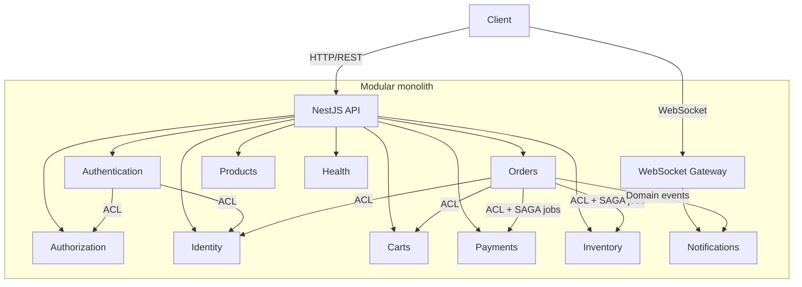

# E-commerce Store API

<p align="center">
  <a href="https://github.com/raouf-b-dev/ecommerce-store-api/actions"></a>
  <a href="https://www.typescriptlang.org/"></a>
  <a href="https://nestjs.com/"></a>
  <a href="https://www.postgresql.org/"></a>
  <a href="https://redis.io/"></a>
  <a href="https://bullmq.io/"></a>
  <a href="https://jestjs.io/"></a>
  <a href="https://www.docker.com/"></a>
  <a href="LICENSE"></a>
  <a href="https://nodejs.org/"></a>
</p>

> NestJS modular-monolith e-commerce API built with Domain-Driven Design and Hexagonal Architecture.

## Table of Contents

- [What this is](#what-this-is)
- [Quick start](#quick-start)
- [Verify](#verify)
- [Architecture](#architecture)
- [Documentation](#documentation)
- [Capabilities](#capabilities)
- [Project layout](#project-layout)
- [License](#license)

---

<a id="what-this-is"></a>

## What this is

A **modular monolith** e-commerce backend: ten bounded contexts under `src/modules/`, NestJS, TypeScript, PostgreSQL, Redis Stack, and BullMQ. Contexts communicate only through ACL gateways and domain events.

It is a **reference implementation** you can run, test, and read chapter by chapter in [`docs/`](docs/README.md). Checkout SAGA, CQRS reads, concurrency controls, auth/RBAC, and ops foundations are implemented with tests and linked runbooks.

**Current limits**

| Topic           | Status                                                                                                        |
| :-------------- | :------------------------------------------------------------------------------------------------------------ |
| Payment gateway | Mock adapter only. The port is ready for a real provider.                                                     |
| Deploy topology | Single-instance ops foundation (migrations, health probes, backup/smoke). Not multi-instance consistency yet. |
| Product scope   | Reference backend, not a hosted storefront or finished public ecommerce product.                              |
| Hosted demo     | No public staging environment. Run locally with Docker.                                                       |

What is done and what comes next: [`docs/ROADMAP.md`](docs/ROADMAP.md).

---

<a id="quick-start"></a>

## Quick start

### Prerequisites

- **Node.js** ≥ 24
- **npm** ≥ 11
- **Docker Desktop** ≥ 28
- **Git** ≥ 2.47

### Run locally

```bash
# 1. Clone and install
git clone https://github.com/raouf-b-dev/ecommerce-store-api.git
cd ecommerce-store-api
npm install

# 2. Generate environment files (JWT and metrics keys are auto-generated)
npm run env:init
# Verify DB_* and REDIS_* in .env.development match Compose defaults (see LOCAL-SETUP.md)

# 3. Start PostgreSQL + Redis and run migrations
npm run d:up:dev
npm run migration:run:dev

# 4. Start the API (first boot initializes roles/permissions), then seed
npm run start:dev
npm run db:seed
```

First-time setup detail: [`docs/development/LOCAL-SETUP.md`](docs/development/LOCAL-SETUP.md). Seeded accounts: [`docs/development/SEEDING.md`](docs/development/SEEDING.md).

| Endpoint        | URL                                                                  |
| :-------------- | :------------------------------------------------------------------- |
| API             | `http://localhost:<PORT>`                                            |
| Swagger         | `http://localhost:<PORT>/api`                                        |
| Seeded accounts | [`docs/development/SEEDING.md`](docs/development/SEEDING.md)         |
| Local env setup | [`docs/development/LOCAL-SETUP.md`](docs/development/LOCAL-SETUP.md) |

Canonical local default is `3000`, but use the value from `.env.development` if you remap it.

### Optional: monitoring stack

```bash
npm run d:up:obs:dev
```

Grafana is on **`http://localhost:<GRAFANA_HOST_PORT>`**. See [`docs/observability/MONITORING-STACK-GUIDE.md`](docs/observability/MONITORING-STACK-GUIDE.md) for the full port map and extraction criteria.

---

<a id="verify"></a>

## Verify

The CI pipeline runs the same layers locally. Use these commands to confirm behavior after changes:

```bash
npm test                      # Unit tests (domain, use cases, adapters)
npm run test:integration      # Real Postgres / Redis (Testcontainers)
npm run test:e2e              # Full-app HTTP flows (auth, checkout, IDOR, idempotency)
npm run test:arch             # Hexagonal and module boundary rules
npm run test:redis:chaos      # Redis reconnect and degradation behavior
npm run smoke-test            # Live-process probes (health, auth) when API is running
npm run test:cov              # Coverage report
```

| Layer        | What it proves                                                              |
| :----------- | :-------------------------------------------------------------------------- |
| Unit         | Domain rules, use cases, and adapter logic in isolation                     |
| Integration  | Write repositories, cache-aside, CQRS query adapters against real databases |
| E2E          | Auth lifecycle, checkout SAGA, HTTP contracts, idempotency replay           |
| Architecture | No illegal imports across bounded contexts                                  |
| Smoke        | Liveness, readiness, and authenticated endpoints on a running process       |

Pipeline detail: [`.github/workflows/ci.yml`](.github/workflows/ci.yml) and [`docs/infrastructure/cicd/PROJECT-PIPELINE.md`](docs/infrastructure/cicd/PROJECT-PIPELINE.md).

---

<a id="architecture"></a>

## Architecture

Ten bounded contexts live in one deployable unit. Orders orchestrate checkout through ACL gateways and BullMQ jobs. Authentication reaches Identity and Authorization through ACL gateways. Full C4, ACL maps, SAGA sequences, and infrastructure wiring live in [`docs/architecture/ARCHITECTURE.md`](docs/architecture/ARCHITECTURE.md).


```mermaid
graph TD
    Client["Client"] -->|HTTP/REST| API["NestJS API"]
    Client -->|WebSocket| WS["WebSocket Gateway"]

    subgraph Monolith["Modular monolith"]
        API --> Auth["Authentication"]
        API --> Authz["Authorization"]
        API --> Identity["Identity"]
        API --> Orders["Orders"]
        API --> Products["Products"]
        API --> Carts["Carts"]
        API --> Payments["Payments"]
        API --> Inventory["Inventory"]
        API --> Health["Health"]
        WS --> Notifications["Notifications"]
        Auth -->|ACL| Identity
        Auth -->|ACL| Authz
        Orders -->|ACL| Identity
        Orders -->|ACL| Carts
        Orders -->|"ACL + SAGA jobs"| Inventory
        Orders -->|"ACL + SAGA jobs"| Payments
        Orders -->|Domain events| Notifications
    end
```

### Where to look in the code

| Topic                  | Why it matters                              | Where                                                                                                              |
| :--------------------- | :------------------------------------------ | :----------------------------------------------------------------------------------------------------------------- |
| Checkout orchestration | Multi-step purchase flow                    | [`src/modules/orders/core/application/usecases/checkout/`](src/modules/orders/core/application/usecases/checkout/) |
| SAGA compensation      | Stock release, refund, cancel after failure | [`checkout-failure.listener.ts`](src/modules/orders/primary-adapters/listeners/checkout-failure.listener.ts)       |
| CQRS read adapters     | Flat list/detail reads without N+1          | `src/modules/*/secondary-adapters/query/`                                                                          |
| HTTP idempotency       | Retry-safe checkout command                 | [`src/infrastructure/idempotency/`](src/infrastructure/idempotency/)                                               |
| Auth and RBAC          | RSA JWT, refresh rotation, permissions      | [`authentication/`](src/modules/authentication/), [`authorization/`](src/modules/authorization/)                   |
| Hexagonal boundaries   | Domain isolated from infrastructure         | [`docs/architecture/DDD-HEXAGONAL.md`](docs/architecture/DDD-HEXAGONAL.md)                                         |

Shortest path through the tree: **auth/RBAC → checkout → compensation → CQRS query adapter → idempotency → tests**.

---

<a id="documentation"></a>

## Documentation

Start with the full index: [`docs/README.md`](docs/README.md). These chapters are the main entry points:

| Document                                                                       | Description                                |
| :----------------------------------------------------------------------------- | :----------------------------------------- |
| [`FEATURES.md`](docs/FEATURES.md)                                              | Implemented features with code locations   |
| [`ROADMAP.md`](docs/ROADMAP.md)                                                | Completed work and planned phases          |
| [`ARCHITECTURE.md`](docs/architecture/ARCHITECTURE.md)                         | System context, bounded contexts, diagrams |
| [`DDD-HEXAGONAL.md`](docs/architecture/DDD-HEXAGONAL.md)                       | Layer rules and module boundaries          |
| [`CQRS.md`](docs/architecture/CQRS.md)                                         | Read path design and query adapters        |
| [`INTEGRATION-PATTERNS.md`](docs/integration/INTEGRATION-PATTERNS.md)          | ACL gateways, SAGA, domain events          |
| [`OWASP-COMPLIANCE.md`](docs/security/OWASP-COMPLIANCE.md)                     | Security control mapping                   |
| [`JWT-RSA-JWKS.md`](docs/security/JWT-RSA-JWKS.md)                             | RSA JWT and JWKS                           |
| [`SECRET-ROTATION.md`](docs/security/SECRET-ROTATION.md)                       | Production secret rotation                 |
| [`RELEASE-BACKUP-RECOVERY.md`](docs/infrastructure/RELEASE-BACKUP-RECOVERY.md) | Backup, restore, smoke, rollback           |
| [`PROJECT-PIPELINE.md`](docs/infrastructure/cicd/PROJECT-PIPELINE.md)          | CI/CD workflow                             |
| [`MONITORING-STACK-GUIDE.md`](docs/observability/MONITORING-STACK-GUIDE.md)    | Grafana, Prometheus, Loki, Tempo           |
| [`architecture/adr/`](docs/architecture/adr/README.md)                         | Architecture decision records              |
| [`SEEDING.md`](docs/development/SEEDING.md)                                    | Local seed accounts and catalog            |
| [`LOCAL-SETUP.md`](docs/development/LOCAL-SETUP.md)                            | Environment files and first boot order     |
| [`TROUBLESHOOTING.md`](docs/infrastructure/TROUBLESHOOTING.md)                 | Common local issues                        |
| [`AGENT.md`](AGENT.md)                                                         | Contributor and agent conventions          |

---

<a id="capabilities"></a>

## Capabilities

Full catalog with locations: [`docs/FEATURES.md`](docs/FEATURES.md).

- **Modular monolith** with ten bounded contexts and ACL gateway isolation
- **Checkout SAGA** with BullMQ orchestration and compensation on failure
- **CQRS read path** with JOIN query adapters across core modules
- **Concurrency**: optimistic version locking (HTTP 409) and pessimistic inventory reservation
- **Auth and security**: RSA JWT (JWKS), refresh rotation, RBAC, user-scoped rate limiting, HTTP idempotency on checkout
- **Ops and quality**: Docker, health probes, backup/restore/smoke, structured observability, full CI fan-out (unit, integration, E2E, arch, restore drill)

---

<a id="project-layout"></a>

## Project layout

```
src/
├── shared-kernel/            # Result, value objects, policies, ports
├── infrastructure/           # DB, Redis, BullMQ, JWT, logging, WebSocket
├── interceptors/             # Global HTTP interceptors
├── modules/                  # Bounded contexts
│   └── [module]/
│       ├── core/domain/
│       ├── core/application/
│       ├── primary-adapters/
│       ├── secondary-adapters/
│       └── testing/
├── config/
└── main.ts
```

Layer rules: [`docs/architecture/DDD-HEXAGONAL.md`](docs/architecture/DDD-HEXAGONAL.md).

---

<a id="license"></a>

## License

Released under the [MIT License](LICENSE).

---

**Built by [Abderaouf .B](https://github.com/raouf-b-dev)** · [Issues](https://github.com/raouf-b-dev/ecommerce-store-api/issues) · [Repository](https://github.com/raouf-b-dev/ecommerce-store-api)
