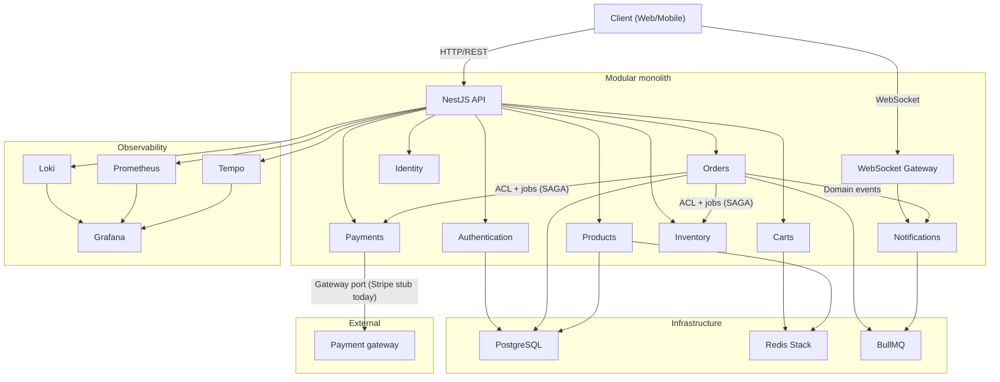

# 🛒 E-commerce Store API

<p align="center"> <a href="https://github.com/raouf-b-dev/ecommerce-store-api/actions"></a> <a href="https://www.typescriptlang.org/"></a> <a href="https://nestjs.com/"></a> <a href="https://www.postgresql.org/"></a> <a href="https://redis.io/"></a> <a href="https://bullmq.io/"></a> <a href="https://jestjs.io/"></a> <a href="https://www.docker.com/"></a> <a href="LICENSE"></a> <a href="https://nodejs.org/"></a> </p>

> A NestJS modular-monolith e-commerce API using **Domain-Driven Design** and **Hexagonal Architecture**.

## 📋 Table of Contents

- [What Is This?](#what-is-this)
- [How to Review This Project in 5 Minutes](#how-to-review-this-project-in-5-minutes)
- [🚀 Quick Start](#quick-start)
- [Architecture at a Glance](#architecture-at-a-glance)
- [⭐ Feature Catalog](#feature-catalog)
- [📖 Documentation](#documentation)
- [🧪 Testing](#testing)
- [🏗️ Project Structure](#project-structure)
- [📄 License](#license)

---

<a id="what-is-this"></a>

## What Is This?

A **modular monolith** for an e-commerce store: ten bounded contexts under `src/modules/`, talking only through ACL gateways and domain events. NestJS + TypeScript, PostgreSQL, Redis Stack, and BullMQ.

It is a **reference implementation** of backend patterns that tutorials often skip — checkout SAGA with compensation, Redis-backed HTTP idempotency, RSA JWT with refresh rotation and reuse detection, RBAC, and structured observability (logs, metrics, traces).

It is **not** a hosted storefront product and **not** a claim that the API is finished for public ecommerce. Current work and sequencing live in [`docs/ROADMAP.md`](docs/ROADMAP.md).

---

<a id="how-to-review-this-project-in-5-minutes"></a>

## How to Review This Project in 5 Minutes

| What to inspect                  | Why it matters                                        | Where to look                                                                   |
| :------------------------------- | :---------------------------------------------------- | :------------------------------------------------------------------------------ |
| Checkout orchestration           | Multi-step purchase flow                              | `src/modules/orders/core/application/usecases/checkout/`                        |
| SAGA compensation                | Stock release / refund / cancel after payment failure | `src/modules/orders/primary-adapters/listeners/checkout-failure.listener.ts`    |
| Auth, RBAC, and refresh sessions | JWT, rotation, reuse detection, permissions           | `src/modules/authentication/`, [JWT-RSA-JWKS.md](docs/security/JWT-RSA-JWKS.md) |
| HTTP idempotency                 | Retry-safe checkout command (not the whole SAGA)      | `src/infrastructure/idempotency/`                                               |
| Hexagonal boundaries             | Domain/application isolated from adapters             | [DDD-HEXAGONAL.md](docs/architecture/DDD-HEXAGONAL.md), `src/modules/*/core/`   |
| Observability                    | Logs, metrics, traces, dashboards                     | `src/infrastructure/metrics/`, `src/infrastructure/tracing/`, `docker/`         |
| Tests                            | Unit, integration, architecture rules, E2E            | `src/modules/*/*.spec.ts`, `src/modules/*/testing/`, `test/`                    |

Shortest path: **Auth/RBAC → checkout use case → SAGA compensation → idempotency → tests**.

---

<a id="quick-start"></a>

## 🚀 Quick Start

### Prerequisites

- **Node.js** ≥ 22 · **npm** ≥ 11 · **Docker Desktop** ≥ 28 · **Git** ≥ 2.49

### Installation

```bash
# 1. Clone & install
git clone https://github.com/raouf-b-dev/ecommerce-store-api.git
cd ecommerce-store-api
npm install

# 2. Generate environment files
npm run env:init

# 3. Fill .env.* with local secrets (DB, Redis, JWT keys)

# 4. Start PostgreSQL + Redis and run migrations
npm run d:up:dev
npm run migration:run:dev

# 5. Start the API, then seed local data (roles must exist from first boot)
npm run start:dev
npm run db:seed
```

- API: `http://localhost:3000`
- Swagger: `http://localhost:3000/api`
- Seeded accounts: [SEEDING.md](docs/development/SEEDING.md)

#### Optional: monitoring stack

```bash
npm run d:up:full:prod
```

Grafana is published on **`http://localhost:3001`** (not 3000 — that is the API).

---

<a id="architecture-at-a-glance"></a>

## Architecture at a Glance


```mermaid
graph TD
    Client["Client (Web/Mobile)"] -->|HTTP/REST| API["NestJS API"]
    Client -->|WebSocket| WS["WebSocket Gateway"]

    subgraph Monolith["Modular monolith"]
        API --> Auth["Authentication"]
        API --> Identity["Identity"]
        API --> Orders["Orders"]
        API --> Products["Products"]
        API --> Carts["Carts"]
        API --> Payments["Payments"]
        API --> Inventory["Inventory"]
        WS --> Notifications["Notifications"]
        Orders -->|"ACL + jobs (SAGA)"| Inventory
        Orders -->|"ACL + jobs (SAGA)"| Payments
        Orders -->|Domain events| Notifications
    end

    subgraph Infra["Infrastructure"]
        Auth --> PG["PostgreSQL"]
        Orders --> PG
        Products --> PG
        Carts --> Redis["Redis Stack"]
        Products --> Redis
        Orders --> BullMQ["BullMQ"]
        Notifications --> BullMQ
    end

    subgraph Observability["Observability"]
        API --> Loki["Loki"]
        API --> Prometheus["Prometheus"]
        API --> Tempo["Tempo"]
        Loki --> Grafana["Grafana"]
        Prometheus --> Grafana
        Tempo --> Grafana
    end

    subgraph External["External"]
        Payments -->|"Gateway port (Stripe stub today)"| Stripe["Payment gateway"]
    end
```

C4, sequence, and class diagrams: [**ARCHITECTURE.md**](docs/architecture/ARCHITECTURE.md).

---

<a id="feature-catalog"></a>

## ⭐ Feature Catalog

Canonical write-ups: [`docs/FEATURES.md`](docs/FEATURES.md).

### 🏗️ Architecture

| Feature                | Description                                              | Location                                                            |
| :--------------------- | :------------------------------------------------------- | :------------------------------------------------------------------ |
| Strategic DDD          | Subdomains, bounded contexts, context mapping            | [ARCHITECTURE.md](docs/architecture/ARCHITECTURE.md)                |
| Tactical DDD           | Entities, value objects, aggregates, domain services     | `src/modules/*/core/domain/`                                        |
| Hexagonal Architecture | Ports and adapters — infrastructure-agnostic domain core | [DDD-HEXAGONAL.md](docs/architecture/DDD-HEXAGONAL.md)              |
| ACL Gateway Pattern    | Gateway ports decoupling bounded contexts                | [INTEGRATION-PATTERNS.md](docs/integration/INTEGRATION-PATTERNS.md) |
| Modular Monolith       | Isolated modules under `src/modules/`                    | `src/modules/`                                                      |
| Result Pattern         | `Result<T, E>` instead of throwing from use cases        | `src/shared-kernel/domain/`                                         |

### 🔄 Workflows & jobs

| Feature             | Description                                                                | Location                                    |
| :------------------ | :------------------------------------------------------------------------- | :------------------------------------------ |
| SAGA orchestration  | Multi-step checkout with compensation on failure                           | `src/modules/orders/primary-adapters/jobs/` |
| HTTP idempotency    | Redis `SET NX` + `@Idempotent()` on checkout — retry-safe **HTTP command** | `src/infrastructure/idempotency/`           |
| BullMQ nested flows | Background job pipelines (e.g. notifications)                              | `src/modules/notifications/`                |
| Payment gateway     | Gateway port; Stripe adapter is a **stub** until real integration lands    | `src/modules/payments/`                     |

### ⚡ Data & performance

| Feature               | Description                                     | Location                                                  |
| :-------------------- | :---------------------------------------------- | :-------------------------------------------------------- |
| RedisJSON             | Cart storage as JSON documents                  | `src/modules/carts/secondary-adapters/`                   |
| RedisSearch           | Catalog search/filter from Redis                | `src/modules/products/secondary-adapters/`                |
| Cache-aside decorator | `CachedRepository` wrapping Postgres with Redis | `src/modules/*/secondary-adapters/repositories/cached-*/` |

### 🔐 Security

| Feature                | Description                                           | Location                                         |
| :--------------------- | :---------------------------------------------------- | :----------------------------------------------- |
| RSA JWT (RS256 + JWKS) | Access tokens with JWKS public-key distribution       | [JWT-RSA-JWKS.md](docs/security/JWT-RSA-JWKS.md) |
| Refresh token rotation | Session tokens, SHA-256 hashing, reuse detection      | `src/modules/authentication/`                    |
| RBAC                   | Database-backed roles and permissions                 | `src/modules/authorization/`                     |
| Rate limiting          | Redis-backed `@nestjs/throttler`                      | `src/infrastructure/throttler/`                  |
| Helmet / CORS / XSS    | Security headers, origin whitelist, body sanitization | `src/main.ts`, `src/interceptors/`               |
| Pagination caps        | `@Max(100)` on list query DTOs                        | `src/modules/*/primary-adapters/dtos/`           |

### 📦 Infrastructure

| Feature            | Description                                         | Location                                                         |
| :----------------- | :-------------------------------------------------- | :--------------------------------------------------------------- |
| Multi-stage Docker | Node 24 Alpine, tini, non-root                      | `Dockerfile`                                                     |
| Graceful shutdown  | Drain HTTP, close pools, stop workers               | [PROCESS-LIFECYCLE.md](docs/infrastructure/PROCESS-LIFECYCLE.md) |
| Health probes      | Liveness (process) and readiness (Postgres + Redis) | `src/modules/health/`                                            |
| API versioning     | URI versioning (`/v1/`)                             | `src/modules/*/`                                                 |
| Local seeding      | Admin/customer accounts and catalog                 | [SEEDING.md](docs/development/SEEDING.md)                        |
| Multi-env config   | Typed env validation and secrets separation         | [SECRETS-MANAGEMENT.md](docs/security/SECRETS-MANAGEMENT.md)     |

### 🔭 Observability

| Feature            | Description                                                   | Location                                                                  |
| :----------------- | :------------------------------------------------------------ | :------------------------------------------------------------------------ |
| Structured logging | Winston JSON → Loki via Promtail                              | `src/infrastructure/logging/`                                             |
| Correlation IDs    | `X-Request-Id` on HTTP and BullMQ jobs                        | `src/infrastructure/logging/`                                             |
| Prometheus metrics | RED + domain counters                                         | `src/infrastructure/metrics/`                                             |
| Tracing            | OpenTelemetry → Tempo (OTLP gRPC)                             | `src/infrastructure/tracing/`                                             |
| Grafana stack      | Pre-provisioned Loki / Prometheus / Tempo                     | [MONITORING-STACK-GUIDE.md](docs/observability/MONITORING-STACK-GUIDE.md) |
| CI                 | GitHub Actions: lint, typecheck, unit, arch, integration, E2E | `.github/workflows/`                                                      |

---

<a id="documentation"></a>

## 📖 Documentation

| Document                                                                      | Description                                   |
| :---------------------------------------------------------------------------- | :-------------------------------------------- |
| [**docs/README.md**](docs/README.md)                                          | Full documentation index                      |
| [**FEATURES.md**](docs/FEATURES.md)                                           | Feature catalog with code locations           |
| [**ROADMAP.md**](docs/ROADMAP.md)                                             | What is done, what is next, and in what order |
| [**ARCHITECTURE.md**](docs/architecture/ARCHITECTURE.md)                      | C4, domain flows, sequence diagrams           |
| [**DDD-HEXAGONAL.md**](docs/architecture/DDD-HEXAGONAL.md)                    | DDD and hexagonal rules                       |
| [**INTEGRATION-PATTERNS.md**](docs/integration/INTEGRATION-PATTERNS.md)       | ACL, SAGA, domain events                      |
| [**JWT-RSA-JWKS.md**](docs/security/JWT-RSA-JWKS.md)                          | RSA JWT and JWKS                              |
| [**SECRETS-MANAGEMENT.md**](docs/security/SECRETS-MANAGEMENT.md)              | Config taxonomy and secrets                   |
| [**SEEDING.md**](docs/development/SEEDING.md)                                 | Local seed accounts and catalog               |
| [**MONITORING-STACK-GUIDE.md**](docs/observability/MONITORING-STACK-GUIDE.md) | Grafana / Prometheus / Loki / Tempo           |
| [**PROCESS-LIFECYCLE.md**](docs/infrastructure/PROCESS-LIFECYCLE.md)          | Signals and graceful shutdown                 |
| [**TROUBLESHOOTING.md**](docs/infrastructure/TROUBLESHOOTING.md)              | Common local issues                           |
| [**AGENT.md**](AGENT.md)                                                      | Contributor / agent conventions               |

---

<a id="testing"></a>

## 🧪 Testing

```bash
npm test                 # Unit tests
npm run test:integration # Testcontainers / real DB
npm run test:e2e         # Full-app HTTP flows
npm run test:arch        # Hexagonal / module boundary rules
npm run test:cov         # Coverage
```

---

<a id="project-structure"></a>

## 🏗️ Project Structure

```
src/
├── shared-kernel/            # Result, value objects, policies, ports
├── infrastructure/           # DB, Redis, BullMQ, JWT, logging, WebSocket
├── interceptors/             # Global HTTP interceptors
├── modules/                  # Bounded contexts
│   └── [module]/
│       ├── core/domain/
│       ├── core/application/
│       ├── primary-adapters/
│       ├── secondary-adapters/
│       └── testing/
├── config/
└── main.ts
```

Layer rules: [DDD-HEXAGONAL.md](docs/architecture/DDD-HEXAGONAL.md).

---

<a id="license"></a>

## 📄 License

Released under the [MIT License](LICENSE).

---

**Built by [Abderaouf .B](https://github.com/raouf-b-dev)** · [Issues](https://github.com/raouf-b-dev/ecommerce-store-api/issues) · [Repository](https://github.com/raouf-b-dev/ecommerce-store-api)
