# 🛒 E-commerce MVP API

<p align="center"> <a href="https://github.com/raouf-b-dev/ecommerce-store-api/actions"></a> <a href="https://www.typescriptlang.org/"></a> <a href="https://nestjs.com/"></a> <a href="https://www.postgresql.org/"></a> <a href="https://redis.io/"></a> <a href="https://bullmq.io/"></a> <a href="https://jestjs.io/"></a> <a href="https://www.docker.com/"></a> <a href="LICENSE"></a> <a href="https://nodejs.org/"></a>  </p>

> An enterprise-level NestJS MVP API for an e-commerce store built with **Domain-Driven Design**, **Clean Architecture**, and modern best practices.

## 📋 Table of Contents

- [🌟 Key Features](#-key-features)
- [🚀 Advanced Engineering Features](#-advanced-engineering-features)
- [🎯 Recruiter's Guide](#-recruiters-guide)
- [🚀 Quick Start](#-quick-start)
- [🧪 Testing](#-testing)
- [🗄️ Database Management](#database-management)
- [🐳 Docker & Infrastructure](#-docker--infrastructure)
- [🏗️ Project Architecture](#project-architecture)
- [🔧 Environment Configuration](#-environment-configuration)
- [📜 Available Scripts](#-available-scripts)
- [🚦 API Endpoints](#-api-endpoints)
- [🔐 Security & Best Practices](#-security--best-practices)
- [🛠️ Troubleshooting](#troubleshooting)
- [� Roadmap](#-roadmap)
- [�📊 Project Statistics](#-project-statistics)
- [👋 Contributing](CONTRIBUTING.md)
- [🏗️ System Architecture](docs/ARCHITECTURE.md)
- [📄 License](#-license)
- [🤝 Acknowledgments](#-acknowledgments)
- [📞 Support](#-support)

---

## 🌟 Why This Project? (A Learning Journey)

> "The main goal when I started building this API was to learn new stuff that I did not know before... I reinforced my knowledge on DDD, I learned how to effectively create a scalable system, separate concerns, separate business logic from technical logic..."

I built this project not just as another e-commerce demo, but as a deep dive into **Enterprise Node.js Architecture**. My goal was to bridge the gap between "tutorial code" and "production systems" by implementing the hard parts that most courses skip:

- **Distributed Systems**: Handling eventual consistency with SAGA pattern & RabbitMQ/BullMQ.
- **Fail-Safe Mechanisms**: Designing compensation flows when things go wrong (e.g., payment succeeds but inventory fails).
- **Strict DDD**: Enforcing boundaries between Domain, Application, and Infrastructure layers.
- **Testing Culture**: Writing 50+ test suites because in the real world, tests are not optional.

I built this to prove (to myself and future employers) that I can handle complex, scalable backend systems. I hope it serves as a valuable reference for others on the same journey!

---

## 🌟 Key Features

### 🏗️ **Architecture & Design**

- **Domain-Driven Design (DDD)** with clear layer separation (Domain, Application, Infrastructure, Presentation)
- **Strategic DDD** with explicit Subdomains (Core, Generic, Supporting) and Bounded Contexts
- **Anti-Corruption Layer (ACL)** using Ports & Adapters to decouple modules
- **Clean Architecture** principles ensuring the core logic is independent of frameworks and external tools
- **Result Pattern** for consistent, type-safe error handling across the entire application
- **Hexagonal Architecture (Ports & Adapters)** for easy swapping of infrastructure components (e.g., switching between Postgres and Redis repositories)

### Architecture at a Glance

```mermaid
graph TD
    Client["📱 Client App (Web/Mobile)"] -->|HTTP/REST| API["🛡️ NestJS API Gateway"]
    Client -->|WebSocket| WS["🔌 WebSocket Gateway"]

    subgraph "Application Core (Modular Monolith)"
        API --> Auth["🔐 Auth Module"]
        API --> Orders["📦 Orders Module"]
        API --> Products["🏷️ Products Module"]
        API --> Carts["🛒 Carts Module"]
        API --> Payments["💳 Payments Module"]
        API --> Inventory["🏭 Inventory Module"]
        API --> Customers["👥 Customers Module"]

        WS --> Notifications["🔔 Notifications Module"]

        Orders -->|SAGA Orchestration| Inventory
        Orders -->|SAGA Orchestration| Payments
        Orders -->|Event| Notifications
    end

    subgraph "Infrastructure Layer"
        Auth -->|Persist| PG["🐘 PostgreSQL"]
        Orders -->|Persist| PG
        Products -->|Persist| PG

        Carts -->|Cache/Persist| Redis["⚡ Redis Stack"]
        Products -->|Search| Redis

        Orders -->|Async Jobs| BullMQ["🐂 BullMQ Job Queue"]
        Notifications -->|Async Jobs| BullMQ
    end

    subgraph "External Services"
        Payments <-->|Verify| Stripe["💳 Payment Gateway"]
    end
```



> **Key Strength**: Fully supports **[Hybrid Payment Orchestration](#-hybrid-payment-orchestration-cod--online)** (Online + Cash-on-Delivery), handling complex state transitions for both synchronous and asynchronous flows.

See the full [**System Architecture & Diagrams**](ARCHITECTURE.md) for detailed Sequence and Class diagrams.

### 🛠️ **Technology Stack**

- **NestJS** - Enterprise-grade Node.js framework
- **PostgreSQL** with **TypeORM** - Relational data with automated migrations
- **Redis Stack** - Utilizing **RedisJSON** for document storage and **RedisSearch** for ultra-fast product indexing
- **BullMQ** - Robust message queue for handling asynchronous background jobs and distributed tasks
- **Docker Compose** - Fully containerized environment for consistent development and deployment

### 🧪 **Quality Assurance**

- **Comprehensive Unit Testing** with Jest
- **High Test Coverage** across all layers
- **GitHub Actions CI/CD** with automated testing
- **ESLint + Prettier** for code quality
- **Type-safe environment configuration**

### 📦 **Core Modules**

- **Order Processing** - Complex order lifecycle with SAGA orchestration and compensation logic
- **Product Catalog** - Advanced product management with RedisSearch indexing and filtering
- **Shopping Carts** - High-performance cart management with RedisJSON persistence
- **Inventory Management** - Real-time stock tracking and reservation system
- **Customer Profiles** - Management of user data, shipping addresses, and preferences
- **Payment Orchestration** - Strategy-based handling of Online and COD payment flows
- **Authentication** - Secure JWT-based identity and access management
- **Notifications** - Real-time WebSocket and background alert delivery system

---

## 🚀 Advanced Engineering Features

This project goes beyond a simple CRUD API by implementing complex distributed systems patterns:

### 🛡️ **Strict Idempotency**

- **Problem**: Network retries can lead to duplicate orders or payments.
- **Solution**: Implemented a custom `@Idempotent()` decorator and interceptor using Redis as a distributed lock and result cache. This ensures that critical operations (like checkout) are executed exactly once, even if the client retries the request.

### 🔄 **Event-Driven Compensation (SAGA Pattern)**

- **Problem**: In a distributed system, if one step of a multi-stage process (like checkout) fails, the system must revert previous successful steps.
- **Solution**: Implemented a `CheckoutFailureListener` that monitors BullMQ job failures. If a checkout fails after payment or stock reservation, it automatically triggers compensation logic:
  - Releasing stock reservations
  - Processing payment refunds
  - Cancelling the pending order

### ⚡ **Redis Stack Integration**

- **RedisJSON**: Stores complex product and cart data as JSON documents, reducing the need for expensive SQL joins for frequently accessed data.
- **RedisSearch**: Provides full-text search and advanced filtering on product data directly from Redis, significantly improving performance compared to traditional SQL `LIKE` queries.

### 💳 **Hybrid Payment Orchestration (COD + Online)**

- **Problem**: Real-world e-commerce systems need to handle both immediate payments (Credit Card) and deferred confirmations (Cash on Delivery) without duplicating business logic.
- **Solution**: Designed a unified **Strategy Pattern** for checkout flows.
  - **Online**: Full SAGA (Validate -> Reserve -> Pay -> Confirm).
  - **COD**: Async Pause (Validate -> Reserve -> **Stop & Wait** -> Manual Confirm).
  - Checks shared stock availability logic while respecting different lifecycle requirements.

---

## 🎯 Recruiter's Guide

If you are a recruiter or hiring manager, here is why this project demonstrates senior-level engineering skills:

1.  **Architectural Depth**: Most "e-commerce" tutorials stop at simple controllers. This project implements full **DDD**, showing an understanding of how to manage complexity in large-scale systems.
2.  **Reliability Engineering**: The use of **Idempotency** and **Compensation Logic** shows a "production-first" mindset where data consistency and system reliability are prioritized.
3.  **Modern Infrastructure**: Proficiency with **Redis Stack**, **BullMQ**, and **Docker** demonstrates the ability to design and manage modern, scalable infrastructure.
4.  **Testing Excellence**: High test coverage (Unit, Integration, and E2E) proves a commitment to code quality and long-term maintainability.

---

## 🚀 Quick Start

### Prerequisites

Ensure you have the following installed:

- **Node.js** ≥ 22 (tested with v22.14.0)
- **npm** ≥ 11 (tested with v11.4.2)
- **Docker Desktop** ≥ 28 (tested with v28.3.2)
- **Docker Compose v2** (`docker compose` command)
- **Git** ≥ 2.49

### Installation

1.  **Clone the repository**

    ```bash
    git clone https://github.com/raouf-b-dev/ecommerce-store-api.git
    cd ecommerce-store-api

    ```

2.  **Install dependencies**

    ```bash
    npm install

    ```

3.  **Generate environment files**

    ```bash
    # Generate all environment files
    npm run env:init

    # Or generate specific environment
    npm run env:init:dev

    ```

4.  **Configure environment variables**

    Update the generated `.env.*` files with your secrets:
    - Database credentials
    - Redis configuration
    - JWT secrets
    - Other service configurations

5.  **Start infrastructure services**

    ```bash
    npm run d:up:dev

    ```

6.  **Run database migrations**

    ```bash
    npm run migration:run:dev

    ```

7.  **Start the development server**

    ```bash
    npm run start:dev

    ```

The API will be available at `http://localhost:3000` 🎉

📖 **API Documentation**: `http://localhost:3000/api` (Swagger UI)

---

## 🧪 Testing

Our testing strategy ensures high code quality and reliability:

```bash
# Run all tests
npm test

# Watch mode for development
npm run test:watch

# Generate coverage report
npm run test:cov

# Run E2E tests
npm run test:e2e

# CI mode (used in GitHub Actions)
npm run test:ci

```

### Test Coverage

- **Unit Tests**: Domain logic, services, and utilities
- **Integration Tests**: Database interactions and Redis caching
- **E2E Tests**: Complete API endpoint testing
- **Coverage Reporting**: Detailed coverage metrics with Jest

---

## Database Management

### Migrations with TypeORM

```bash
# Generate migration from entity changes
npm run migration:generate:dev -- CreateProductTable

# Create empty migration
npm run migration:create:dev -- AddProductIndex

# Run pending migrations
npm run migration:run:dev

# Revert last migration
npm run migration:revert:dev

# Show migration status
npm run migration:show:dev

```

### Multi-Environment Support

Replace `:dev` with `:prod`, `:staging`, or `:test` for different environments.

---

## 🐳 Docker & Infrastructure

### Docker Compose Commands

```bash
# Development environment
npm run d:up:dev      # Start services
npm run d:down:dev    # Stop services
npm run d:reset:dev   # Reset with fresh data

# Production environment
npm run d:up:prod
npm run d:down:prod
npm run d:reset:prod

# Other environments: staging, test
npm run d:up:staging
npm run d:up:test

```

### Services Included

- **PostgreSQL 16.3** - Primary database
- **Redis Stack 7.2** - Caching and search (includes RedisJSON & RedisSearch)
- **Custom networking** for service communication

---

## Project Architecture

### Clean Architecture Layers

```
src/
├── core/                    # Shared kernel & cross-cutting concerns
│   ├── domain/              # Base entities, value objects, & Result pattern
│   ├── application/         # Common application services & interfaces
│   └── infrastructure/      # Shared persistence, decorators, & interceptors
├── modules/                 # Feature-based modules (Bounded Contexts)
│   ├── [module]/            # e.g., orders, products, inventory
│   │   ├── domain/          # Entities, Value Objects, & Repository interfaces
│   │   ├── application/     # Use Cases & Application services
│   │   ├── infrastructure/  # Repository implementations & external clients
│   │   ├── presentation/    # Controllers, DTOs, Listeners, & Jobs
│   │   ├── testing/         # Module-specific factories, mocks, & builders
│   │   └── [module].module.ts
├── config/                  # Global configuration & environment validation
├── shared/                  # Generic utilities & helper functions
├── testing/                 # Root-level testing utilities & E2E setup
└── main.ts                  # Application bootstrap
```

### Design Principles

- **Dependency Inversion**: High-level modules don't depend on low-level modules
- **Single Responsibility**: Each class has one reason to change
- **Open/Closed**: Open for extension, closed for modification
- **Interface Segregation**: Many client-specific interfaces

---

## 🔧 Environment Configuration

### Environment Files

- `.env.development` - Development settings
- `.env.staging` - Staging environment
- `.env.production` - Production configuration
- `.env.test` - Testing environment
- `.env.example` - Template with all required keys

### Key Configuration Areas

- **Database Connection** (PostgreSQL)
- **Redis Configuration** (connection, keyspace)
- **JWT Authentication** (secrets, expiration)
- **API Settings** (port, CORS, rate limiting)

---

## 📜 Available Scripts

### Development

- `start:dev` - Start in watch mode
- `start:debug` - Start with debugging
- `build` - Build for production
- `lint` - Run ESLint with auto-fix

### Testing

- `test` - Run unit tests
- `test:watch` - Run tests in watch mode
- `test:cov` - Generate coverage report
- `test:e2e` - Run end-to-end tests
- `test:ci` - Run tests in CI mode

### Database

- `migration:generate:*` - Generate new migration
- `migration:run:*` - Apply migrations
- `migration:revert:*` - Rollback migration

### Docker

- `d:up:*` - Start environment services
- `d:down:*` - Stop environment services
- `d:reset:*` - Reset environment with fresh data

### Utilities

- `env:init` - Generate all environment files
- `clean` - Remove build artifacts

---

## 🚦 API Endpoints

### Core Resources

| Module            | Method | Endpoint               | Description                             |
| :---------------- | :----- | :--------------------- | :-------------------------------------- |
| **Auth**          | `POST` | `/api/auth/register`   | Register a new user                     |
|                   | `POST` | `/api/auth/login`      | Authenticate and get JWT                |
| **Products**      | `GET`  | `/api/products`        | List products with filtering/pagination |
|                   | `GET`  | `/api/products/:id`    | Get detailed product information        |
| **Cart**          | `POST` | `/api/carts`           | Create or retrieve active cart          |
|                   | `POST` | `/api/carts/items`     | Add item to cart with stock check       |
| **Orders**        | `POST` | `/api/orders/checkout` | Process checkout (SAGA Pattern)         |
|                   | `GET`  | `/api/orders`          | List user order history                 |
| **Notifications** | `GET`  | `/api/notifications`   | Get real-time user notifications        |

### Documentation

The full API specification, including request/response schemas and authentication requirements, is available via Swagger UI:

👉 **`http://localhost:3000/api/docs`** (when running locally)

---

## 🔐 Security & Best Practices

### Security Features

- **JWT Authentication** with secure token handling
- **Input Validation** with class-validator decorators
- **SQL Injection Prevention** with TypeORM query builders
- **CORS Configuration** for cross-origin requests
- **Rate Limiting** (configurable per endpoint)

### Development Best Practices

- **TypeScript** for compile-time type checking
- **ESLint + Prettier** for consistent code style
- **Husky Git Hooks** for pre-commit validation
- **Environment-based Configuration** for different deployment stages
- **Comprehensive Error Handling** with custom exceptions

---

## Troubleshooting

### Common Issues

#### Docker Services Won't Start

```bash
# Check if ports are in use
lsof -i :5432  # PostgreSQL
lsof -i :6379  # Redis

# Reset Docker environment
npm run d:reset:dev

```

#### Migration Errors

```bash
# Ensure database is running
npm run d:up:dev

# Check connection with migration status
npm run migration:show:dev

# Reset database if needed (⚠️ DATA LOSS)
npm run d:reset:dev
npm run migration:run:dev

```

#### Test Failures

```bash
# Run tests in isolation
npm run test:ci

# Check for open handles
npm run test -- --detectOpenHandles

# Ensure test database is clean
npm run d:reset:test

```

### Environment Issues

- Verify all required environment variables are set
- Check `.env.example` for the complete list of required keys
- Ensure Docker services are healthy before running the application

---

## 🚧 Roadmap

This project is continuously evolving. Here are the planned features and improvements:

### 🔹 Core Features

- [ ] **Real Payment Integration**: Support for Stripe, PayPal, and other gateways.
- [ ] **Advanced Analytics**: Reporting dashboard for sales, inventory, and customer behavior.
- [x] **Real-time Notifications**: WebSockets/SSE for order status updates and stock alerts.

### 🔹 Engineering & DevOps

- [ ] **E2E Testing Suite**: Comprehensive end-to-end tests using Supertest and Testcontainers.
- [ ] **Performance Benchmarking**: Detailed load testing and optimization reports.
- [ ] **API Versioning**: Implementing a robust versioning strategy for long-term support.

### 🔹 Ecosystem

- [ ] **Admin Dashboard**: A modern frontend for store management (Angular/React).
- [ ] **Customer Storefront**: A high-performance web application built with Angular.

---

## 📊 Project Statistics

- **Languages**: TypeScript 100%
- **Test Coverage**: High (run `npm run test:cov` for details)
- **Build Status**: Automated CI/CD with GitHub Actions
- **Dependencies**: Always up-to-date with security patches

---

## 📄 License

Released under the [MIT License](LICENSE). Feel free to use, modify, and distribute this code for personal or commercial projects.

---

## 🤝 Acknowledgments

- **NestJS Team** for the excellent framework
- **TypeORM** for robust database management
- **Redis** for high-performance caching
- **Jest** for comprehensive testing capabilities

---

## 📞 Support

For questions, issues, or contributions:

- **GitHub Issues**: [Report bugs or request features](https://github.com/raouf-b-dev/ecommerce-store-api/issues)
- **GitHub Repository**: [https://github.com/raouf-b-dev/ecommerce-store-api](https://github.com/raouf-b-dev/ecommerce-store-api)

---

**Built with ❤️ by [Abderaouf .B](https://github.com/raouf-b-dev)**

_Crafting enterprise-level APIs with clean architecture and modern best practices_
