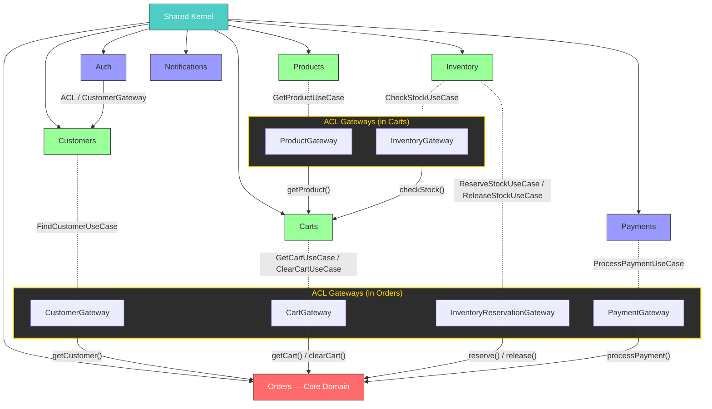

# DDD & Hexagonal Architecture — Strict Academic Reference

This document is the **canonical architectural reference** for the E-commerce Store API. It defines the strict academic rules of Domain-Driven Design (DDD) and Hexagonal Architecture (Ports & Adapters) as applied to this codebase. All contributors must read and follow this document.

> **Companion docs**: `ARCHITECTURE.md` (system context & domain flows), `CONTRIBUTING.md` (contribution guidelines)

---

## 1. Hexagonal Architecture (Ports & Adapters)

> _Source: Alistair Cockburn, 2005_

The Hexagonal Architecture organizes software as a **core application** surrounded by **ports** and **adapters**. The application does not know how it is driven or what external systems it talks to.

### 1.1 The Three Zones

```
┌──────────────────────────────────────────────────────────────┐
│                    PRIMARY ADAPTERS                          │
│           (Driving Side — "Who triggers us")                 │
│   Controllers · CLI · Cron · WebSocket Gateways · Consumers │
│                                                              │
│   ┌──────────────────────────────────────────────────────┐   │
│   │                APPLICATION CORE                      │   │
│   │                                                      │   │
│   │   ┌──────────────────────────────────────────────┐   │   │
│   │   │              DOMAIN LAYER                    │   │   │
│   │   │   Entities · Value Objects · Domain Services │   │   │
│   │   │   Repository Interfaces · Domain Events      │   │   │
│   │   └──────────────────────────────────────────────┘   │   │
│   │                                                      │   │
│   │              APPLICATION LAYER                       │   │
│   │   Use Cases · Application Services · Port Interfaces │   │
│   └──────────────────────────────────────────────────────┘   │
│                                                              │
│                   SECONDARY ADAPTERS                         │
│           (Driven Side — "What we talk to")                  │
│   DB Repos · API Clients · Cache · Queue · Logger Impl       │
└──────────────────────────────────────────────────────────────┘
```

### 1.2 Dependency Rule

> **Dependencies ALWAYS point inwards.**

| Layer                  | May depend on                        | Must NOT depend on                  |
| ---------------------- | ------------------------------------ | ----------------------------------- |
| **Domain**             | Nothing                              | Application, Adapters, Frameworks   |
| **Application**        | Domain only                          | Adapters, Frameworks                |
| **Primary Adapters**   | Application                          | Domain directly, Secondary Adapters |
| **Secondary Adapters** | Domain interfaces, Application ports | Primary Adapters                    |

### 1.3 Ports & Adapters Definitions

| Concept               | Academic Definition                                                                 | This Project's Convention                                                 |
| --------------------- | ----------------------------------------------------------------------------------- | ------------------------------------------------------------------------- |
| **Port**              | An interface defined by the application core that the outside world must conform to | Abstract classes in `domain/repositories/` and `application/ports/`       |
| **Primary Adapter**   | Code that **drives** the application (sends input)                                  | `primary-adapters/` folder — Controllers, DTOs, Job handlers, Guards      |
| **Secondary Adapter** | Code that the application **drives** (sends output)                                 | `secondary-adapters/` folder — Repository impls, API clients, Cache impls |
| **Driving Actor**     | External entity that triggers the application                                       | HTTP client, Cron scheduler, WebSocket client                             |
| **Driven Actor**      | External dependency the application uses                                            | PostgreSQL, Redis, Stripe/PayPal Gateway                                  |

### 1.4 How This Maps to Our Directory Structure

```
src/modules/[module]/
├── core/
│   ├── domain/                  ← THE INNERMOST RING
│   │   ├── models/              ← Entities, Aggregates
│   │   ├── value-objects/       ← Immutable value types
│   │   ├── repositories/        ← PORT: Storage abstractions
│   │   └── events/              ← Domain events
│   └── application/             ← ORCHESTRATION RING
│       ├── usecases/            ← Application-specific business rules
│       ├── services/            ← Cross-cutting application logic
│       └── ports/               ← PORT: External service abstractions
│
│
├── primary-adapters/            ← PRIMARY ADAPTERS (driving)
│   ├── dtos/                    ← Input/Output transformation
│   └── jobs/                    ← Background job handlers
│
└── secondary-adapters/          ← SECONDARY ADAPTERS (driven)
    ├── database/                ← TypeORM entities, ORM config
    ├── persistence/mappers/     ← Domain ↔ ORM entity translation
    ├── repositories/            ← Concrete repository implementations
    ├── gateways/                ← Concrete gateway implementations
    └── schedulers/              ← Concrete scheduler implementations
```

---

## 2. Domain-Driven Design (DDD)

> _Source: Eric Evans, "Domain-Driven Design: Tackling Complexity in the Heart of Software", 2003_

### 2.1 Strategic Design Patterns

| Pattern                   | Definition                                                                                             | This Project                                                                                                         |
| ------------------------- | ------------------------------------------------------------------------------------------------------ | -------------------------------------------------------------------------------------------------------------------- |
| **Bounded Context**       | A boundary within which a domain model is defined and applicable                                       | Each folder in `src/modules/` is a Bounded Context                                                                   |
| **Shared Kernel**         | A subset of the domain model shared between multiple contexts. Must be pure domain — no infrastructure | `src/shared-kernel/domain/` — contains only `Result`, `AppError`, `UseCase`, `Money`, `Quantity`, `IdempotencyStore` |
| **Context Map**           | Documents the relationships between Bounded Contexts                                                   | Orders imports from Customers (ACL via CustomerGateway), Carts (ACL via CartGateway)                                 |
| **Upstream/Downstream**   | One context provides, another consumes                                                                 | Orders (downstream) consumes Customers, Carts, Inventory, Payments (upstream)                                        |
| **Anti-Corruption Layer** | Translates between two contexts' models                                                                | Gateway adapters in `secondary-adapters/adapters/` (e.g., `CustomerGatewayAdapter`, `CartGatewayAdapter`)            |

### 2.2 Tactical Design Patterns

| Pattern                            | Definition                                          | Location in Codebase                                                                |
| ---------------------------------- | --------------------------------------------------- | ----------------------------------------------------------------------------------- |
| **Entity**                         | Has identity, mutable state, lifecycle              | `core/domain/models/`                                                               |
| **Value Object**                   | Defined by attributes, immutable, no identity       | `core/domain/value-objects/`                                                        |
| **Aggregate**                      | Cluster of entities with a single root entity       | Domain models that encapsulate child entities                                       |
| **Repository**                     | Abstracts storage operations for aggregates         | `core/domain/repositories/` (interface) → `secondary-adapters/repositories/` (impl) |
| **Domain Service**                 | Business logic that doesn't belong to one entity    | `core/domain/services/`                                                             |
| **Domain Event**                   | Records something significant that happened         | `core/domain/events/`                                                               |
| **Application Service / Use Case** | Orchestrates domain objects for a specific task     | `core/application/usecases/`                                                        |
| **Port**                           | Interface the core defines for external interaction | `core/application/ports/`                                                           |
| **Factory**                        | Encapsulates complex creation logic                 | `ErrorFactory` in shared-kernel                                                     |

### 2.3 Shared Kernel — Strict Rules

> A **Shared Kernel** is a contract between teams. Anything that goes into the Shared Kernel becomes a **dependency for all Bounded Contexts**, so it must be:

1. **Pure domain** — No framework imports, no infrastructure, no I/O
2. **Minimal** — Only include what genuinely has no single owner
3. **Stable** — Changing Shared Kernel breaks all consumers
4. **Versioned conceptually** — Any change must be treated as a breaking change

**What belongs in Shared Kernel:**

- Generic type primitives (`Result<T, E>`)
- Base error hierarchy (`AppError`, `ErrorFactory`)
- Abstract contracts (`UseCase<I, O, E>`, `ApplicationService<Req, Res>`)
- Truly universal value objects (`Money`, `Quantity`)

**What does NOT belong in Shared Kernel:**

- ❌ Feature-specific domain files (even if used by many modules)
- ❌ Infrastructure (databases, caches, loggers)
- ❌ Controllers, middleware, guards
- ❌ NestJS module files

### 2.4 Context Mapping Rules for This Project

#### ACL Gateway Pattern (Strict Boundary Enforcement)

When a module needs **cross-context operations** from another module, it must go through an **ACL Gateway**. The adapter injects upstream **application-layer exports** (Use Cases) — not Repositories. This preserves upstream domain invariants and enables microservice migration.



**Live example — Orders → Customers:**

```
 Port (abstract class)                    Adapter (concrete impl)
 ─────────────────────                    ──────────────────────
 orders/core/application/ports/           orders/secondary-adapters/gateways/
   customer.gateway.ts                      customer-gateway.adapter.ts
   └─ CustomerGateway                       └─ injects FindCustomerUseCase from Customers
   └─ defines CustomerCheckoutInfo          └─ translates Customer → CustomerCheckoutInfo
```

The port defines **downstream-specific DTOs** (e.g., `CustomerCheckoutInfo` instead of the full `Customer` entity). The adapter is the **only place** that imports from the upstream module.

**Why application-layer exports, not Repositories?**

- **Upstream invariants preserved**: validation (e.g., customer exists, is active) is enforced by the upstream use case, not duplicated in the downstream adapter
- **Domain encapsulation**: the adapter never constructs foreign entities with `new Customer(...)` or `new Cart(...)`
- **Minimal surface area**: Use Cases expose only what downstream needs, not the full repository contract
- **Microservice readiness**: when extracting to microservices, swap the local Use Case call with an HTTP/gRPC client — the gateway port contract stays identical

#### What IS and IS NOT allowed:

```typescript
// ✅ CORRECT: Use ACL Gateway port for cross-context data access
import { CustomerGateway } from '../ports/customer.gateway';
constructor(private customerGateway: CustomerGateway) {}

// ✅ CORRECT: Already-abstract port interfaces
import { NotificationScheduler } from 'src/modules/notifications/core/application/ports/notification.scheduler';

// ❌ WRONG: Direct repository import from another module
import { CustomerRepository } from 'src/modules/customers/core/domain/repositories/customer.repository';

// ❌ WRONG: Direct entity import from another module for data access
import { Customer } from 'src/modules/customers/core/domain/entities/customer';

// ❌ WRONG: Importing adapters from another module
import { RedisCustomerRepo } from 'src/modules/customers/secondary-adapters/repositories/redis.customer-repo';
```

**Rule**: Only the ACL adapter (in `secondary-adapters/gateways/`) may import upstream application-layer exports (Use Cases or Application Services). The application core sees only its own gateway port. For the full catalogue of integration patterns (ACL Gateway, Domain Events, Saga, Transactional Outbox), see [`INTEGRATION-PATTERNS.md`](INTEGRATION-PATTERNS.md).

#### Cross-Context Use Case Ownership

> **Derived guideline** _(Evans Ch. 14 & 15; Vernon Ch. 3)_: If a use case mutates aggregates from multiple contexts, it belongs in the Bounded Context that owns the **primary aggregate** being mutated — typically the Core Domain.

The `CheckoutUseCase` touches Orders, Carts, Inventory, Payments, and Customers. It belongs in **Orders** because:

1. The primary _consequential mutation_ is on `Order` — an Orders aggregate
2. If it lived in Carts or Payments, it would need gateways _back_ to Orders — creating **bidirectional dependencies** (a DDD anti-pattern)
3. The Core Domain orchestrates; Supporting and Generic Subdomains are _called_, never _call back_

---

## 3. Infrastructure vs Adapters Clarification

This is a common source of confusion. Here is the precise distinction:

| Term                      | Scope              | What It Contains                                                 | In This Project                                      |
| ------------------------- | ------------------ | ---------------------------------------------------------------- | ---------------------------------------------------- |
| **Primary Adapters**      | Driving side       | Controllers, Guards, Interceptors, Filters, CLI, Cron triggers   | `modules/[x]/primary-adapters/`, `src/interceptors/` |
| **Secondary Adapters**    | Driven side        | Repository impls, API clients, Cache impls, Queue producers      | `modules/[x]/secondary-adapters/`                    |
| **Global Infrastructure** | Shared driven-side | DB connections, Cache config, Redis setup, Logger, External APIs | `src/infrastructure/`                                |

**Key insight**: `src/infrastructure/` is the **global secondary adapter layer**. It is NOT a catch-all for everything. Primary adapters (filters, interceptors) live at the app level (`src/filters/`, `src/interceptors/`) because they are **presentation concerns**, not infrastructure.

---

## 4. Decision Checklist — "Where Does This File Go?"

Use this flowchart when adding new code:

```
Is it a pure type/interface with NO feature owner?
  └─ YES → shared-kernel/domain/

Does it drive the app (receives input from the outside)?
  └─ YES → Is it module-specific?
       └─ YES → modules/[module]/primary-adapters/
       └─ NO (global) → src/interceptors/

Does the app drive it (talks to external systems)?
  └─ YES → Is it module-specific?
       └─ YES → modules/[module]/secondary-adapters/
       └─ NO (global) → src/infrastructure/

Does it contain business rules?
  └─ YES → modules/[module]/core/domain/

Does it orchestrate domain objects?
  └─ YES → modules/[module]/core/application/

Does it have its own controller + use case?
  └─ YES → It's a Bounded Context → modules/[new-module]/
```

---

## 5. Naming Conventions Summary

| Concept          | Module-Level Name                    | Global-Level Name                   |
| ---------------- | ------------------------------------ | ----------------------------------- |
| Driving adapters | `primary-adapters/`                  | `src/filters/`, `src/interceptors/` |
| Driven adapters  | `secondary-adapters/`                | `src/infrastructure/`               |
| Business core    | `core/domain/` + `core/application/` | `shared-kernel/domain/`             |
| NestJS module    | `[module].module.ts`                 | `infrastructure.module.ts`          |

---

## References

- Evans, Eric. _Domain-Driven Design: Tackling Complexity in the Heart of Software_. Addison-Wesley, 2003.
- Cockburn, Alistair. _Hexagonal Architecture_. 2005. https://alistair.cockburn.us/hexagonal-architecture/
- Vernon, Vaughn. _Implementing Domain-Driven Design_. Addison-Wesley, 2013.
- Millett, Scott & Tune, Nick. _Patterns, Principles, and Practices of Domain-Driven Design_. Wrox, 2015.
