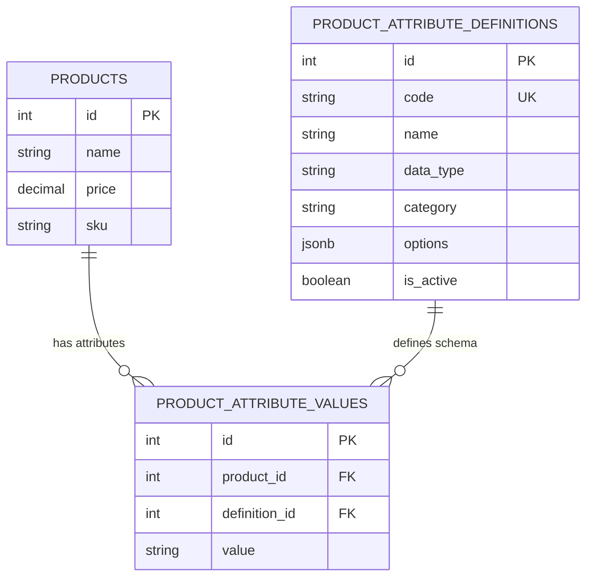

# 🧩 Entity-Attribute-Value (EAV) Pattern

This document describes the **Entity-Attribute-Value** pattern as a design reference for dynamic product attributes in the E-commerce Store API. It serves as both a design reference and an architectural decision record.

## 📋 Table of Contents

- [What is EAV?](#-what-is-eav)
- [Why EAV for E-commerce?](#-why-eav-for-e-commerce)
- [Industry Examples](#-industry-examples)
- [Our Implementation](#-our-implementation)
- [Database Design](#-database-design)
- [DDD Integration](#-ddd-integration)
- [API Design](#-api-design)
- [Seed Strategy](#-seed-strategy)
- [Performance Best Practices](#-performance-best-practices)
- [References](#-references)

---

## 🧠 What is EAV?

**Entity-Attribute-Value (EAV)** is a data modeling pattern where attributes (properties) of an entity are stored as rows in a separate table rather than columns on the entity's own table.

### Traditional (Column-Per-Attribute)

```sql
-- Fixed schema — every attribute is a column
CREATE TABLE products (
  id SERIAL PRIMARY KEY,
  name VARCHAR(200),
  price DECIMAL(12, 2),
  color VARCHAR(50),           -- ❌ Category-specific
  size VARCHAR(20),            -- ❌ Category-specific
  battery_capacity INT,        -- ❌ Category-specific (electronics only)
  fabric VARCHAR(50),          -- ❌ Category-specific (clothing only)
  calories INT,                -- ❌ Category-specific (food only)
  screen_size DECIMAL(5,1),    -- ❌ Category-specific (electronics only)
  -- ... 50+ more columns for different product categories
);
```

**Problems:**

- Schema is rigid — adding a new attribute requires a migration
- Category-specific columns pollute the generic entity
- Every product row has dozens of unused `NULL` columns
- ALTER TABLE on large tables causes downtime

### EAV (Row-Per-Attribute)

```sql
-- Flexible schema — attributes are rows
CREATE TABLE product_attribute_definitions (
  id SERIAL PRIMARY KEY,
  code VARCHAR(50) UNIQUE,
  name VARCHAR(100),
  data_type VARCHAR(20),  -- STRING | NUMBER | BOOLEAN
  category VARCHAR(50),
  options JSONB           -- ['RED', 'BLUE', 'GREEN']
);

CREATE TABLE product_attribute_values (
  id SERIAL PRIMARY KEY,
  product_id INT REFERENCES products(id),
  definition_id INT REFERENCES product_attribute_definitions(id),
  value VARCHAR(500),
  UNIQUE(product_id, definition_id)
);
```

**Benefits:**

- Zero-migration attribute creation — just INSERT a row
- Category-agnostic core entity
- Each product category defines exactly what it needs
- Clean separation between schema and data

---

## 💡 Why EAV for E-commerce?

E-commerce systems are inherently **multi-category**. A laptop, a t-shirt, and a bag of coffee all need "Product" records, but with vastly different attributes.

### The Product Attribute Problem

| Requirement                         | Column-Per-Attribute             | EAV ✅                           |
| :---------------------------------- | :------------------------------- | :------------------------------- |
| Add new attribute without migration | ❌ Requires ALTER TABLE          | ✅ INSERT row                    |
| Different attributes per category   | ❌ Shared schema for all         | ✅ Each category defines its own |
| Remove unused attributes            | ❌ Column stays forever          | ✅ DELETE row                    |
| Validate allowed values             | ❌ CHECK constraints or app code | ✅ `options` JSONB on definition |
| Group attributes by category        | ❌ Naming conventions            | ✅ `category` column             |
| Support boolean, string, number     | ❌ All columns typed separately  | ✅ `data_type` on definition     |
| Marketplace multi-vendor support    | ❌ Schema per vendor impossible  | ✅ Vendors define own attributes |

### When NOT to Use EAV

EAV is not a replacement for core domain fields. Fields that:

- Are queried in WHERE clauses frequently → **keep as columns** (`price`, `sku`, `name`)
- Participate in business logic or domain rules → **keep as entity properties**
- Are required on every record → **keep as columns** (`name`, `price`)
- Need referential integrity (FK) → **keep as columns** (`categoryId`)

**Rule of thumb:** If the field appears in a SQL JOIN, WHERE clause on every query, or a domain method, it's a first-class column. If it's metadata that varies by product category, it's an EAV attribute.

---

## 🌍 Industry Examples

### Magento / Adobe Commerce — EAV Pioneer

Magento is the **most famous production EAV implementation** in e-commerce:

- **EAV tables per entity type**: `catalog_product_entity_varchar`, `catalog_product_entity_int`, `catalog_product_entity_decimal`, `catalog_product_entity_text`
- **Attribute sets**: Groups of attributes assigned to product types (e.g., "Clothing" has size/color, "Electronics" has battery/RAM)
- **Admin UI**: Admins create custom attributes via dashboard — stored in `eav_attribute` table
- **Takeaway**: The world's most deployed open-source e-commerce platform runs on EAV. Our approach follows the same principle at a simpler scale — one `value` column instead of type-specific tables.

### Shopify — Metafields

Shopify exposes dynamic product attributes as "Metafields":

```json
// GET /admin/api/2024-01/products/{id}/metafields.json
{
  "metafield": {
    "namespace": "specifications",
    "key": "battery_capacity",
    "value": "5000",
    "type": "number_integer"
  }
}
```

- **Namespaces** = our `category` column
- **Types** = our `data_type` enum (string, number, boolean, plus richer types like `list.single_line_text_field`)
- **Takeaway**: Shopify's Metafields are exactly our "Attribute Definitions + Values"

### Salesforce — Custom Fields

Salesforce is the gold standard for entity customization:

- **Custom Objects & Fields**: Admins create custom fields via UI → stored in metadata tables
- **Field Types**: Text, Number, Checkbox, Picklist, Date, Lookup, Formula
- **Storage**: EAV-like `CustomFieldData` tables partitioned per org
- **Takeaway**: The world's #1 CRM runs on dynamic field definitions. The pattern applies equally to e-commerce products.

### WooCommerce — Post Meta

WordPress/WooCommerce uses `wp_postmeta` — one of the most deployed EAV systems on earth:

```sql
-- wp_postmeta — powers product attributes for 28% of online stores
SELECT meta_key, meta_value FROM wp_postmeta WHERE post_id = 42;
-- Returns: ('_price', '29.99'), ('_sku', 'SHIRT-001'), ('color', 'Blue'), ...
```

- Simple key-value store per product
- No typing, no validation, no categories — our approach adds all three

---

## 🏗️ Our Implementation

### Design Principles

1. **Definitions are reference data** — seedable, CRUD-managed entities
2. **Typed values** — `data_type` enforces STRING/NUMBER/BOOLEAN at the application layer
3. **Constrained values** — `options` JSONB restricts allowed values for enum-like attributes (e.g., colors, sizes)
4. **Categorized** — `category` field groups attributes for UI rendering and filtering (e.g., "Specifications", "Dimensions", "Materials")
5. **Marketplace-ready** — any vendor or admin can define category-specific attributes via API

### Architecture Alignment

The EAV system fits our Hexagonal Architecture:

```
┌─────────────────────────────────────────────────────┐
│  Primary Adapters (Controllers / DTOs)              │
│  POST /products/attributes/definitions              │
│  PUT  /products/:id/attributes/:defId               │
├─────────────────────────────────────────────────────┤
│  Application Layer (Use Cases)                      │
│  CreateAttributeDefinitionUseCase                   │
│  SetProductAttributeUseCase (validates type+options) │
├─────────────────────────────────────────────────────┤
│  Domain Layer                                       │
│  ProductAttributeDefinition (entity)                │
│  ProductAttributeValue (entity)                     │
│  AttributeDataType (value object / enum)            │
│  ProductAttributeDefinitionRepository (port)        │
├─────────────────────────────────────────────────────┤
│  Secondary Adapters (Postgres + TypeORM)             │
│  product_attribute_definitions table                │
│  product_attribute_values table                     │
└─────────────────────────────────────────────────────┘
```

---

## 🗄️ Database Design

### Tables

```sql
-- Defines WHAT attributes exist (seedable, CRUD)
CREATE TABLE product_attribute_definitions (
  id            SERIAL PRIMARY KEY,
  code          VARCHAR(50) UNIQUE NOT NULL,
  name          VARCHAR(100) NOT NULL,
  description   VARCHAR(255),
  data_type     VARCHAR(20) NOT NULL,        -- 'STRING' | 'NUMBER' | 'BOOLEAN'
  category      VARCHAR(50) NOT NULL,        -- 'SPECIFICATIONS', 'DIMENSIONS', etc.
  options       JSONB,                       -- ['RED','BLUE','GREEN'] or NULL
  is_active     BOOLEAN DEFAULT TRUE,
  created_at    TIMESTAMPTZ DEFAULT NOW(),
  updated_at    TIMESTAMPTZ DEFAULT NOW()
);

-- Stores actual values PER product
CREATE TABLE product_attribute_values (
  id            SERIAL PRIMARY KEY,
  product_id    INT NOT NULL REFERENCES products(id) ON DELETE CASCADE,
  definition_id INT NOT NULL REFERENCES product_attribute_definitions(id),
  value         VARCHAR(500) NOT NULL,
  created_at    TIMESTAMPTZ DEFAULT NOW(),
  updated_at    TIMESTAMPTZ DEFAULT NOW(),
  UNIQUE(product_id, definition_id)
);

-- Indexes for common query patterns
CREATE INDEX idx_pav_product ON product_attribute_values(product_id);
CREATE INDEX idx_pav_definition ON product_attribute_values(definition_id);
CREATE INDEX idx_pad_category ON product_attribute_definitions(category);
CREATE INDEX idx_pad_active ON product_attribute_definitions(is_active);
```

### Relationships



---

## 🧱 DDD Integration

### Where EAV Lives in Our Domain

- **`ProductAttributeDefinition`** is a domain **entity** (has identity, lifecycle, CRUD)
- **`ProductAttributeValue`** is a domain **entity** (has identity, belongs to Product)
- **`AttributeDataType`** is a **value object** (enum — STRING, NUMBER, BOOLEAN)
- **Definitions** are reference data — like product categories or order statuses
- **Values** are product-scoped data — like order line items

### Validation in Domain Layer

```typescript
// In SetProductAttributeUseCase — application-layer orchestration
// with domain-layer validation via the definition entity

// 1. Definition must exist and be active
const defResult = await this.definitionRepo.findById(input.definitionId);
if (defResult.isFailure) return defResult;
if (defResult.value === null) return ErrorFactory.UseCaseError(..., HttpStatus.NOT_FOUND);
if (!defResult.value.isActive) return ErrorFactory.UseCaseError('Attribute is deactivated', ...);

// 2. Validate value against data type (domain rule on the definition entity)
const validation = defResult.value.validateValue(input.value);
if (validation.isFailure) return validation;

// 3. Validate against allowed options (domain rule)
if (defResult.value.options && !defResult.value.options.includes(input.value)) {
  return ErrorFactory.UseCaseError(
    `Value '${input.value}' not in allowed options: ${defResult.value.options.join(', ')}`,
    ...
  );
}
```

### Aggregate Boundaries

- **ProductAttributeDefinition** — standalone aggregate (CRUD independently of products)
- **ProductAttributeValue** — belongs to the Product aggregate conceptually, but stored separately for flexibility. Accessed via `GET /products/:id/attributes`

---

## 🌐 API Design

### Attribute Definitions (Global — Admin/System)

```
POST   /products/attributes/definitions          Create a new attribute definition
GET    /products/attributes/definitions          List all (filter by ?category=SPECIFICATIONS&isActive=true)
GET    /products/attributes/definitions/:id      Get by ID
PATCH  /products/attributes/definitions/:id      Update definition
PATCH  /products/attributes/definitions/:id/deactivate   Soft-deactivate
```

### Attribute Values (Per-Product)

```
GET    /products/:productId/attributes                    Get all attributes for a product
PUT    /products/:productId/attributes/:definitionId      Set/update attribute value (upsert)
DELETE /products/:productId/attributes/:definitionId      Remove attribute from product
```

### Example Flow

```bash
# 1. Admin creates a custom attribute definition
POST /products/attributes/definitions
{
  "code": "BATTERY_CAPACITY",
  "name": "Battery Capacity (mAh)",
  "dataType": "NUMBER",
  "category": "SPECIFICATIONS"
}
# → 201: { "id": 42, "code": "BATTERY_CAPACITY", ... }

# 2. Set value on a specific product
PUT /products/5/attributes/42
{
  "value": "5000"
}
# → 200: { "productId": 5, "definitionId": 42, "value": "5000" }

# 3. Retrieve all attributes for a product
GET /products/5/attributes
# → 200: [
#   { "code": "BATTERY_CAPACITY", "name": "Battery Capacity (mAh)", "value": "5000", "category": "SPECIFICATIONS" },
#   { "code": "COLOR", "name": "Color", "value": "Midnight Black", "category": "APPEARANCE" }
# ]
```

---

## 🌱 Seed Strategy

### Category-Based Defaults

Different product categories ship with pre-defined attribute definitions as seed data:

```
Category          →   Attribute Code         →   Category Tag
Electronics       →   BATTERY_CAPACITY       →   SPECIFICATIONS
Electronics       →   RAM_SIZE               →   SPECIFICATIONS
Electronics       →   SCREEN_SIZE            →   SPECIFICATIONS
Electronics       →   STORAGE_CAPACITY       →   SPECIFICATIONS
Electronics       →   PROCESSOR              →   SPECIFICATIONS
Clothing          →   FABRIC                 →   MATERIALS
Clothing          →   SIZE                   →   DIMENSIONS
Clothing          →   FIT_TYPE               →   DIMENSIONS
Clothing          →   CARE_INSTRUCTIONS      →   DETAILS
General           →   COLOR                  →   APPEARANCE
General           →   WEIGHT                 →   DIMENSIONS
General           →   BRAND                  →   DETAILS
General           →   WARRANTY_MONTHS        →   DETAILS
Food & Beverage   →   CALORIES               →   NUTRITION
Food & Beverage   →   ALLERGENS              →   NUTRITION
Food & Beverage   →   EXPIRY_DAYS            →   DETAILS
```

### Seed Endpoint

```
POST /products/seed-attributes
```

- Idempotent — skips definitions that already exist (by code)
- Logs created/skipped counts

### Custom Deployments

A fashion marketplace would define its own attribute set:

```typescript
const FASHION_ATTRIBUTES = [
  {
    code: 'FABRIC',
    name: 'Fabric',
    dataType: 'STRING',
    category: 'MATERIALS',
    options: ['COTTON', 'POLYESTER', 'SILK', 'WOOL', 'LINEN', 'DENIM'],
  },
  {
    code: 'FIT_TYPE',
    name: 'Fit Type',
    dataType: 'STRING',
    category: 'DIMENSIONS',
    options: ['SLIM', 'REGULAR', 'RELAXED', 'OVERSIZED'],
  },
  {
    code: 'SUSTAINABLE',
    name: 'Sustainably Sourced',
    dataType: 'BOOLEAN',
    category: 'COMPLIANCE',
  },
];
```

An electronics store would seed:

```typescript
const ELECTRONICS_ATTRIBUTES = [
  {
    code: 'BATTERY_CAPACITY',
    name: 'Battery Capacity (mAh)',
    dataType: 'NUMBER',
    category: 'SPECIFICATIONS',
  },
  {
    code: 'SCREEN_SIZE',
    name: 'Screen Size (inches)',
    dataType: 'NUMBER',
    category: 'SPECIFICATIONS',
  },
  {
    code: 'CONNECTIVITY',
    name: 'Connectivity',
    dataType: 'STRING',
    category: 'SPECIFICATIONS',
    options: ['WIFI', 'BLUETOOTH', 'USB-C', 'NFC', '5G'],
  },
];
```

---

## ⚡ Performance Best Practices

### 1. Index Strategy

```sql
-- Fast lookup by product (most common query)
CREATE INDEX idx_pav_product ON product_attribute_values(product_id);

-- Fast lookup by definition (admin analytics)
CREATE INDEX idx_pav_definition ON product_attribute_values(definition_id);

-- Composite index for upsert unique constraint
-- (automatically created by UNIQUE constraint)
```

### 2. Eager Loading

When retrieving product details with attributes, use a single query with JOIN:

```sql
SELECT p.*, pad.code, pad.name, pad.category, pav.value
FROM products p
LEFT JOIN product_attribute_values pav ON pav.product_id = p.id
LEFT JOIN product_attribute_definitions pad ON pad.id = pav.definition_id
WHERE p.id = $1 AND pad.is_active = true;
```

### 3. Caching Definitions

Attribute definitions change infrequently. Cache them:

- **Application-level**: Cache definitions in a Map on startup, invalidate on CRUD
- **Redis** (future): `HSET product:attr:defs <code> <json>` with TTL

### 4. Avoid N+1

Never fetch attributes one-by-one. Always batch:

```typescript
// ✅ Good — single query for all product attributes
const attrs = await this.valueRepo.findByProductId(productId);

// ❌ Bad — N queries for N attributes
for (const def of definitions) {
  await this.valueRepo.findByProductAndDefinition(productId, def.id);
}
```

### 5. Bulk Operations

For seeding or migration, use `saveMany()` to insert definitions and values in batches.

---

## 📚 References

### Design Pattern Sources

| Resource                                                                                         | Description                                                       |
| :----------------------------------------------------------------------------------------------- | :---------------------------------------------------------------- |
| [Martin Fowler — EAV](https://martinfowler.com/bliki/EntityAttributeValue.html)                  | Canonical description of the pattern, trade-offs, and when to use |
| [PostgreSQL JSONB Docs](https://www.postgresql.org/docs/current/datatype-json.html)              | JSONB operators for querying `options` column                     |
| [Shopify Metafields API](https://shopify.dev/docs/api/admin-rest/2024-01/resources/metafield)    | How Shopify implements dynamic product fields                     |
| [Magento EAV Model](https://developer.adobe.com/commerce/php/development/components/attributes/) | The most famous EAV implementation in e-commerce                  |

### Best Practice Articles

| Resource                                                                                                | Description                                                                                |
| :------------------------------------------------------------------------------------------------------ | :----------------------------------------------------------------------------------------- |
| [EAV — Magento's Approach](https://developer.adobe.com/commerce/php/development/components/attributes/) | How one of the largest EAV implementations works in production                             |
| [Custom Fields at Scale](https://www.figma.com/blog/how-figma-stores-custom-properties/)                | Figma's approach to flexible metadata storage                                              |
| [WordPress Post Meta](https://developer.wordpress.org/reference/functions/get_post_meta/)               | WordPress's `wp_postmeta` — one of the most deployed EAV systems on earth (42% of the web) |

### Decision Record

| Decision                                           | Rationale                                                                                         |
| :------------------------------------------------- | :------------------------------------------------------------------------------------------------ |
| EAV over JSONB column                              | Need CRUD on definitions, categorization, typed validation, seed system                           |
| `value` as VARCHAR(500)                            | Stores all types as strings; parsing to correct type happens in application layer via `data_type` |
| `options` as JSONB                                 | Flexible enum-like constraints without a separate options table                                   |
| Separate definitions table                         | Definitions are shared across all products; acts as a schema registry                             |
| `category` column                                  | Groups attributes for UI rendering (tabs/sections) and API filtering                              |
| Unique constraint on `(product_id, definition_id)` | One value per attribute per product — enforced at DB level                                        |
