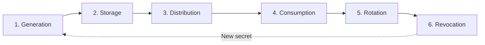
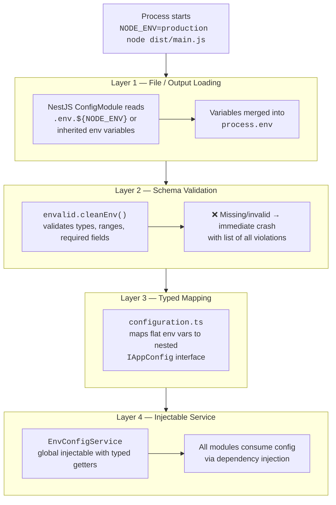
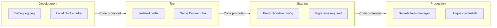
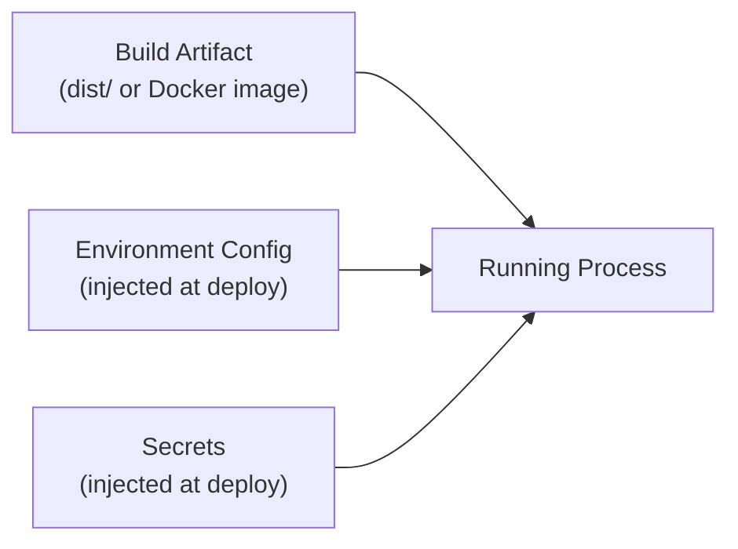
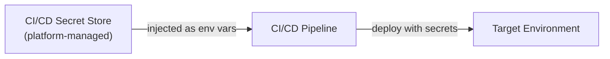

# 🔐 Secrets & Environment Management

> An engineering reference for environment configuration and secrets management in the E-Commerce Store API. Covers foundational principles, the secret lifecycle, deployment injection patterns, and the project's implementation.
>
> **Companion docs**: [`AGENT.md`](../AGENT.md) · [`ARCHITECTURE.md`](ARCHITECTURE.md) · [`ROADMAP.md`](ROADMAP.md)

---

## Table of Contents

1. [Foundational Principles](#1-foundational-principles)
2. [Configuration Taxonomy](#2-configuration-taxonomy)
3. [The Secret Lifecycle](#3-the-secret-lifecycle)
4. [Project File Layout & Git Boundaries](#4-project-file-layout--git-boundaries)
5. [Environment Variables Reference](#5-environment-variables-reference)
6. [Boot-Time Configuration Pipeline](#6-boot-time-configuration-pipeline)
7. [The `generate-envs` Toolchain](#7-the-generate-envs-toolchain)
8. [Environment Parity & Promotion](#8-environment-parity--promotion)
9. [Build vs Runtime — The Separation Principle](#9-build-vs-runtime--the-separation-principle)
10. [Secret Injection Patterns by Deployment Model](#10-secret-injection-patterns-by-deployment-model)
11. [Key Rotation Procedures](#11-key-rotation-procedures)
12. [Incident Response — Compromised Secrets](#12-incident-response--compromised-secrets)
13. [Defence in Depth](#13-defence-in-depth)
14. [Adding a New Environment Variable](#14-adding-a-new-environment-variable)
15. [Developer Quick Start](#15-developer-quick-start)
16. [Scaling Roadmap](#16-scaling-roadmap)
17. [Troubleshooting](#17-troubleshooting)

---

## 1. Foundational Principles

The secrets management strategy is built on five industry-standard principles. Every decision in this document traces back to one of them.

### 1.1 — Store config in the environment (12-Factor App, Factor III)

Configuration that varies between environments (credentials, hostnames, feature flags) must live **outside the codebase** — in environment variables, secret stores, or injected files. The application binary/image is identical across all environments; only the configuration changes.

> _"An app's config is everything that is likely to vary between deploys. [...] The twelve-factor app stores config in environment variables."_
> — [12factor.net/config](https://12factor.net/config)
>
> See also: [OWASP Secrets Management Cheat Sheet](https://cheatsheetseries.owasp.org/cheatsheets/Secrets_Management_Cheat_Sheet.html)

### 1.2 — Strict separation of build, release, run (12-Factor App, Factor V)

The **build stage** produces an executable artifact (e.g., `dist/`, Docker image). The **release stage** combines the build artifact with environment-specific configuration. The **run stage** executes the release. Secrets are injected at the release stage — they are never baked into the build artifact.

```
Build ──→ Immutable Artifact ──→ Release (artifact + config) ──→ Run
                                       ↑
                                 Secrets injected here
```

### 1.3 — Principle of Least Privilege

Each environment, service, and team member should have access only to the secrets they need. A developer's local database password should not grant access to production. CI/CD pipelines should have read-only access to secrets, not administrative access to the secret store.

### 1.4 — Defence in Depth

No single control prevents all breaches. Layer multiple independent safeguards:

| Layer          | Control                            | Failure Mode If Missing                      |
| :------------- | :--------------------------------- | :------------------------------------------- |
| **Prevention** | `.gitignore`, pre-commit hooks     | Secrets committed to git                     |
| **Detection**  | Secret scanning (GitHub, GitLeaks) | Leaked secrets go unnoticed                  |
| **Mitigation** | Rotation, short-lived tokens       | Leaked secrets remain valid indefinitely     |
| **Recovery**   | Incident response playbook         | Panic, ad-hoc responses, incomplete rotation |

### 1.5 — Fail-Fast Validation

Missing or malformed configuration should crash the application **immediately at startup** — not surface as a cryptic runtime error hours later under specific code paths. The API enforces this with `envalid` schema validation before any NestJS module loads.

---

## 2. Configuration Taxonomy

Not all environment variables carry equal risk. This project classifies every variable into one of three tiers, and each tier determines how the value is stored, transmitted, and rotated.

| Tier   | Classification                                                                       | Examples                                                | Storage                               | Rotation Frequency     | Leak Impact                                                          |
| :----- | :----------------------------------------------------------------------------------- | :------------------------------------------------------ | :------------------------------------ | :--------------------- | :------------------------------------------------------------------- |
| **T1** | **Secrets** — Credentials that grant access to systems or can impersonate identities | `JWT_SECRET`, `DB_PASSWORD`, `REDIS_PASSWORD`           | Secrets manager, injected at runtime  | 90 days or on incident | **Critical** — full system compromise, data breach, identity forgery |
| **T2** | **Sensitive Config** — Infrastructure details that reveal attack surface             | `DB_HOST`, `DB_PORT`, `REDIS_HOST`                      | `.env.<environment>`, CI/CD variables | Rarely (infra changes) | **Medium** — aids reconnaissance, enables targeted attacks           |
| **T3** | **Non-Sensitive Config** — Behavioural settings with no security impact              | `NODE_ENV`, `PORT`, `JWT_EXPIRES_IN`, `REDIS_KEYPREFIX` | `.env.<environment>`, can be in code  | Per environment        | **Low** — no direct security impact                                  |

> [!IMPORTANT]
> The tier determines the **minimum acceptable storage mechanism**. A T1 secret must never be stored in a lower-security tier's mechanism (e.g., hardcoded in code, committed to git).

---

## 3. The Secret Lifecycle

Every secret passes through six phases. Weaknesses in any phase compromise the entire chain.



### 3.1 — Generation

Secrets must be generated with cryptographically secure randomness:

```bash
# Passwords & Symmetric Keys (32 bytes, base64 encoded = 43 chars)
openssl rand -base64 32
```

> [!CAUTION]
> Never use human-created passwords (`dev1234`, `password123`, `admin`), dictionary words, or reuse secrets across environments. Each environment must have independently generated credentials.

### 3.2 — Storage (at Rest)

| Method                                                        | Security Level | When to Use                           |
| :------------------------------------------------------------ | :------------- | :------------------------------------ |
| Plain text file on disk (`.env.*`)                            | 🔴 Low         | Local development only                |
| CI/CD platform secrets (GitHub Secrets, Bitbucket Variables)  | 🟡 Medium      | Small team, single pipeline           |
| Container orchestration secrets (K8s Secrets, Docker Secrets) | 🟡 Medium      | Containerised deployments             |
| External secrets manager (AWS SM, Vault, Azure KV)            | 🟢 High        | Production, compliance-sensitive      |
| Hardware Security Module (HSM) / KMS                          | 🟢 Highest     | Signing keys, regulatory requirements |

### 3.3 — Distribution (in Transit)

How do secrets move from storage to the running application?

| Pattern                          | Mechanism                                  | Secrets Visible In                   |
| :------------------------------- | :----------------------------------------- | :----------------------------------- |
| File mount                       | `.env` file copied to server, volume mount | Filesystem                           |
| Environment variable injection   | CI/CD injects into process env             | `process.env`, `/proc/<pid>/environ` |
| Secret volume mount (K8s/Docker) | Mounted as read-only tmpfs file            | In-memory filesystem                 |
| API fetch at boot                | App calls secrets manager before start     | Application memory only              |

### 3.4 — Consumption (at Runtime)

The E-Commerce API consumes secrets exactly once — at application boot — via the configuration pipeline (see [Section 6](#6-boot-time-configuration-pipeline)). After validation and mapping, the raw `process.env` values are accessed only through the typed `EnvConfigService`. Secrets are never:

- Logged (Structured logging must exclude secret fields)
- Returned in API responses (Global exception filters must strip internal details in production)
- Passed to third-party analytics or error tracking

### 3.5 — Rotation

See [Section 11](#11-key-rotation-procedures) for full procedures. The key principle: rotation must be **possible without downtime** and **practised regularly**, not only during incidents.

### 3.6 — Revocation

When a secret is compromised or a team member departs:

1. **Rotate immediately** — generate and deploy a new secret
2. **Invalidate sessions** — rotating `JWT_SECRET` automatically invalidates all access tokens
3. **Audit access logs** — determine if the compromised secret was exploited
4. **Update dependent systems** — any service that consumed the old secret must be updated

---

## 4. Project File Layout & Git Boundaries

```
ecommerce-store-api/
│
│  ── Git-Tracked (Committed) ──────────────────────────────────
├── .env.example                 # Template: all keys with dummy values
├── .secrets.example             # Template: high-sensitivity secret keys
├── .gitignore                   # Enforces the boundary below
├── scripts/
│   └── generate-envs.js         # Generates real env files from templates
└── src/config/
    ├── validate-env.ts          # Boot-time schema validation (envalid)
    ├── configuration.ts         # Maps env vars → typed IAppConfig interface
    └── env-config.service.ts    # Injectable typed config accessor
│
│  ── Git-Ignored (Never Committed) ────────────────────────────
├── .env.development             # Local dev config (auto-generated)
├── .env.test                    # Test config (auto-generated)
├── .env.staging                 # Staging config (empty values, manually filled)
├── .env.production              # Production config (empty values, manually filled)
└── .secrets                     # High-sensitivity secrets (local only)
```

### `.gitignore` Rules

```gitignore
# Ignore actual environment files
.env.*
!.env.example

# Ignore secrets file
.secrets
```

The single pattern `.env.*` catches all environment-specific files. The negation `!.env.example` explicitly re-includes the template. This approach is future-proof.

---

## 5. Environment Variables Reference

### Application

| Variable   | Type     | Required | Default       | Tier | Description                                             |
| :--------- | :------- | :------- | :------------ | :--- | :------------------------------------------------------ |
| `NODE_ENV` | `string` | ✅       | `development` | T3   | Choices: `development`, `production`, `test`, `staging` |
| `PORT`     | `number` | ✅       | `3000`        | T3   | Application serving port                                |

### PostgreSQL

| Variable      | Type     | Required | Default | Tier      | Description              |
| :------------ | :------- | :------- | :------ | :-------- | :----------------------- |
| `DB_HOST`     | `string` | ✅       | —       | T2        | Database server hostname |
| `DB_PORT`     | `number` | ✅       | `5432`  | T2        | Database port            |
| `DB_USERNAME` | `string` | ✅       | —       | T2        | Database role name       |
| `DB_PASSWORD` | `string` | ✅       | —       | **T1** 🔑 | Database role password   |
| `DB_DATABASE` | `string` | ✅       | —       | T3        | Database name            |

### Redis

| Variable          | Type     | Required | Default | Tier      | Description           |
| :---------------- | :------- | :------- | :------ | :-------- | :-------------------- |
| `REDIS_HOST`      | `string` | ✅       | —       | T2        | Redis server hostname |
| `REDIS_PORT`      | `number` | ❌       | `6379`  | T2        | Redis server port     |
| `REDIS_PASSWORD`  | `string` | ❌       | `""`    | **T1** 🔑 | Redis AUTH password   |
| `REDIS_KEYPREFIX` | `string` | ❌       | `""`    | T3        | Key namespace prefix  |
| `REDIS_DB`        | `number` | ❌       | `0`     | T3        | Redis database index  |

### Authentication (JWT)

| Variable         | Type     | Required | Default | Tier      | Description                              |
| :--------------- | :------- | :------- | :------ | :-------- | :--------------------------------------- |
| `JWT_SECRET`     | `string` | ✅       | —       | **T1** 🔑 | Symmetric secret for signing JWTs        |
| `JWT_EXPIRES_IN` | `string` | ✅       | —       | T3        | Access token lifetime (e.g. `1h`, `15m`) |

---

## 6. Boot-Time Configuration Pipeline

The application loads and validates configuration through four sequential layers. If any layer fails, the process exits immediately with a descriptive error.



### Layer 1 — File Loading

```typescript
// src/app.module.ts
const env = process.env.NODE_ENV || 'development';
const envFilePath = `.env.${env}`;
const loadEnvFile = existsSync(envFilePath) ? envFilePath : undefined;

ConfigModule.forRoot({
  isGlobal: true,
  envFilePath: loadEnvFile, // undefined → skips file loading (e.g., in Docker where env is injected)
  expandVariables: true,
  load: [configuration],
});
```

`NODE_ENV` determines which file is loaded. If the file does not exist (common in containerised deployments where env vars are injected directly), `envFilePath` resolves to `undefined` and `ConfigModule` gracefully skips file loading. On the host, `NODE_ENV` is typically set via `cross-env` in the npm script.

### Layer 2 — Schema Validation

```typescript
// src/config/validate-env.ts
export function validateEnv(env: NodeJS.ProcessEnv) {
  return cleanEnv(env, {
    DB_HOST: str(), // required — crashes if absent
    REDIS_HOST: str(), // required
    PORT: port({ default: 3000 }), // optional — falls back to default
    NODE_ENV: str({
      choices: ['development', 'production', 'test', 'staging'],
    }),
    // ...
  });
}
```

`envalid` provides: type coercion (string → number/bool), required vs optional with defaults, enumerated choices, and an aggregated error report listing **all** violations at once.

### Layer 3 — Typed Configuration Object

Flat environment variables are mapped to a nested, domain-organised `IAppConfig` interface in `configuration.ts`. This provides IDE autocompletion and compile-time type safety.

### Layer 4 — Injectable Config Service

`EnvConfigService` is exported from the `@Global()` `EnvConfigModule`, making it available across the entire application without per-module imports. All application code accesses configuration exclusively through this service — never through `process.env` directly.

> [!IMPORTANT]
> **Direct `process.env` access is prohibited** in business logic, domain entities, use cases, and adapters. The only acceptable locations are `main.ts` (bootstrap), the config layer itself, and files managing logger/exception details dynamically.

---

## 7. The `generate-envs` Toolchain

[`scripts/generate-envs.js`](../scripts/generate-envs.js) reads the tracked template (`.env.example`) and generates real environment files with intelligent per-environment defaults.

### Why a Generator?

| Problem                                              | Solution                                                                |
| :--------------------------------------------------- | :---------------------------------------------------------------------- |
| New developer forgets to create `.env.development`   | `npm run env:init` scaffolds all files                                  |
| `.env.example` adds a new key; existing devs miss it | Regenerate with `--force`; `envalid` crashes if key is missing          |
| Production `.env` created with dev defaults          | Generator **wipes** credentials for prod/staging, forcing manual config |
| Team has no canonical list of required variables     | `.env.example` is the single source of truth                            |

### Commands

| Command                       | Scope                         |
| :---------------------------- | :---------------------------- |
| `npm run env:init`            | All environments + `.secrets` |
| `npm run env:init:dev`        | `.env.development` only       |
| `npm run env:init:prod`       | `.env.production` only        |
| `npm run env:init:staging`    | `.env.staging` only           |
| `npm run env:init:test`       | `.env.test` only              |
| `npm run env:init -- --force` | Overwrite existing files      |

### Per-Environment Behaviour

| Environment   | Credential Values                                |
| :------------ | :----------------------------------------------- |
| `development` | Copied from `.env.example` (safe local defaults) |
| `test`        | Copied from `.env.example` (safe local defaults) |
| `production`  | **Emptied** — must be explicitly set             |
| `staging`     | **Emptied** — must be explicitly set             |

---

## 8. Environment Parity & Promotion

### The Four Environments



### The Promotion Rule

> **Code moves forward; configuration is injected at each stage.**
> The exact same build artifact (Docker image, compiled `dist/`) is deployed to staging and production. The only difference is the configuration injected at runtime.

### Critical Invariants

| Rule                                                      | Rationale                                                          |
| :-------------------------------------------------------- | :----------------------------------------------------------------- |
| Each environment uses unique database credentials         | Prevents accidental cross-environment data access                  |
| Each environment uses a unique `REDIS_KEYPREFIX`          | Prevents cache collisions when environments share a Redis instance |
| Production secrets must never exist on developer machines | Limits blast radius of a compromised developer workstation         |

---

## 9. Build vs Runtime — The Separation Principle

This is the core architectural decision that determines how secrets reach production. The API follows the industry-standard pattern: **build once, deploy many**.

### What the Build Produces

The build stage (`nest build` or `docker build`) produces an **immutable, environment-agnostic artifact**:

```
dist/                      # Compiled JavaScript
├── main.js                # Entry point
├── config/
│   ├── configuration.js   # Config factory (reads process.env)
│   └── validate-env.js    # Validation schema
└── modules/               # Application logic
```

This artifact contains **zero secrets, zero environment-specific values**. It can be deployed to any environment without modification.

### What the Runtime Requires

At startup, the runtime receives configuration from its environment:



### Why Secrets Must Not Be Baked

| Practice                                | Problem                                                                                      |
| :-------------------------------------- | :------------------------------------------------------------------------------------------- |
| Secrets in source code                  | Every clone contains credentials; revocation requires rewriting git history                  |
| Secrets in the Docker image             | `docker inspect` or layer extraction reveals them; images cached in registries are permanent |
| Secrets in CI build logs                | `echo $SECRET` or verbose build output leaks to anyone with CI access                        |
| Secrets in `COPY .env* .` in Dockerfile | The file is embedded in an image layer, visible to `docker history`                          |

> [!CAUTION]
> A Docker image is **not** a secure secret store. Even "deleted" files persist in intermediate layers. Never `COPY` or `ADD` `.env` files into a Docker image. Always inject configuration at container start time.

### The Correct Pattern

```dockerfile
# ✅ Correct Dockerfile — no secrets
FROM node:24-alpine AS build
WORKDIR /app
COPY package*.json ./
RUN npm ci
COPY . .
RUN npm run build
RUN npm prune --production

FROM node:24-alpine AS runtime
WORKDIR /app
COPY --from=build /app/dist ./dist
COPY --from=build /app/node_modules ./node_modules
COPY --from=build /app/package.json ./

# No .env files copied — they are injected at runtime
EXPOSE 3000
CMD ["node", "dist/main.js"]
```

```bash
# Secrets injected at container start — never baked
docker run -d \
  --env-file .env.production \
  -e JWT_SECRET="your_production_secret" \
  ecommerce-store-api:latest
```

---

## 10. Secret Injection Patterns by Deployment Model

This section describes **how secrets physically reach the running process** at each deployment maturity level. Choose the pattern that matches your current infrastructure.

### Pattern A — Manual File Deployment (VPS / Bare Metal)

**Best for**: Solo developer, single server, early-stage product


**Workflow**:

```bash
# 1. Generate the production env template locally
npm run env:init:prod

# 2. Fill in production secrets manually
nano .env.production

# 3. Transfer to the production server
scp .env.production deploy@server:/opt/ecommerce-api/.env.production

# 4. On the server, start the application via Docker Compose
ssh deploy@server "cd /opt/ecommerce-api && docker compose -f docker-compose.yaml -f docker-compose.prod.yml --env-file .env.production up -d --build"
```

**Security controls**:

- File permissions: `chmod 600 .env.production` (owner read/write only)
- File ownership: `chown apiuser:apiuser .env.production` (application user only)
- Never store production env files on developer laptops permanently — transfer and delete

| ✅ Strengths                    | ❌ Weaknesses                                             |
| :------------------------------ | :-------------------------------------------------------- |
| Simple, no extra infrastructure | Secrets live as plaintext on disk                         |
| Works with any hosting          | No audit trail                                            |
| Easy to understand              | Manual rotation is error-prone                            |
|                                 | Single point of failure (server compromise = full access) |

---

### Pattern B — CI/CD Secret Injection

**Best for**: Team with automated deployments (GitHub Actions, GitLab CI, Bitbucket Pipelines)



**GitHub Actions Example**:

```yaml
# .github/workflows/deploy.yml
name: Deploy to Production
on:
  push:
    branches: [main]

jobs:
  deploy:
    runs-on: ubuntu-latest
    environment: production # ← GitHub Environment with protection rules
    steps:
      - uses: actions/checkout@v4

      - name: Build
        run: npm ci && npm run build

      - name: Deploy
        env:
          # These come from GitHub Settings → Secrets and Variables → Actions
          DB_PASSWORD: ${{ secrets.DB_PASSWORD }}
          REDIS_PASSWORD: ${{ secrets.REDIS_PASSWORD }}
          JWT_SECRET: ${{ secrets.JWT_SECRET }}
        run: |
          ssh deploy@${{ vars.DEPLOY_HOST }} "cat > /opt/ecommerce-api/.env.production << 'ENVEOF'
          NODE_ENV=production
          PORT=3000
          DB_HOST=${{ vars.DB_HOST }}
          DB_PORT=${{ vars.DB_PORT }}
          DB_USERNAME=${{ vars.DB_USERNAME }}
          DB_PASSWORD=${DB_PASSWORD}
          DB_DATABASE=${{ vars.DB_DATABASE }}
          REDIS_HOST=${{ vars.REDIS_HOST }}
          REDIS_PORT=${{ vars.REDIS_PORT }}
          REDIS_PASSWORD=${REDIS_PASSWORD}
          REDIS_KEYPREFIX=ecom:prod:
          JWT_SECRET=${JWT_SECRET}
          JWT_EXPIRES_IN=1h
          ENVEOF"

          ssh deploy@${{ vars.DEPLOY_HOST }} "cd /opt/ecommerce-api && docker compose -f docker-compose.yaml -f docker-compose.prod.yml --env-file .env.production up -d --build"
```

**Key principle**: Secrets are stored in the CI/CD platform's encrypted secret store. They are injected into the pipeline's environment at runtime and used to construct the production env file on the target server. The secret values **never appear in source code or build logs**.

| ✅ Strengths                           | ❌ Weaknesses                                                        |
| :------------------------------------- | :------------------------------------------------------------------- |
| Secrets never on developer machines    | Platform lock-in (secrets stored per platform)                       |
| Audit trail in CI/CD UI                | Requires robust pipeline integration                                 |
| Team access control via platform roles | Secrets at rest in platform storage (encrypted but platform-managed) |
| Automated, repeatable deployments      |                                                                      |

---

### Pattern C — Container Orchestration Secrets

**Best for**: Docker Swarm, Kubernetes, AWS ECS

#### Docker Compose with Environment Variables (Current Recommended Production Setup)

```yaml
# docker-compose.prod.yml
services:
  api:
    image: ecommerce-api:latest
    env_file:
      - .env.production # T2/T3 config
    environment:
      # T1 secrets override — can come from CI/CD or host env
      - DB_PASSWORD=${DB_PASSWORD}
      - REDIS_PASSWORD=${REDIS_PASSWORD}
      - JWT_SECRET=${JWT_SECRET}
    depends_on:
      - postgres
      - redis
```

#### Kubernetes Secrets

```yaml
# k8s/secrets.yaml — NEVER commit this file
apiVersion: v1
kind: Secret
metadata:
  name: ecom-api-secrets
  namespace: ecom
type: Opaque
stringData:
  DB_PASSWORD: 'generated-production-password'
  REDIS_PASSWORD: 'generated-redis-password'
  JWT_SECRET: 'super-long-randomly-generated-symmetric-key'
```

```yaml
# k8s/deployment.yaml
apiVersion: apps/v1
kind: Deployment
metadata:
  name: ecommerce-api
spec:
  template:
    spec:
      containers:
        - name: api
          image: ecommerce-api:latest
          envFrom:
            - configMapRef:
                name: ecom-api-config # T2/T3 variables
            - secretRef:
                name: ecom-api-secrets # T1 secrets
```

| ✅ Strengths                                         | ❌ Weaknesses                                                              |
| :--------------------------------------------------- | :------------------------------------------------------------------------- |
| Platform-native, encrypted at rest                   | K8s Secrets are base64, not encrypted by default (enable EncryptionConfig) |
| Declarative, version-controlled (manifests)          | Requires orchestration knowledge                                           |
| Secrets never touch the container filesystem (tmpfs) | Secret YAML files need their own access control                            |
| Automatic distribution to pods/containers            |                                                                            |

---

### Pattern D — External Secrets Manager (Production-Grade)

**Best for**: Multi-service architecture, regulatory compliance, enterprise deployments

When deploying to environments requiring maximum compliance, you should implement an external secrets manager like AWS Secrets Manager or HashiCorp Vault. In this setup, the API fetches its credentials directly from the secrets manager at boot using an SDK, storing nothing on disk or in the orchestrator environment.

| Provider      | Service             | Key Features                                                      |
| :------------ | :------------------ | :---------------------------------------------------------------- |
| **AWS**       | Secrets Manager     | Auto-rotation with Lambda, cross-account access, CloudTrail audit |
| **AWS**       | SSM Parameter Store | Free tier, hierarchical paths, cheaper for non-rotating secrets   |
| **Azure**     | Key Vault           | Managed HSM option, RBAC, certificate management                  |
| **GCP**       | Secret Manager      | IAM-based access, automatic replication, version management       |
| **HashiCorp** | Vault               | Self-hosted, dynamic secrets, lease-based access, multi-cloud     |

---

## 11. Key Rotation Procedures

### JWT Secret

The most critical secret — possession enables forging authentication tokens for any user.

```bash
# 1. Generate new 32-byte secret
openssl rand -base64 32

# 2. Update the target .env file or CI/CD secret store
# 3. Restart the API / redeploy via orchestrator
```

> [!WARNING]
> Since the project uses symmetric JWT signing (`HS256` or equivalent), rotating the `JWT_SECRET` **invalidates all existing access and refresh tokens**. All users are forced to re-authenticate. Plan production rotations during maintenance windows.

### PostgreSQL Password

```bash
# 1. Generate new password
openssl rand -base64 32

# 2. Update in PostgreSQL
psql -U postgres -c "ALTER USER ecom_user WITH PASSWORD 'new_password';"

# 3. Update .env / secrets manager
# 4. Restart the application container
```

### Redis Password

```bash
# 1. Generate new password
openssl rand -base64 32

# 2. Update in Redis (live, no restart needed)
redis-cli -a old_password CONFIG SET requirepass "new_password"

# 3. Update .env / secrets manager
# 4. Restart the application container
```

### Rotation Schedule

| Secret           | Frequency       | Trigger                                                          |
| :--------------- | :-------------- | :--------------------------------------------------------------- |
| `JWT_SECRET`     | 90 days         | Scheduled, or immediately on compromise                          |
| `DB_PASSWORD`    | 90 days         | Scheduled                                                        |
| `REDIS_PASSWORD` | 90 days         | Scheduled                                                        |
| **All secrets**  | **Immediately** | Team member departure, suspected breach, secret detected in logs |

---

## 12. Incident Response — Compromised Secrets

If a secret has been (or may have been) exposed:

### Immediate Actions (First 30 Minutes)

1. **Rotate the compromised secret** — this is the single most important step. Generate a new value, deploy it, restart affected services.
2. **Revoke active sessions** — if `JWT_SECRET` was compromised, rotate it; all tokens are automatically invalidated.
3. **Assess scope** — determine which systems used the compromised credential and whether unauthorised access occurred.

### Follow-Up Actions (Next 24 Hours)

4. **Audit access logs** — check database logs, Redis logs, and application logs for suspicious activity during the exposure window.
5. **Remove from git history** (if committed):
   ```bash
   # Recommended: git-filter-repo (faster, safer than BFG)
   pip install git-filter-repo
   git filter-repo --path .env.production --invert-paths
   git push --force --all
   ```
6. **Notify stakeholders** — team members, security officer, and (if required by regulation) affected users.
7. **Post-mortem** — document how the exposure happened and what preventive controls to add.

---

## 13. Defence in Depth

### Layer 1 — Prevention

| Control                                 | Implementation                                       |
| :-------------------------------------- | :--------------------------------------------------- |
| `.gitignore` rules                      | `.env.*` ignored, `!.env.example` allowed            |
| Generator produces empty prod values    | Prevents copy-paste of dev credentials to production |
| Boot validation crashes on missing vars | Impossible to start with incomplete config           |

### Layer 2 — Detection

| Control                        | Implementation                                   |
| :----------------------------- | :----------------------------------------------- |
| Pre-commit hook (recommended)  | Check for `.env.*` or `.secrets` in staged files |
| GitHub secret scanning         | Automatic detection of keys/passwords in pushes  |
| GitLeaks / TruffleHog (CI job) | Scans entire repo history for secret patterns    |

### Layer 3 — Mitigation

| Control                   | Implementation                     |
| :------------------------ | :--------------------------------- |
| Short-lived access tokens | Limits window of token misuse      |
| Environment isolation     | Unique credentials per environment |

### Layer 4 — Recovery

| Control                                 | Implementation                                               |
| :-------------------------------------- | :----------------------------------------------------------- |
| Documented rotation procedures          | See [Section 11](#11-key-rotation-procedures)                |
| Incident response playbook              | See [Section 12](#12-incident-response--compromised-secrets) |
| `git-filter-repo` for history scrubbing | Removes secrets from all commits                             |

---

## 14. Adding a New Environment Variable

When a new feature requires configuration, follow this checklist to maintain consistency across the entire config pipeline.

### Checklist

- [ ] **Step 1** — Add to `.env.example` with a dummy/placeholder value
- [ ] **Step 2** — Add validation rule in `src/config/validate-env.ts`
- [ ] **Step 3** — Add to `IAppConfig` interface and factory in `src/config/configuration.ts`
- [ ] **Step 4** — Add typed getter(s) in `src/config/env-config.service.ts`
- [ ] **Step 5** — Update `scripts/generate-envs.js` if the variable needs per-environment logic
- [ ] **Step 6** — Regenerate local files: `npm run env:init -- --force`
- [ ] **Step 7** — Add to the [Variables Reference](#5-environment-variables-reference) table in this document

> [!IMPORTANT]
> **All 7 steps are required.** Skipping any step creates drift. The fail-fast validation is your safety net — if you add a variable to `.env.example` but forget `validate-env.ts`, the app may start without it and fail at runtime instead of boot.

---

## 15. Developer Quick Start

```bash
# 1. Clone and install
git clone <repo-url> && cd ecommerce-store-api
npm install

# 2. Generate environment files from templates
npm run env:init

# 3. Fill in local secrets in .env.development (if any were left blank)
#    - Most defaults are pre-filled safely!

# 4. Start infrastructure (Postgres + Redis)
npm run d:up:dev

# 5. Start the API
npm run start:dev
```

For development and test environments, `env:init` pre-fills safe defaults. You only need to set custom passwords or keys if overriding defaults.

---

## 16. Scaling Roadmap

As the system grows, these enhancements build on the foundation established above:

| Enhancement                                               | When to Adopt                                        | Effort |
| :-------------------------------------------------------- | :--------------------------------------------------- | :----- |
| **Pre-commit hook** for secret file detection             | Now (minimal effort, high value)                     | Low    |
| **CI/CD secret injection** (Pattern B)                    | When automated deployments are set up                | Low    |
| **External secrets manager** (Pattern D)                  | When running multiple services or meeting compliance | High   |
| **Automated rotation** via cloud-native tools             | When using AWS Secrets Manager / Vault               | High   |
| **Runtime config reload** (feature flags without restart) | When operational agility is needed                   | Medium |
| **Secret scanning in CI** (GitLeaks, TruffleHog)          | Now (prevents accidental pushes)                     | Low    |

---

## 17. Troubleshooting

### Boot crash: "Missing environment variable"

```
EnvError: ================================
 Invalid environment variables:
    DB_PASSWORD: Missing value for DB_PASSWORD
    JWT_SECRET: Missing value for JWT_SECRET
 ================================
```

**Cause**: The `.env.*` file for the current `NODE_ENV` is missing or incomplete.
**Fix**: Run `npm run env:init`, then fill in required values. Verify `NODE_ENV` is set correctly.

### Docker Compose shows `${VARIABLE}` literally

The `--env-file` flag was not passed. Use the npm scripts:

```bash
npm run d:up:dev    # ✅ Passes --env-file .env.development
docker compose up   # ❌ Variables not interpolated securely for the app override
```

### `env:init` skips existing files

By design — prevents accidental overwrite. Use `--force`:

```bash
npm run env:init -- --force
```

### New variable added but app starts without it

The variable was added to `.env.example` but not to `validate-env.ts`. Without validation, the app starts and the missing value causes a runtime error later. Always add validation rules for required variables.

---

_Last updated: April 2026_
