# System Architecture

High-level overview of the ecommerce-store-api architecture, design decisions, and system flows.

## Table of Contents

- [System Context](#system-context-c4-level-1)
- [Strategic Domain-Driven Design](#strategic-domain-driven-design)
- [High-Level Architecture](#high-level-architecture)
- [Component Dependencies](#component-dependencies-c4-level-2)
- [Checkout Sequence Diagram](#checkout-sequence-diagram)
- [SAGA Compensation Flow](#saga-compensation-flow-failure-handling)
- [Key Patterns Implemented](#key-patterns-implemented)
- [Payment Methods (Current Scope)](#payment-methods-current-scope)
- [Payment Event Handling](#payment-event-handling-async)
- [Idempotency Logic](#idempotency-logic)
- [Notification System Architecture](#notification-system-architecture)

## Strategic Domain-Driven Design

Strategic DDD defines boundaries and relationships between parts of the system.

### Subdomains

| Subdomain | Type | Description |
| :-------- | :--- | :---------- |
| **Orders** | **Core Domain** | Order lifecycle, checkout SAGA orchestration, and revenue flows. |
| **Identity** | Supporting | User accounts, profiles, contact info, and shipping addresses. |
| **Authorization** | Supporting | RBAC, permission resolution, and user role assignments. |
| **Carts** | Supporting | Shopping sessions, item selection, and cart persistence (RedisJSON). |
| **Inventory** | Supporting | Stock levels and reservations. |
| **Products** | Supporting | Catalog, categories, and search indexing. |
| **Payments** | Generic | Payment intents and gateway abstraction. Provider adapter is a mock today. |
| **Authentication** | Generic | Credentials, password hashing, sessions, and JWT management. |
| **Notifications** | Generic | Real-time and background alerts. |
| **Analytics** | Supporting | Admin ops reporting / query composition (revenue, series, top products, stock alerts). No write aggregates; see [domains/ANALYTICS.md](domains/ANALYTICS.md). |
| **Health** | Generic | Liveness and readiness probes (process, PostgreSQL; Redis reported on `/health`). |

### Bounded Contexts and Context Mapping

Each NestJS module under `src/modules/` is treated as a context. Health is an ops module (probes). Analytics is a query-only composition module, not a write aggregate. Context mapping keeps write-side boundaries explicit and avoids a tangled dependency graph.

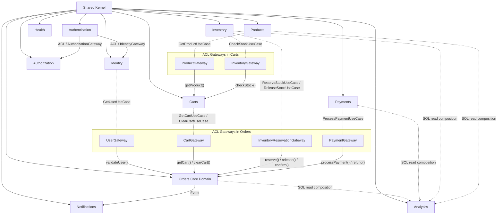

> **Analytics:** Query-only composition BC. Reads Orders/Payments/Inventory/Products tables via Postgres query adapters: no ACL gateways and no write aggregates. Details: [domains/ANALYTICS.md](domains/ANALYTICS.md).

> **Anti-Corruption Layer (ACL):** Downstream contexts define their own ports (gateway interfaces) with only the data they need. Adapters in the secondary layer translate upstream models into the downstream domain language. If Identity changes its user entity, only the Orders `ModuleUserGateway` adapter needs updating, not Orders use cases.

Health has no ACL consumers. It exposes HTTP probes only.

## System Context (C4 Level 1)

How the API sits in the local landscape:

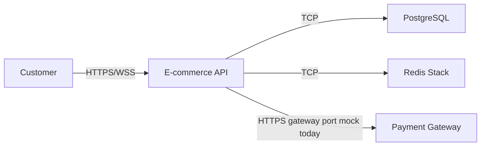

The payment gateway edge is a port with a mock adapter today. A real provider can replace the adapter without changing Orders or the checkout SAGA shape.

## High-Level Architecture

Modular monolith on NestJS. PostgreSQL is the primary store. Redis Stack handles caching, cart documents, search, and BullMQ.

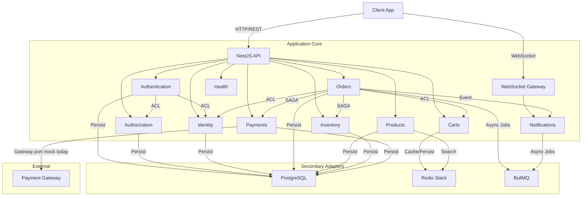

Checkout SAGA steps: Validate Cart → Reserve Stock → Process Payment (gateway port) → Confirm Order. Payment runs through a mock adapter today. The port is ready for a real provider when you wire one in.

## Component Dependencies (C4 Level 2)

Module dependencies with Orders as orchestrator:

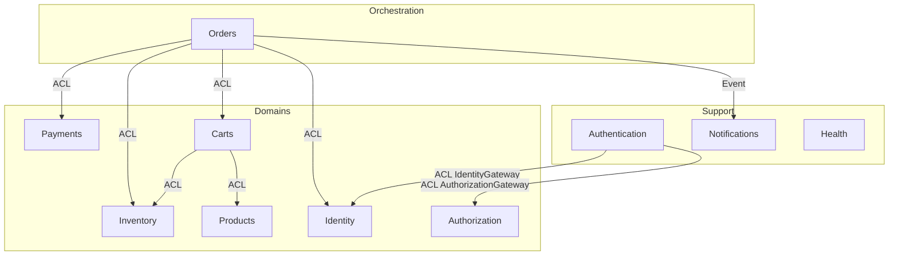

Note: `PaymentsModule` imports `AuthenticationModule` so Nest can apply auth guards on payment routes. That is a Nest wiring import, not an ACL gateway between Payments and Authentication.

## Checkout Sequence Diagram

Happy path with SAGA coordination. Payment goes through the gateway port (mock adapter today).

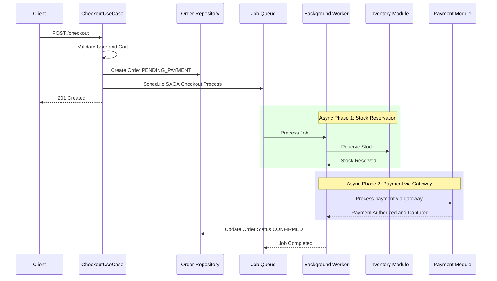

## SAGA Compensation Flow (Failure Handling)

If a checkout step fails (stock unavailable, payment declined, and so on), `CheckoutFailureListener` runs compensation.

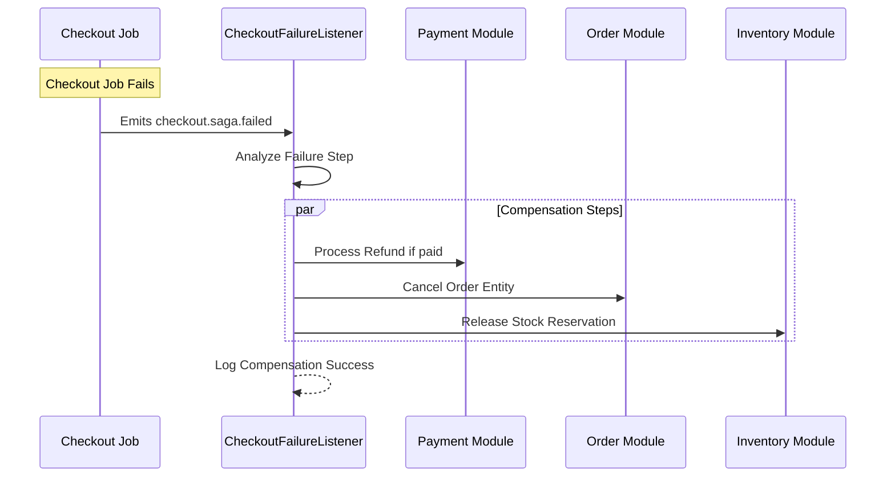

## Key Patterns Implemented

### 1. Domain-Driven Design (DDD)

- Rich domain models: business rules live in entities (`Cart`, `Order`, `Product`).
- Value objects: `Money`, `Address`, `PaymentMethod`, and similar.
- Repositories: interfaces in domain, implementations in secondary adapters.

### 2. Result Pattern

Use cases return `Result<T, E>` instead of throwing for business outcomes. Errors stay explicit and typed.

### 3. Idempotency

Checkout is protected by `@Idempotent()` with a Redis store so retries do not duplicate side effects.

### 4. Background Processing

Multi-step workflows run on BullMQ so HTTP stays fast and work can retry safely.

## Checkout Execution and SAGA Compensation Flow

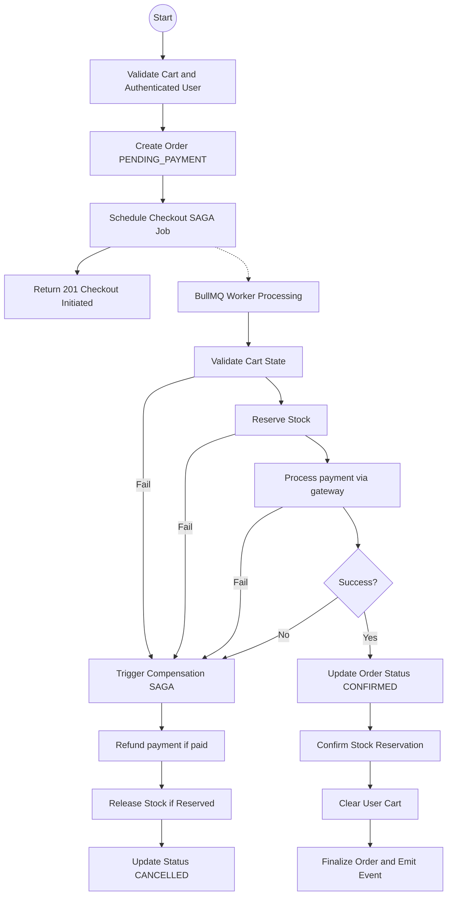

## Payment Methods (Current Scope)

`PaymentMethodType` currently includes **Stripe only**. The Stripe gateway adapter is a **mock** suitable for local and CI checkout proofs. A real provider SDK is not wired yet.

## Payment Event Handling (Async)

Orders can react to payment-completed jobs on the payment-events queue.

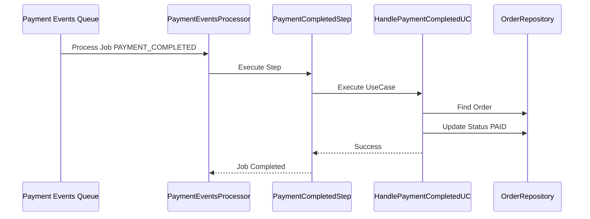

Webhook signature verification for a live Stripe account is stubbed. Do not treat production webhook security as complete until a real verifier is implemented.

## Idempotency Logic

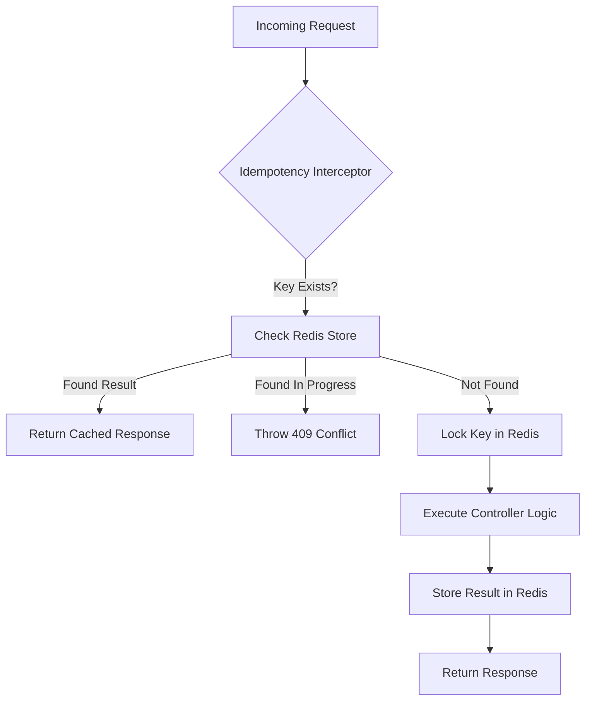

## Notification System Architecture

Notifications use a nested BullMQ flow: Save → Send → Update, so delivery and persistence stay ordered.

### Module Structure (Hexagonal Architecture)

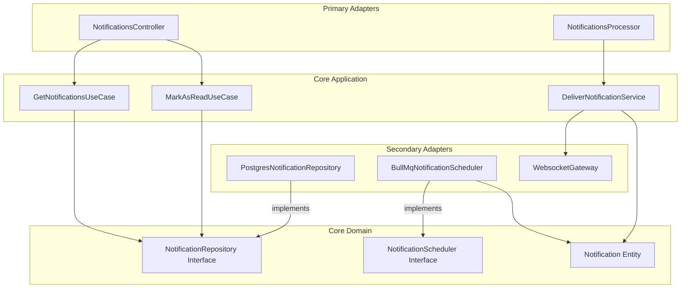

### Reliable Delivery Flow (BullMQ Nested Flow)

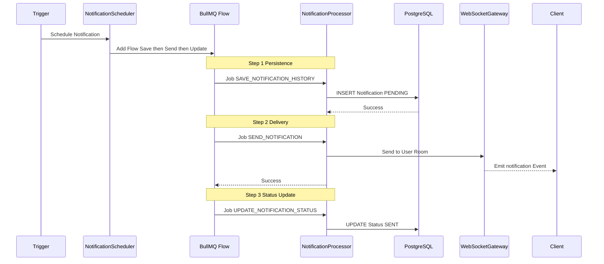
