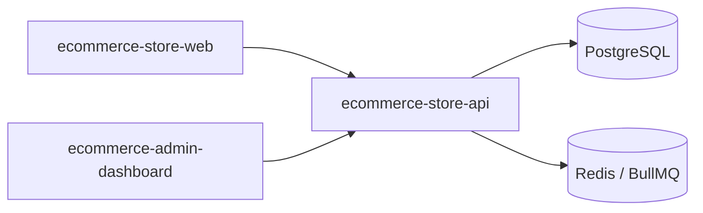
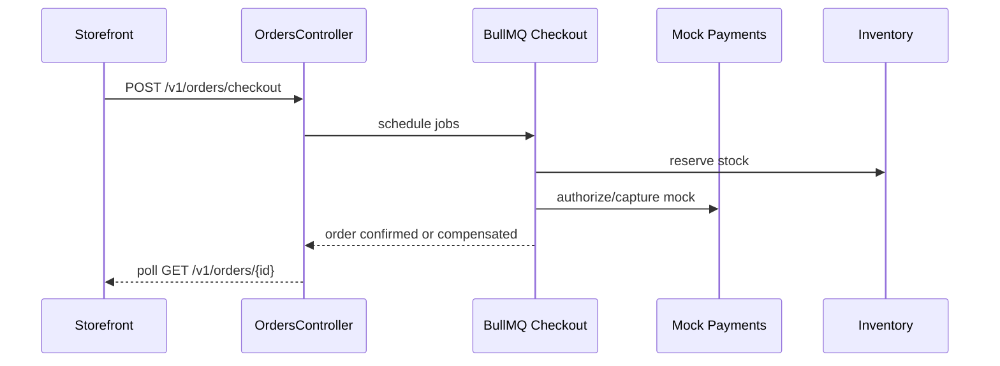

# Architecture overview

High-level context for reviewers. Detailed rules live in [`docs/architecture/DDD-HEXAGONAL.md`](../architecture/DDD-HEXAGONAL.md).

## System context

## Checkout SAGA (simplified)

