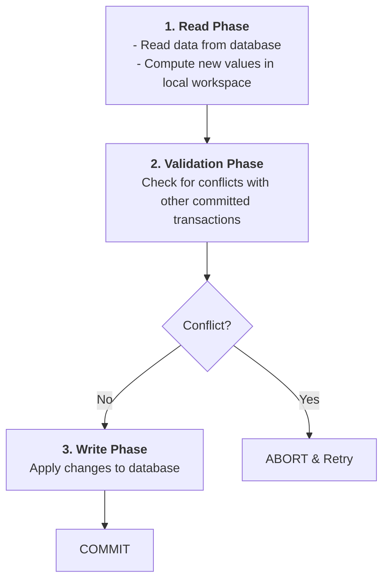
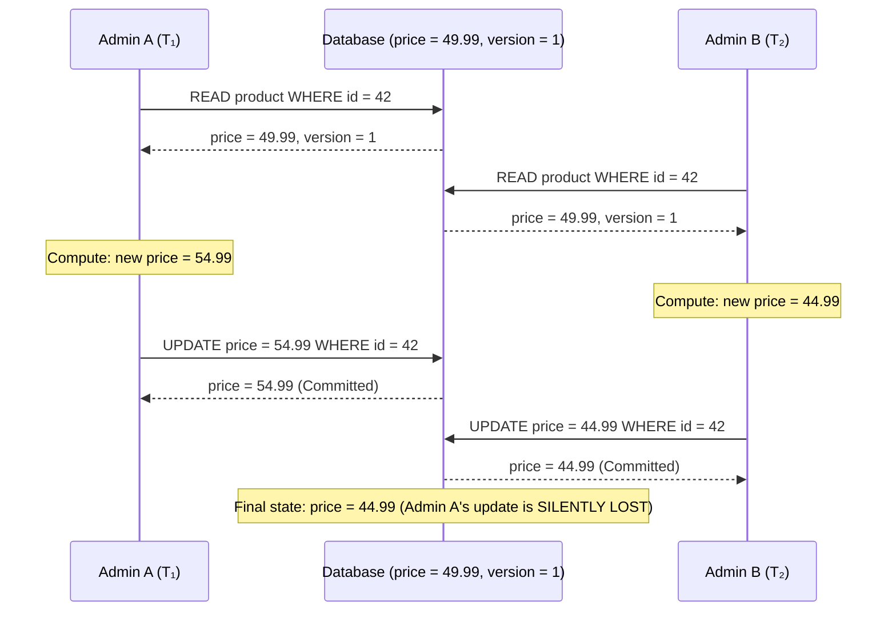
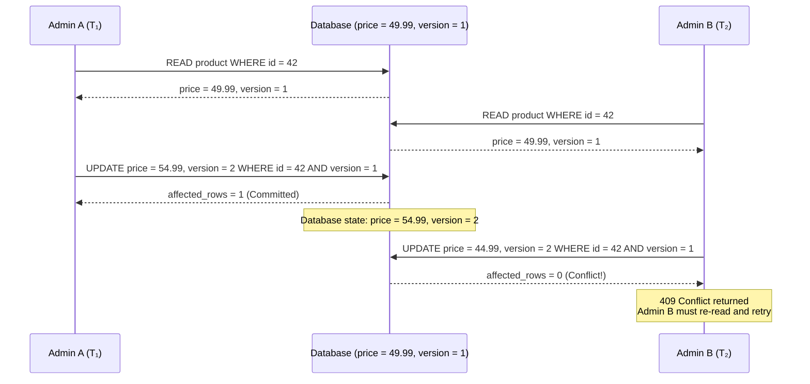
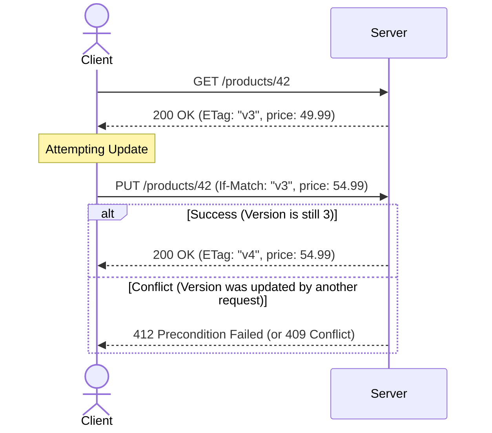
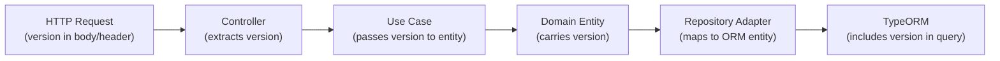

# Optimistic Concurrency Control (OCC)

A deep-dive into optimistic locking: the theory behind version-based conflict detection, the Lost Update problem with worked examples, conflict resolution strategies, and implementation patterns using TypeORM's `@VersionColumn()`.

> _Part of the [Concurrency Control](CONCURRENCY-FOUNDATIONS.md) series._

---

## 1. Theory

> _Source: Kung, H.T. & Robinson, J.T. (1981). "On Optimistic Methods for Concurrency Control." ACM Transactions on Database Systems, 6(2), pp. 213–226._

Optimistic Concurrency Control (OCC) operates on the assumption that conflicts between concurrent transactions are **rare**. Instead of acquiring locks to prevent conflicts, OCC allows all transactions to execute freely against a snapshot of the data, then validates at commit time whether any conflict occurred.

The protocol divides each transaction into three phases:



---

## 2. The Lost Update Problem

The **Lost Update** is the primary anomaly that OCC prevents at the application level. It occurs when two transactions read the same value, each compute a new value independently, and the last write silently overwrites the first.

**Scenario**: Two administrators simultaneously update the price of a product.



---

## 3. Version-Based OCC (Application-Level)

The most common OCC implementation uses a **version counter** column. Every row carries an integer `version` that is incremented on each successful update. The `UPDATE` statement includes the expected version in its `WHERE` clause:

```sql
-- Read phase: fetch the current state including its version
SELECT id, price, version FROM products WHERE id = 42;
-- Returns: id=42, price=49.99, version=1

-- Write phase: attempt the update, asserting the version hasn't changed
UPDATE products
SET price = 54.99, version = version + 1
WHERE id = 42 AND version = 1;

-- If affected_rows = 1 → success (no concurrent modification)
-- If affected_rows = 0 → conflict detected (version was incremented by another transaction)
```

**With OCC applied to the previous scenario**:



---

## 4. Version vs. Timestamp vs. Hash Strategies

| Strategy                     | Mechanism                                                        | Advantages                                                                                | Disadvantages                                                                                     |
| :--------------------------- | :--------------------------------------------------------------- | :---------------------------------------------------------------------------------------- | :------------------------------------------------------------------------------------------------ |
| **Integer version**          | Increment a counter on each update. Compare expected vs. actual. | Simple, deterministic, no clock dependency. Counter value has clear semantic meaning.     | Requires a dedicated column. Must be propagated to all clients.                                   |
| **Timestamp (`updated_at`)** | Compare `updated_at` against the value read by the client.       | Can reuse an existing audit column. No schema change.                                     | Clock skew across distributed nodes can cause false positives/negatives. Precision matters.       |
| **Row hash / ETag**          | Compute a hash of row contents and compare.                      | Detects any change, including columns not tracked by a version counter. No schema change. | Computationally more expensive. Hash collisions (theoretically possible, practically negligible). |

> **Recommendation (Fowler, 2002)**: Integer version columns are preferred due to their simplicity, determinism, and zero clock dependency. Timestamp-based strategies should be reserved for systems where adding a version column is infeasible.

---

## 5. Conflict Resolution Strategies

When an optimistic lock conflict is detected, the application must decide how to proceed:

| Strategy            | Description                                                                                                | When to Use                                                                                  |
| :------------------ | :--------------------------------------------------------------------------------------------------------- | :------------------------------------------------------------------------------------------- |
| **Client retry**    | Return `409 Conflict` with the current state. The client re-reads, re-applies their change, and resubmits. | Interactive UIs where the human can review the conflict. Standard approach for REST APIs.    |
| **Automatic retry** | The application re-reads, re-applies business logic, and retries internally (up to a limit).               | Idempotent background jobs where no human is in the loop.                                    |
| **Last-write-wins** | Deliberately skip version checking.                                                                        | Non-critical metadata (e.g., "last viewed at" timestamps) where lost updates are acceptable. |
| **Merge**           | Application-level conflict resolution that merges changes from both transactions (e.g., CRDTs).            | Collaborative editing. Extremely rare in transactional systems.                              |

### 5.1 HTTP Semantics for OCC

The standard HTTP protocol for version-based OCC uses conditional headers:



> **Note**: `412 Precondition Failed` is the RFC-correct response for `If-Match` failures. `409 Conflict` is more commonly used in practice because it is semantically clearer to API consumers. Either is acceptable.

---

## 6. Implementation — TypeORM `@VersionColumn()`

TypeORM provides built-in OCC support via `@VersionColumn()`. When an entity with a version column is saved, TypeORM automatically:

1. Includes `AND version = :expectedVersion` in the `UPDATE` statement's `WHERE` clause.
2. Increments the `version` column in the `SET` clause.
3. Checks `affected_rows`. If `0`, throws `OptimisticLockVersionMismatchError`.

```typescript
import { Entity, Column, VersionColumn, PrimaryGeneratedColumn } from 'typeorm';

@Entity('products')
export class ProductEntity {
  @PrimaryGeneratedColumn('uuid')
  id: string;

  @Column({ type: 'varchar', length: 255 })
  name: string;

  @Column({ type: 'decimal', precision: 10, scale: 2 })
  price: number;

  @VersionColumn()
  version: number;
}
```

Generated SQL:

```sql
UPDATE products
SET name = $1, price = $2, version = version + 1
WHERE id = $3 AND version = $4;
-- If affected_rows = 0 → OptimisticLockVersionMismatchError thrown
```

### 6.1 Handling the Error in GlobalExceptionFilter

```typescript
import { OptimisticLockVersionMismatchError } from 'typeorm';

if (exception instanceof OptimisticLockVersionMismatchError) {
  return response.status(HttpStatus.CONFLICT).json({
    statusCode: 409,
    error: 'Conflict',
    message:
      'The resource was modified by another request. ' +
      'Please re-read the resource and retry your update.',
  });
}
```

### 6.2 Propagating Version Through the Hexagonal Layers

In a DDD/Hexagonal architecture, the version must flow through all layers:



The version must also be **returned** in all read DTOs so that clients always have the current version for their next update.

> **Applied (this repository):** the domain entity does **not** carry `version` (see [CONVENTIONS.md](../../ai/CONVENTIONS.md) §13). TypeORM `@VersionColumn()` on `save()` only applies to **managed** entities. Adapters map to detached ORM objects, so they MUST use QueryBuilder `UPDATE … WHERE version = :expectedVersion`, spread `toUpdatePayload()`, and stamp `version` / `updatedAt` in `.set()`.

---

## 7. References

- Kung, H.T. & Robinson, J.T. (1981). "On Optimistic Methods for Concurrency Control." _ACM Transactions on Database Systems_, 6(2), pp. 213–226. DOI: 10.1145/319566.319567
- Fowler, M. (2002). _Patterns of Enterprise Application Architecture_. Addison-Wesley. §16: "Offline Concurrency Patterns."
- Vernon, V. (2013). _Implementing Domain-Driven Design_. Addison-Wesley. Chapter 8: aggregate root versioning.
- TypeORM. _Version Column_. https://typeorm.io/entities#version-column
- Fielding, R. & Reschke, J. (2014). RFC 7232: _Hypertext Transfer Protocol (HTTP/1.1): Conditional Requests_. §3.1: If-Match.
