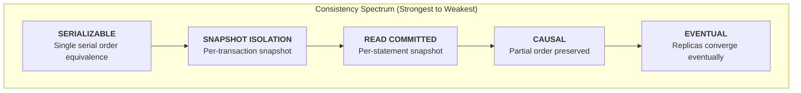
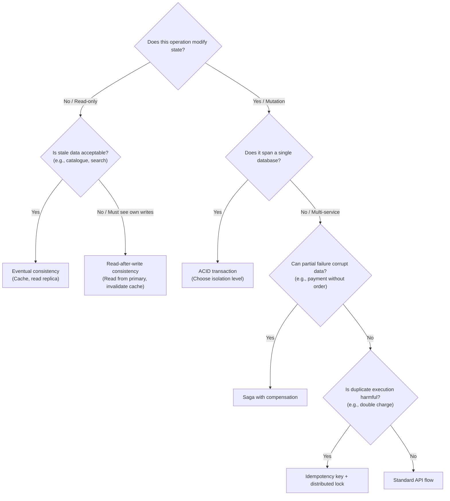

# Consistency — Foundations

An introduction to the consistency spectrum in distributed systems: from strict ACID serialisability to eventual consistency, the CAP theorem and its practical implications (PACELC), and a guide for choosing the appropriate consistency model for different API operations. This document serves as the hub for the consistency deep-dive series.

> _This is a technology-agnostic primer. For implementation-specific patterns, see the linked deep-dives._

---

## Deep-Dive Index

| Document                                              | Scope                                                                                                                                                           |
| :---------------------------------------------------- | :-------------------------------------------------------------------------------------------------------------------------------------------------------------- |
| **[Eventual Consistency](EVENTUAL-CONSISTENCY.md)**   | Convergence semantics, consistency models (read-after-write, monotonic reads, causal), CRDTs, and the consistency implications of caching and replication       |
| **[Idempotency](IDEMPOTENCY.md)**                     | Idempotency keys, exactly-once semantics, the UPSERT pattern, distributed retry safety, and the relationship between idempotency and concurrency control        |
| **[Sagas & Compensation](SAGAS-AND-COMPENSATION.md)** | Long-running transactions across service boundaries: Garcia-Molina's Saga pattern, choreography vs orchestration, compensating transactions, and semantic locks |

**Related series**: [Concurrency Foundations](../concurrency/CONCURRENCY-FOUNDATIONS.md) (MVCC, optimistic/pessimistic locking, distributed locks)

---

## 1. ACID — The Single-Database Guarantee

> _Source: Haerder, T. & Reuter, A. (1983). "Principles of Transaction-Oriented Database Recovery." ACM Computing Surveys, 15(4), pp. 287–317._

Within a single database, the **ACID** properties provide the strongest consistency model:

| Property        | Guarantee                                                                                                                                                                                             |
| :-------------- | :---------------------------------------------------------------------------------------------------------------------------------------------------------------------------------------------------- |
| **Atomicity**   | A transaction either completes entirely or has no effect. There is no partial state.                                                                                                                  |
| **Consistency** | A transaction transitions the database from one valid state to another. All constraints (CHECK, UNIQUE, FK) are enforced.                                                                             |
| **Isolation**   | Concurrent transactions do not interfere with each other. The result is equivalent to some serial ordering. (In practice, determined by the [isolation level](../concurrency/MVCC-AND-ISOLATION.md).) |
| **Durability**  | Once committed, data survives crashes. Guaranteed by the Write-Ahead Log (WAL). See [Storage & Maintenance](../performance/STORAGE-AND-MAINTENANCE.md).                                               |

ACID transactions are the gold standard for data integrity — but they apply **only within a single database**. The moment a workflow spans multiple services, databases, queues, or external APIs, ACID guarantees no longer apply. This is where the consistency spectrum begins.

---

## 2. The Consistency Spectrum

Real-world systems operate across a spectrum — not a binary choice between "consistent" and "inconsistent":

Each step to the right trades **consistency** for **availability** and **latency**. The art of distributed system design is choosing the right point on this spectrum for each operation.

---

## 3. The CAP Theorem

> _Source: Brewer, E.A. (2000). "Towards Robust Distributed Systems." Keynote, ACM PODC. Gilbert, S. & Lynch, N. (2002). "Brewer's Conjecture and the Feasibility of Consistent, Available, Partition-Tolerant Web Services." ACM SIGACT News, 33(2), pp. 51–59._

### 3.1 The Three Properties

| Property                    | Definition                                                                                           |
| :-------------------------- | :--------------------------------------------------------------------------------------------------- |
| **Consistency (C)**         | Every read receives the most recent write or an error. All nodes see the same data at the same time. |
| **Availability (A)**        | Every request receives a non-error response, without guaranteeing it reflects the most recent write. |
| **Partition Tolerance (P)** | The system continues to operate despite arbitrary network partitions between nodes.                  |

**The theorem**: In the presence of a network partition, a distributed system must choose between Consistency and Availability. It cannot guarantee both simultaneously.

### 3.2 Why "Pick Two" Is Misleading

The CAP theorem is often stated as "pick two of three," but this is a simplification. In practice:

1. **Partitions are not optional** in a distributed system. Network failures, switch reboots, and cloud AZ connectivity loss are inevitable. P is not a choice — it is a reality. The real choice is **C vs A during a partition**.

2. **The choice is not global**. Different operations within the same system can make different choices. A stock reservation might choose C (reject the request rather than risk overselling), while a product catalogue query might choose A (serve stale data rather than error).

3. **Outside of partitions, you can have both C and A**. The theorem only constrains behaviour _during_ a partition.

### 3.3 PACELC — A More Practical Framework

> _Source: Abadi, D.J. (2012). "Consistency Tradeoffs in Modern Distributed Database System Design." IEEE Computer, 45(2), pp. 37–42._

PACELC extends CAP to address the tradeoff that exists even when there is no partition:

**P**artition: choose **A**vailability or **C**onsistency; **E**lse (no partition): choose **L**atency or **C**onsistency.

| System                         | During Partition (PA/PC)                    | Normal Operation (EL/EC)                               | Example                                           |
| :----------------------------- | :------------------------------------------ | :----------------------------------------------------- | :------------------------------------------------ |
| **PostgreSQL (single node)**   | Not applicable (not distributed)            | EC (strong consistency)                                | Single-database API — all reads see latest writes |
| **PostgreSQL + read replicas** | PA (replicas may serve stale data)          | EL (replicas trade consistency for lower read latency) | Read-heavy API offloading to replicas             |
| **Redis cache**                | PA (cache may serve stale data)             | EL (cache trades consistency for latency)              | Cached product catalogue                          |
| **DynamoDB (eventual)**        | PA                                          | EL                                                     | Global product catalogue                          |
| **DynamoDB (strong)**          | PC (rejects requests if quorum unavailable) | EC                                                     | Financial ledger                                  |

---

## 4. BASE — The Eventual Consistency Acronym

> _Source: Pritchett, D. (2008). "BASE: An Acid Alternative." ACM Queue, 6(3), pp. 48–55._

As a counterpoint to ACID, the **BASE** model describes systems that favour availability over immediate consistency:

| Property                    | Meaning                                                                                               |
| :-------------------------- | :---------------------------------------------------------------------------------------------------- |
| **B**asically **A**vailable | The system guarantees availability (in the CAP sense) — every request gets a response.                |
| **S**oft state              | The system's state may change over time, even without input, due to background convergence processes. |
| **E**ventual consistency    | If no new updates are made, all replicas will eventually converge to the same value.                  |

> **Warning**: BASE is not a formal model like ACID — it is a descriptive label for systems that trade consistency for availability. "Eventually consistent" requires a precise definition of convergence guarantees. See [Eventual Consistency](EVENTUAL-CONSISTENCY.md) for the formal models.

---

## 5. Where Consistency Models Apply in APIs

| API Operation                                   | Consistency Model                | Rationale                                                                                                                        |
| :---------------------------------------------- | :------------------------------- | :------------------------------------------------------------------------------------------------------------------------------- |
| **Inventory stock check** (checkout)            | Strong (ACID + pessimistic lock) | Overselling violates a business invariant. See [Pessimistic Locking](../concurrency/PESSIMISTIC-LOCKING.md).                     |
| **Order creation**                              | Strong (ACID transaction)        | Order + line items + payment intent must be atomic.                                                                              |
| **Product catalogue read**                      | Eventual (cached)                | Serving a 5-second-stale price is acceptable for browsing. Exact price is re-checked at checkout.                                |
| **Order list query**                            | Read-after-write                 | After creating an order, the customer must see it immediately in their order list. Stale-read from a cache is unacceptable here. |
| **Search results**                              | Eventual                         | Full-text search indexes (Elasticsearch) are asynchronously updated. Brief staleness is acceptable.                              |
| **Checkout SAGA** (order → payment → inventory) | Saga consistency                 | Not ACID — each step is a local transaction. Failures trigger compensating actions. See [Sagas](SAGAS-AND-COMPENSATION.md).      |
| **User profile update**                         | Optimistic (version column)      | Low contention. Conflicts detected and reported. See [Optimistic Locking](../concurrency/OPTIMISTIC-LOCKING.md).                 |
| **Domain event processing**                     | Eventual                         | Events are published asynchronously via outbox/queue. Subscribers process them with a latency window.                            |

---

## 6. The Consistency-Availability Decision Guide

When designing a new API endpoint or workflow, use this decision tree:

---

## 7. References

- Haerder, T. & Reuter, A. (1983). "Principles of Transaction-Oriented Database Recovery." _ACM Computing Surveys_, 15(4), pp. 287–317.
- Brewer, E.A. (2000). "Towards Robust Distributed Systems." Keynote, _ACM PODC_.
- Gilbert, S. & Lynch, N. (2002). "Brewer's Conjecture and the Feasibility of Consistent, Available, Partition-Tolerant Web Services." _ACM SIGACT News_, 33(2), pp. 51–59.
- Abadi, D.J. (2012). "Consistency Tradeoffs in Modern Distributed Database System Design." _IEEE Computer_, 45(2), pp. 37–42.
- Pritchett, D. (2008). "BASE: An Acid Alternative." _ACM Queue_, 6(3), pp. 48–55.
- Kleppmann, M. (2017). _Designing Data-Intensive Applications_. O'Reilly. Chapters 5, 7, 9.
- Vogels, W. (2009). "Eventually Consistent." _Communications of the ACM_, 52(1), pp. 40–44.
