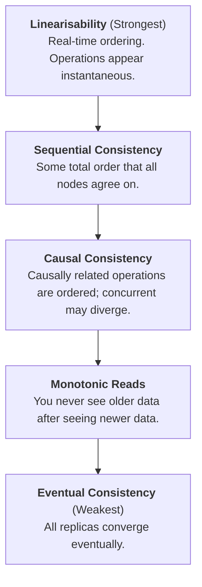
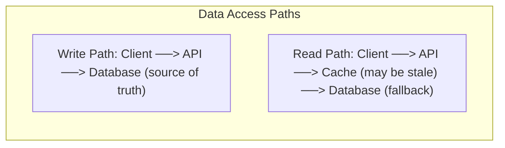
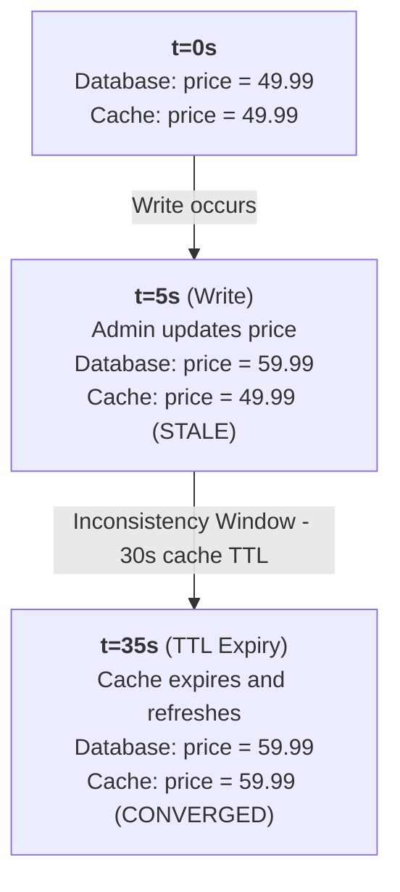
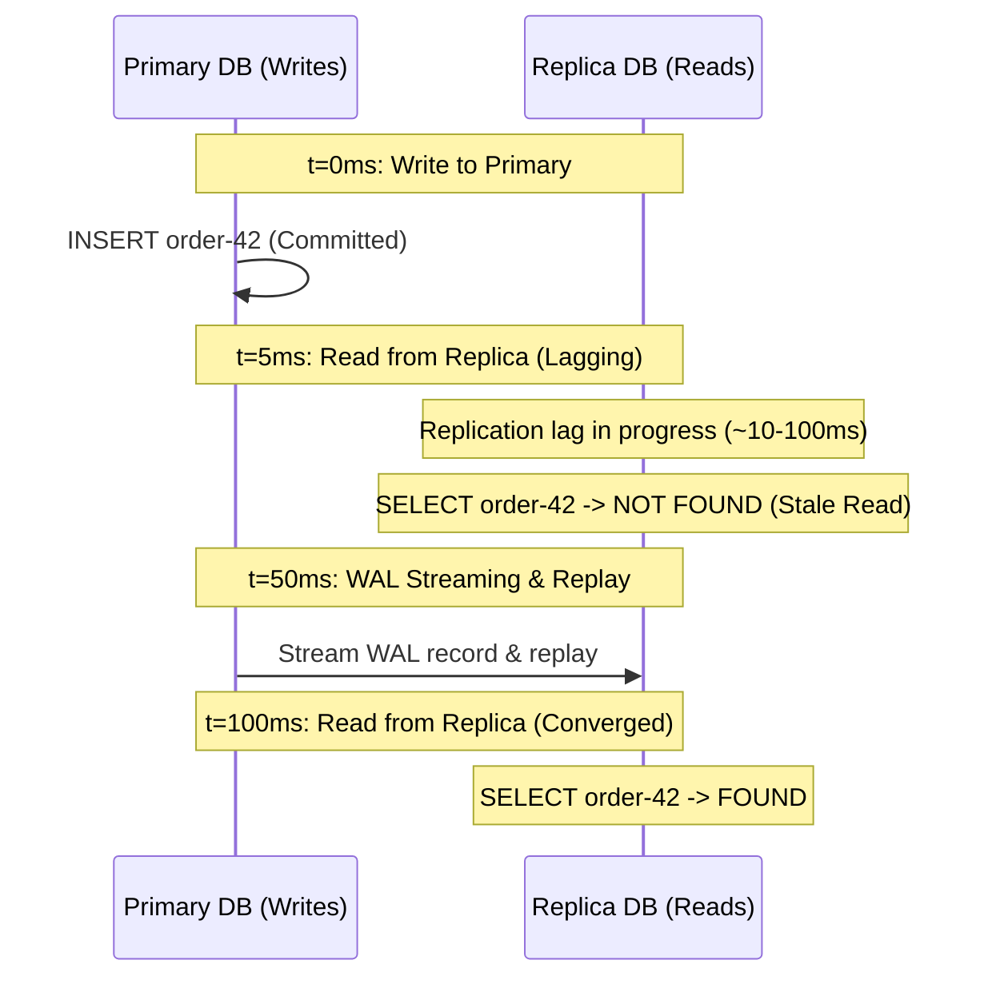
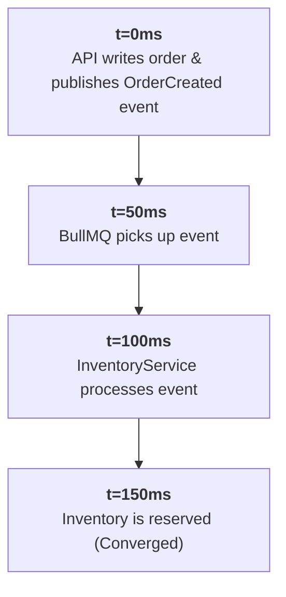

# Eventual Consistency

A deep-dive into eventual consistency: formal convergence definitions, the hierarchy of consistency models (read-after-write, monotonic reads, causal consistency), the consistency implications of caching and replication, and Conflict-Free Replicated Data Types (CRDTs) as a theoretical foundation for automatic convergence.

> _Part of the [Consistency](CONSISTENCY-FOUNDATIONS.md) series._

---

## 1. Formal Definition

> _Source: Vogels, W. (2009). "Eventually Consistent." Communications of the ACM, 52(1), pp. 40-44._

**Eventual consistency** is a consistency model that guarantees that, if no new updates are made to a data item, all replicas of that item will **eventually** converge to the same value. It makes no guarantee about _when_ convergence will occur: only that it will.

**Formal statement**: For a data item x with replicas R₁, R₂, ..., Rₙ, if all writes to x cease at time t, then there exists a time t' > t such that for all i, j: Rᵢ(x) = Rⱼ(x). The interval [t, t'] is the **inconsistency window**.

> _"The eventual consistency model says only that updates will eventually be reflected everywhere. It says nothing about the size of the window during which inconsistencies are visible."_
> Source: Vogels, W. (2009)

---

## 2. The Consistency Model Hierarchy

Eventual consistency is the weakest useful model. Stronger models add specific guarantees about the **order** and **visibility** of reads and writes:



### 2.1 Read-After-Write Consistency (Read-Your-Writes)

**Guarantee**: After a client writes a value, any subsequent read by **the same client** will reflect that write (or a later one). Other clients may still see stale data.

**Why it matters in APIs**: This is the minimum consistency level required for a tolerable user experience. If a customer creates an order and immediately navigates to "My Orders," they must see the order they just created. Showing a stale list (without the new order) is confusing and generates support tickets.

```
Customer A                               Customer B
───────────                              ───────────
POST /orders → 201 Created (order-42)

GET /orders (my orders)
→ MUST include order-42                  GET /orders (their orders)
   (read-after-write guarantee)          → May or may not include order-42 yet
                                            (eventual consistency for other clients)
```

**Common violations and fixes**:

| Violation                                              | Cause                                                        | Fix                                                                                    |
| :----------------------------------------------------- | :----------------------------------------------------------- | :------------------------------------------------------------------------------------- |
| Client creates a resource, GET returns 404             | Read hits a stale cache                                      | Invalidate the cache key on write, or read from primary after a write                  |
| Client updates a resource, GET returns old version     | Read hits a read replica with replication lag                | Route read-after-write requests to the primary (session affinity or sticky routing)    |
| Client creates an order, list endpoint doesn't show it | List query uses a cached/materialised view not yet refreshed | Refresh the view on write, or merge the fresh write into the cached result client-side |

### 2.2 Monotonic Reads

**Guarantee**: If a client reads a value v at time t₁, any subsequent read by **the same client** at time t₂ > t₁ will return v or a newer value: never an older one. The client's view of the data never moves backward.

**Why it matters**: Without monotonic reads, a client refreshing a page might see data "jump backward": e.g., an order status that was `CONFIRMED` reverts to `PENDING` on the next page load because the second request hit a replica with higher lag than the first.

**Implementation**: Pin a client's reads to a specific replica for the duration of a session (session affinity). Alternatively, track the replica's replication offset and route to replicas that have caught up to at least that offset.

### 2.3 Causal Consistency

**Guarantee**: If operation A causally precedes operation B (A _happened before_ B), then every node observes A before B. Concurrent operations (no causal relationship) may be observed in any order.

> _Source: Lamport, L. (1978). "Time, Clocks, and the Ordering of Events in a Distributed System." Communications of the ACM, 21(7), pp. 558-565._

**Example**: In a comment thread, if User A posts a comment and User B replies to it, causal consistency guarantees that no reader sees the reply without seeing the original comment. However, two independent comments posted concurrently may appear in different orders on different nodes.

**Implementation**: Requires tracking causal dependencies: typically via vector clocks, Lamport timestamps, or explicit happens-before metadata. This is expensive and uncommon in typical API backends. Most systems settle for read-after-write + monotonic reads as a pragmatic approximation.

---

## 3. Consistency Implications of Common Architecture Patterns

### 3.1 Caching (Redis, CDN, Application Cache)

A cache introduces an **inconsistency window** equal to its TTL (time-to-live). During this window, reads may return stale data.



Timeline:



**Strategies for reducing the inconsistency window**:

| Strategy                      | How It Works                                                                                   | Inconsistency Window                                                     | Complexity |
| :---------------------------- | :--------------------------------------------------------------------------------------------- | :----------------------------------------------------------------------- | :--------- |
| **TTL-based expiry**          | Cache entries expire after N seconds. Reads after expiry fetch from the database.              | TTL duration (seconds to minutes)                                        | Low        |
| **Write-through**             | On every write, update both the database and the cache atomically.                             | Near-zero (write propagation latency)                                    | Medium     |
| **Write-behind (write-back)** | Writes go to the cache first; a background process asynchronously flushes to the database.     | Near-zero for reads; risk of data loss if the cache crashes before flush | High       |
| **Cache invalidation**        | On write, delete the cache key. Next read triggers a cache miss and fetches from the database. | Duration of one cache miss (milliseconds)                                | Medium     |
| **Event-driven invalidation** | A domain event (e.g., `product.updated`) triggers cache invalidation in subscribers.           | Event propagation latency (typically < 1 second)                         | Medium     |

> _"There are only two hard things in Computer Science: cache invalidation and naming things."_
> Source: Phil Karlton (attributed)

### 3.2 Read Replicas (Database Replication)

PostgreSQL streaming replication introduces **replication lag**: the delay between a write committed on the primary and the same write becoming visible on a replica.



**Read-after-write with replicas**: Route the user's own reads to the primary immediately after a write. One approach:

```typescript
// After a write, set a short-lived flag for the user's session
await redis.set(`read-primary:${userId}`, '1', 'EX', 5); // 5 seconds

// On read, check the flag
const usePrimary = await redis.get(`read-primary:${userId}`);
const dataSource = usePrimary ? primaryDataSource : replicaDataSource;
```

### 3.3 Asynchronous Event Processing (Queues, Domain Events)

When a write triggers asynchronous downstream processing (e.g., BullMQ job, domain event subscriber), there is an inherent inconsistency window between the write and the subscriber's processing:



This is **by design**: asynchronous processing trades immediate consistency for decoupled, resilient, scalable architectures. The [Saga pattern](SAGAS-AND-COMPENSATION.md) provides the framework for managing this type of distributed consistency.

---

## 4. Conflict-Free Replicated Data Types (CRDTs)

> _Source: Shapiro, M., Preguiça, N., Baquero, C., & Zawirski, M. (2011). "Conflict-Free Replicated Data Types." Proceedings of SSS 2011. Springer LNCS 6976, pp. 386-400._

CRDTs are data structures that can be replicated across multiple nodes, updated independently and concurrently, and **guaranteed to converge** to the same state without any coordination or conflict resolution protocol.

### 4.1 How CRDTs Achieve Convergence

CRDTs ensure convergence by constraining operations to be **commutative**, **associative**, and **idempotent**: meaning the order and duplication of operations does not affect the final result.

**Example: G-Counter (Grow-only Counter)**:

```
Each node maintains its own counter. The merged value is the SUM of all nodes.

Node A: {A: 3, B: 0, C: 0}  → local count = 3
Node B: {A: 0, B: 5, C: 0}  → local count = 5
Node C: {A: 0, B: 0, C: 2}  → local count = 2

Merge: {A: max(3,0,0), B: max(0,5,0), C: max(0,0,2)} = {A:3, B:5, C:2}
Global count = 3 + 5 + 2 = 10

No matter WHAT ORDER the merges happen, the result is always 10.
```

### 4.2 CRDT Types

| Type             | Description                                                        | Use Case                                    |
| :--------------- | :----------------------------------------------------------------- | :------------------------------------------ |
| **G-Counter**    | Grow-only counter (increment only)                                 | Page view counters, like counts             |
| **PN-Counter**   | Counter supporting both increment and decrement                    | Inventory approximations (non-critical)     |
| **G-Set**        | Grow-only set (add only, never remove)                             | Tag collections, seen-message IDs           |
| **OR-Set**       | Observed-Remove set (add and remove, last-writer-wins per element) | Shopping cart items (collaborative editing) |
| **LWW-Register** | Last-Writer-Wins register (timestamp-based)                        | User profile fields                         |

### 4.3 Practical Relevance

CRDTs are rarely used directly in typical API backends: they shine in peer-to-peer, offline-first, and geo-replicated systems (e.g., collaborative editors, distributed caches). However, understanding CRDTs provides theoretical grounding for:

- Why "last-write-wins" is a valid (if lossy) conflict resolution strategy
- How distributed counters (e.g., Redis `INCR` across replicas) can converge without locking
- The mathematical foundation behind eventual consistency: convergence is not "hope"; it is a provable property of correctly designed data structures

---

## 5. Designing for Eventual Consistency: Practical Checklist

When introducing eventual consistency into an API, verify each of these:

```
□ The inconsistency window is DEFINED and DOCUMENTED (e.g., "up to 30s cache TTL")
□ Read-after-write consistency is guaranteed for the WRITING client
□ The UI communicates the consistency model (e.g., "changes may take a moment to appear")
□ Idempotency keys protect against duplicate processing during retry windows
□ Monitoring tracks the inconsistency window size (e.g., replication lag metrics)
□ A mechanism exists to force-read from the source of truth when needed
□ Stale data cannot cause safety violations (e.g., a stale price is re-checked at checkout)
```

---

## 6. References

- Vogels, W. (2009). "Eventually Consistent." _Communications of the ACM_, 52(1), pp. 40-44.
- Lamport, L. (1978). "Time, Clocks, and the Ordering of Events in a Distributed System." _Communications of the ACM_, 21(7), pp. 558-565.
- Shapiro, M. et al. (2011). "Conflict-Free Replicated Data Types." _Proceedings of SSS 2011_. Springer LNCS 6976, pp. 386-400.
- Terry, D. et al. (1994). "Session Guarantees for Weakly Consistent Replicated Data." _Proceedings of PDIS_, pp. 140-149. (Defines read-after-write, monotonic reads, monotonic writes, writes-follow-reads.)
- Kleppmann, M. (2017). _Designing Data-Intensive Applications_. O'Reilly. Chapters 5 and 9.
- Bailis, P. & Ghodsi, A. (2013). "Eventual Consistency Today: Limitations, Extensions, and Beyond." _ACM Queue_, 11(3).

