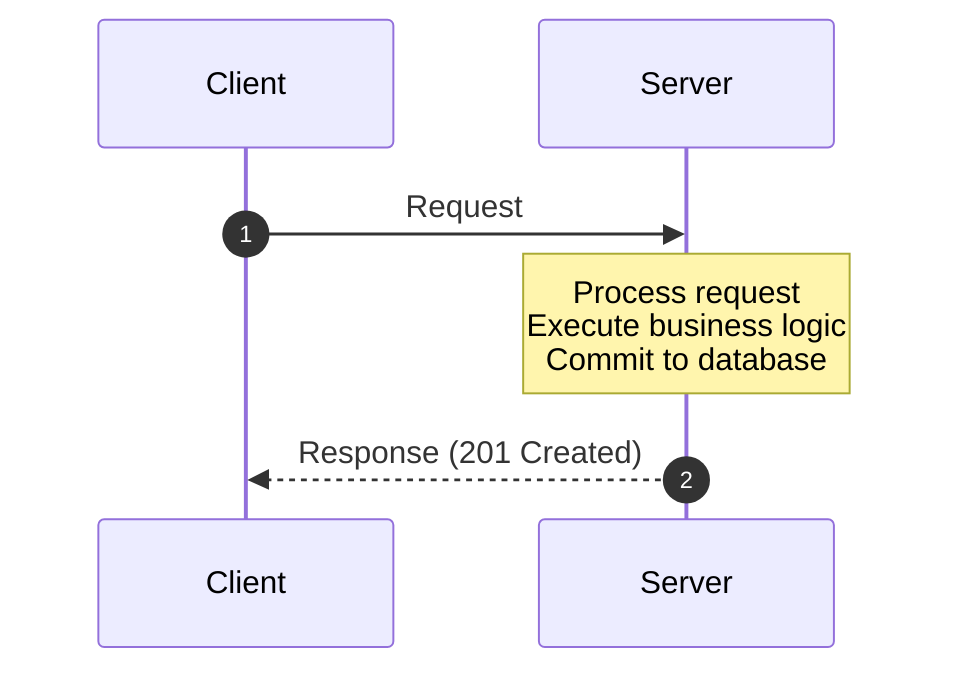
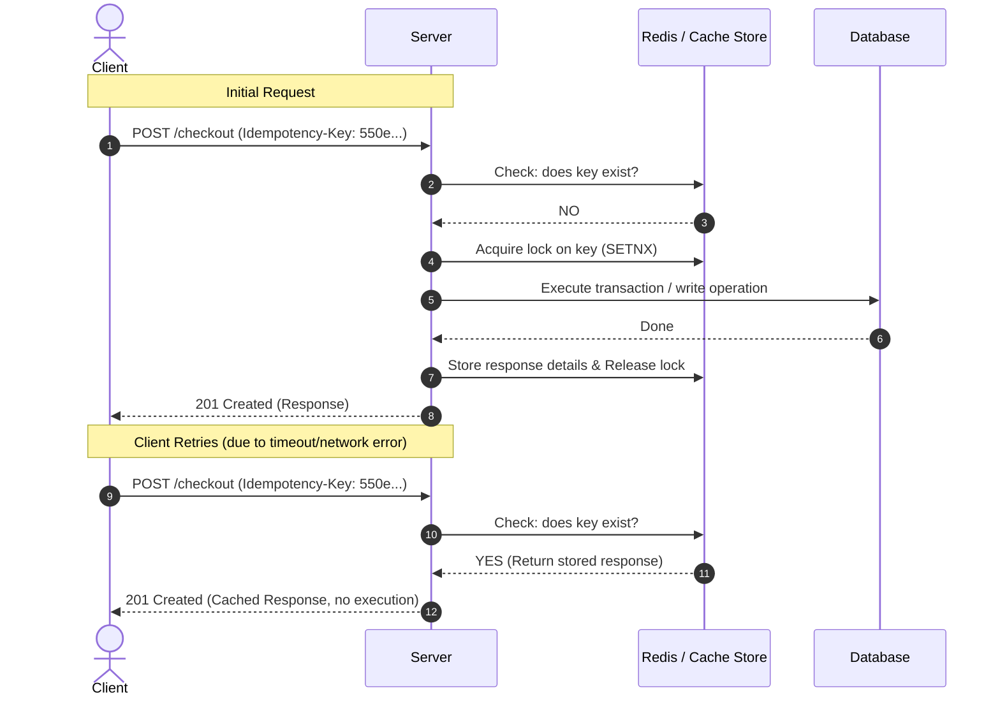
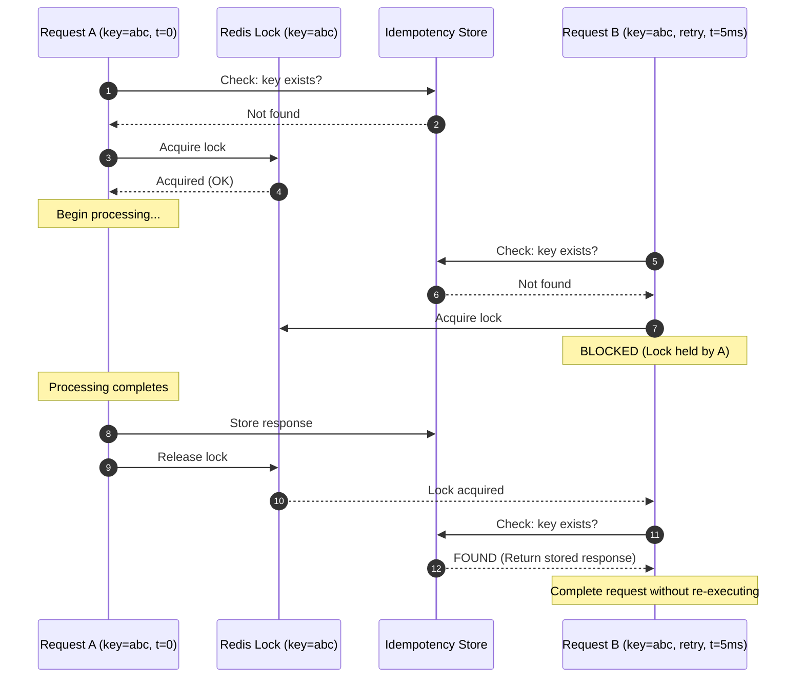
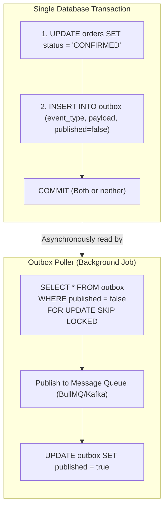

# Idempotency

A deep-dive into idempotency as a correctness mechanism in APIs and distributed systems: the formal definition, why network unreliability makes idempotency non-optional, idempotency key protocols, the `UPSERT` pattern, the relationship between idempotency and distributed locking, and implementation strategies for exactly-once semantics in retry-prone environments.

> _Part of the [Consistency](CONSISTENCY-FOUNDATIONS.md) series. For distributed locking (which idempotency keys often depend on), see [Distributed Locking](../concurrency/DISTRIBUTED-LOCKING.md)._

---

## 1. Formal Definition

> _Source: HTTP/1.1 Semantics: RFC 9110 §9.2.2. Fielding, R. et al. (2022)._

An operation is **idempotent** if executing it once produces the same result as executing it multiple times. Formally, for a function f:

```
f(x) = f(f(x))
```

In the context of HTTP APIs, an operation is idempotent if repeating the same request (with the same parameters) produces the same server-side effect and the same response, regardless of how many times it is executed.

| HTTP Method | Idempotent by Specification? | Explanation                                                                              |
| :---------- | :--------------------------- | :--------------------------------------------------------------------------------------- |
| `GET`       | ✅ Yes                       | Reads do not modify state. Repeating a GET is always safe.                               |
| `PUT`       | ✅ Yes                       | Replaces the entire resource. Repeating the same PUT produces the same state.            |
| `DELETE`    | ✅ Yes                       | Deleting an already-deleted resource is a no-op (or returns 404).                        |
| `PATCH`     | ❌ Not guaranteed            | Depends on the operation. `SET price = 50` is idempotent; `INCREMENT stock BY 1` is not. |
| `POST`      | ❌ Not guaranteed            | Creates a new resource. Repeating a POST typically creates duplicates.                   |

> **The critical insight**: `POST` is the most common HTTP method for mutations in APIs (creating orders, processing payments, submitting forms), and it is the one method that is **not** idempotent by default. This is where idempotency keys become essential.

---

## 2. Why Idempotency Is Non-Optional

### 2.1 The Network Uncertainty Problem

In a distributed system, every network call has three possible outcomes:



Three failure modes:

1. Request lost (server never receives it) → Client retries → SAFE
2. Response lost (server processed, client unaware) → Client retries → DUPLICATE!
3. Timeout (client doesn't know which of 1 or 2) → Client retries → MAYBE DUPLICATE

**The fundamental problem**: When a client receives a timeout or network error, it **cannot distinguish** between "the server never received my request" and "the server processed my request but the response was lost." The only safe action is to retry: but retrying a non-idempotent operation (e.g., `POST /checkout`) can cause **duplicate processing** (double charges, duplicate orders).

### 2.2 Real-World Failure Scenarios

| Scenario                                   | What Happens Without Idempotency                                                             |
| :----------------------------------------- | :------------------------------------------------------------------------------------------- |
| **Mobile network flap** during checkout    | Client retries → two orders created, customer charged twice                                  |
| **Load balancer timeout** (504) on payment | Client retries → two payment captures against the payment provider                           |
| **Browser refresh** on a form submission   | POST resent → duplicate resource created                                                     |
| **Queue re-delivery** (BullMQ, SQS)        | Job processed twice → side effects executed twice (double email, double inventory decrement) |
| **Saga retry** after partial failure       | Compensation already ran, retry re-executes a step that was already compensated              |

---

## 3. The Idempotency Key Protocol

An **idempotency key** is a client-generated unique identifier (typically a UUID) that the server uses to deduplicate requests. The protocol:



### 3.1 Idempotency Key Storage

| Store                         | TTL                                         | Pros                                    | Cons                                                                |
| :---------------------------- | :------------------------------------------ | :-------------------------------------- | :------------------------------------------------------------------ |
| **Redis** | 24-72 hours | Fast, atomic SETNX, natural TTL support | Volatile: lost on restart unless AOF/RDB persistence is configured |
| **Database table**            | 24-72 hours (cleanup job)                   | Durable, survives restarts              | Slower, requires cleanup cron                                       |
| **Hybrid** (Redis + database) | Redis for fast check, DB for durable record | Fast path + durable fallback            | More complex                                                        |

### 3.2 Key Design Decisions

| Decision                      | Recommendation                              | Rationale                                                                                                                                                                                  |
| :---------------------------- | :------------------------------------------ | :----------------------------------------------------------------------------------------------------------------------------------------------------------------------------------------- |
| **Who generates the key?**    | The **client**                              | Only the client knows whether this is a new request or a retry. Server-generated keys cannot solve the duplicate problem because the client doesn't have the key before the first request. |
| **Key scope**                 | Per-operation + per-client                  | The key `550e...` belongs to client A's checkout attempt. Client B using the same key (collision) must be rejected.                                                                        |
| **TTL**                       | 24-72 hours                                 | Long enough to cover retry windows and user sessions. Short enough to avoid unbounded storage growth.                                                                                      |
| **What to store**             | The full HTTP response (status code + body) | On replay, the server returns the **exact same response**, making the retry indistinguishable from the original for the client.                                                            |
| **What if the body differs?** | Return `422 Unprocessable Entity` | If a client sends the same idempotency key with a different request body, this is a client error: they're trying to reuse a key for a different operation. |

---

## 4. The Idempotency-Concurrency Relationship

Idempotency keys are fundamentally a **concurrency control mechanism**. Two concurrent requests with the same idempotency key represent a race condition that must be resolved:



**Without the lock**: Both requests pass the "key not found" check and both execute the operation: defeating the purpose of idempotency. The lock ensures exactly-once execution.

This is why idempotency implementations typically combine:

1. **Redis SETNX** (distributed lock): mutual exclusion for concurrent duplicates
2. **Stored response** (idempotency store): replay for sequential duplicates
3. **Database transaction**: atomicity of the underlying operation

---

## 5. The UPSERT Pattern

For operations that can be expressed as "create if not exists, otherwise update," the database's `UPSERT` (`INSERT ... ON CONFLICT`) provides built-in idempotency at the SQL level:

```sql
-- Idempotent order creation keyed by idempotency_key
INSERT INTO orders (id, idempotency_key, user_id, total, status)
VALUES ($1, $2, $3, $4, 'PENDING')
ON CONFLICT (idempotency_key) DO NOTHING
RETURNING *;

-- If affected_rows = 1 → new order created
-- If affected_rows = 0 → duplicate detected, order already exists
--    → fetch and return the existing order
```

**When UPSERT is sufficient vs. when you need full idempotency key protocol**:

| Scenario                                                                 | UPSERT Sufficient? | Explanation                                                                                                                |
| :----------------------------------------------------------------------- | :----------------- | :------------------------------------------------------------------------------------------------------------------------- |
| Simple resource creation (create order record)                           | ✅ Yes             | The database handles deduplication atomically.                                                                             |
| Operation with side effects (create order + charge payment + send email) | ❌ No              | UPSERT only covers the database write. The payment charge and email are external side effects that need the full protocol. |
| Operation with async processing (create order + enqueue SAGA)            | ❌ No              | The SAGA must also be deduplicated. UPSERT doesn't prevent the queue job from being enqueued twice.                        |

---

## 6. Idempotency in Asynchronous Job Processing

Queue systems (BullMQ, SQS, Kafka) provide **at-least-once** delivery: a message may be delivered more than once. Every job processor must be idempotent.

### 6.1 Strategies

| Strategy                  | How It Works                                                                                                                                                                                                    | Example                                                                                           |
| :------------------------ | :-------------------------------------------------------------------------------------------------------------------------------------------------------------------------------------------------------------- | :------------------------------------------------------------------------------------------------ |
| **Job ID deduplication**  | BullMQ's `jobId` option prevents duplicate enqueueing. If a job with the same ID already exists, the new one is silently dropped.                                                                               | `queue.add('process-order', data, { jobId: orderId })`                                            |
| **Processed-set check**   | Before processing, check if this job ID is in a "processed" set (Redis SET or database table). If yes, skip.                                                                                                    | `if (await redis.sismember('processed-orders', orderId)) return;`                                 |
| **Idempotent operations** | Design the operation itself to be naturally idempotent. Use UPSERT, use `SET status = X` instead of `INCREMENT counter`.                                                                                        | Status transitions are inherently idempotent: setting `CONFIRMED` twice has no additional effect. |
| **Transactional outbox**  | Write the event and the business state change in the **same database transaction**. A separate process reads the outbox and publishes. Re-reading and re-publishing is safe because subscribers are idempotent. | See [Sagas & Compensation](SAGAS-AND-COMPENSATION.md) §4.                                         |

### 6.2 The Transactional Outbox Pattern

The outbox pattern solves the dual-write problem: "How do I atomically update the database AND publish an event?" Without it, the database write and the queue publish are two separate operations: if the process crashes between them, they become inconsistent.



---

## 7. Idempotency Anti-Patterns

| Anti-Pattern                                | Why It's Wrong                                                                                                | Fix                                                                         |
| :------------------------------------------ | :------------------------------------------------------------------------------------------------------------ | :-------------------------------------------------------------------------- |
| **Server-generated idempotency key** | The client doesn't have the key before the first request: it can't send it on retry. | Client generates the key (UUID) before the first request. |
| **No lock between check and execute**       | Two concurrent requests both pass the "key not found" check.                                                  | Acquire a distributed lock (Redis SETNX) on the key before checking.        |
| **Idempotency key without TTL**             | Keys accumulate forever, consuming unbounded storage.                                                         | Set a TTL (24-72 hours) on stored keys.                                     |
| **Idempotency key but no stored response**  | On replay, the server re-executes the operation (with side effects) instead of returning the cached response. | Store the full response on first execution; return it on replay.            |
| **Assuming queue delivery is exactly-once** | Most queues provide at-least-once. Your processor will be called more than once.                              | Make every job processor idempotent.                                        |
| **Using `INSERT` without `ON CONFLICT`**    | Retry creates a duplicate row.                                                                                | Use `INSERT ... ON CONFLICT DO NOTHING` or check-before-insert with a lock. |

---

## 8. References

- Fielding, R. et al. (2022). RFC 9110: _HTTP Semantics_. §9.2.2: Idempotent Methods.
- Stripe (2023). "Idempotent Requests." https://stripe.com/docs/api/idempotent_requests: The industry reference implementation for API idempotency.
- Kleppmann, M. (2017). _Designing Data-Intensive Applications_. O'Reilly. §11.2: "Exactly-once semantics."
- Helland, P. (2012). "Idempotence Is Not a Medical Condition." _Communications of the ACM_, 55(5), pp. 56-65.
- Hohpe, G. & Woolf, B. (2003). _Enterprise Integration Patterns_. Addison-Wesley. §10: "Idempotent Receiver."
- Gu, R. et al. (2023). "Transactional Outbox Pattern in Event-Driven Architectures." _IEEE Access_, 11, pp. 22445-22456.

