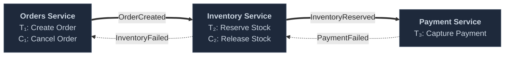
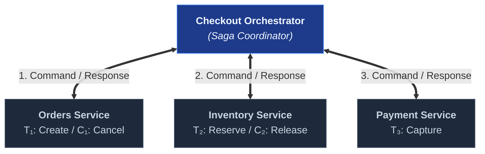
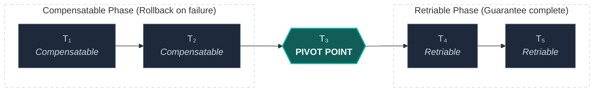
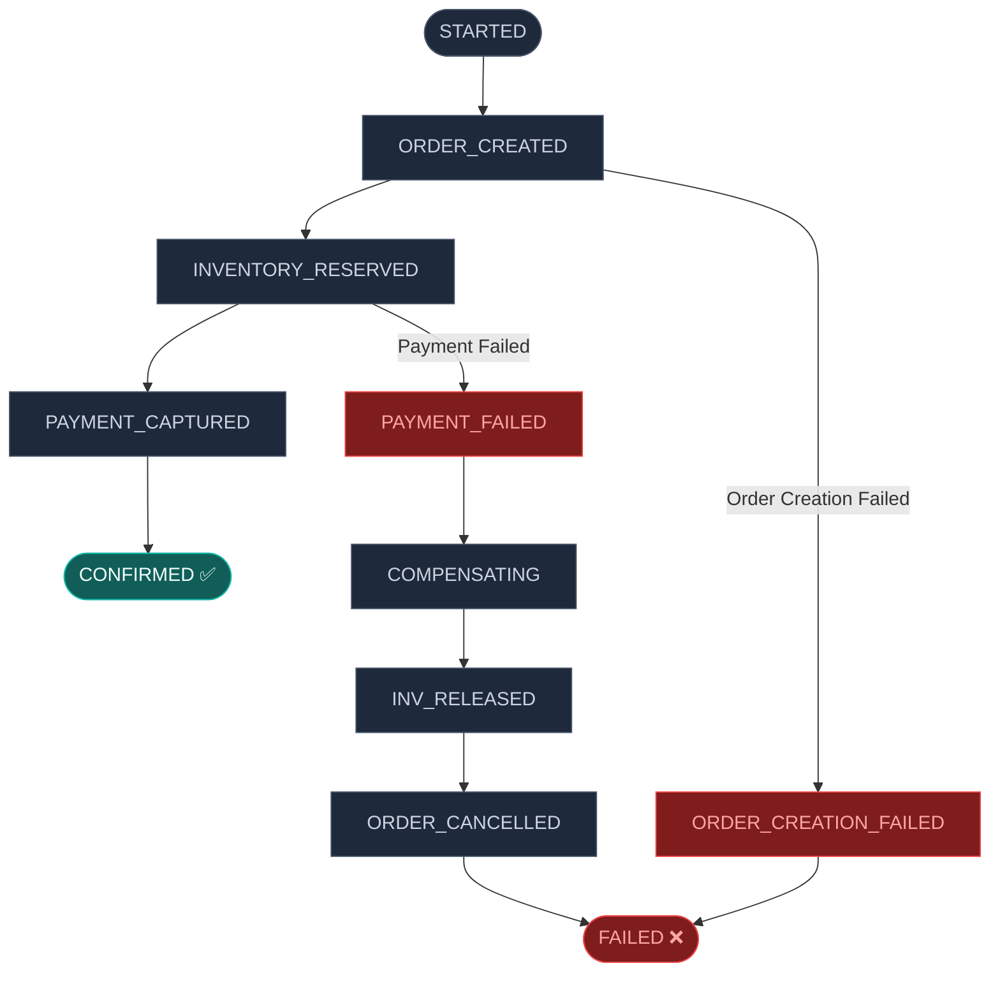

# Sagas & Compensating Transactions

A deep-dive into the Saga pattern for managing consistency across multi-step workflows that cannot be enclosed in a single ACID transaction: the original Garcia-Molina formalism, choreography vs orchestration topologies, compensating transaction design, the semantic lock counter-measure, and failure mode analysis.

> _Part of the [Consistency](CONSISTENCY-FOUNDATIONS.md) series. For single-database transaction isolation, see [MVCC & Isolation Levels](../concurrency/MVCC-AND-ISOLATION.md). For idempotency in saga steps, see [Idempotency](IDEMPOTENCY.md)._

---

## 1. The Problem — Transactions That Span Boundaries

> _Source: Garcia-Molina, H. & Salem, K. (1987). "Sagas." Proceedings of ACM SIGMOD, pp. 249–259._

ACID transactions guarantee atomicity within a single database: either all changes commit or none do. But many business workflows span **multiple transactional boundaries** — different database tables owned by different bounded contexts, external API calls, or asynchronous queue operations.

**Example — E-commerce checkout**:

```
Step 1: Create Order         (Orders context — DB transaction)
Step 2: Reserve Inventory    (Inventory context — DB transaction)
Step 3: Capture Payment      (External payment provider — HTTP call)
Step 4: Confirm Order        (Orders context — DB transaction)
Step 5: Send Confirmation    (Notification service — async job)
```

A single ACID transaction **cannot** span all five steps because:

- Steps 1, 2, and 4 may involve different aggregate roots (DDD boundary).
- Step 3 is an external HTTP call — it cannot participate in a database transaction.
- Step 5 is asynchronous — it must not block the checkout response.
- Holding a database transaction open across HTTP calls causes **connection starvation** (the connection is held idle for the duration of the external call).

---

## 2. The Saga Pattern

A **saga** is a sequence of local transactions (T₁, T₂, ..., Tₙ) where each transaction updates a single service/context and publishes an event or command to trigger the next step. If any step fails, the saga executes **compensating transactions** (C₁, C₂, ..., Cₖ) in reverse order to undo the effects of the preceding successful steps.

```
Forward flow (happy path):
  T₁ → T₂ → T₃ → T₄ → T₅ → SUCCESS

Failure at T₃:
  T₁ → T₂ → T₃ ✗ → C₂ → C₁ → COMPENSATED

Each Tᵢ is a LOCAL transaction (ACID within its own database).
Each Cᵢ is a COMPENSATING transaction that semantically undoes Tᵢ.
```

> **Key distinction**: Compensating transactions do not "roll back" in the database sense — they are **new forward transactions** that logically reverse the effect. For example, the compensation for "reserve inventory" is "release inventory," not a database `ROLLBACK`.

### 2.1 Saga Guarantees

| Property        | ACID Transaction                                                                | Saga                                                                                                    |
| :-------------- | :------------------------------------------------------------------------------ | :------------------------------------------------------------------------------------------------------ |
| **Atomicity**   | All-or-nothing (database enforced)                                              | All-or-compensate (application enforced)                                                                |
| **Consistency** | Database constraints guarantee valid end state                                  | Business logic in compensating transactions must restore a valid state                                  |
| **Isolation**   | Other transactions see either the before or after state, never the intermediate | **No isolation** — intermediate states are visible to concurrent operations (the "dirty read" of sagas) |
| **Durability**  | Committed changes survive crashes                                               | Each local transaction is durable individually                                                          |

> **The isolation gap**: This is the most significant difference between ACID and sagas. During saga execution, other transactions can observe **partially completed** state — e.g., an order exists but inventory is not yet reserved. This requires careful handling. See §5 (Semantic Locks).

---

## 3. Saga Topologies

### 3.1 Choreography (Event-Driven)

Each step publishes a domain event. The next step's service subscribes to that event and acts. There is no central coordinator — each service knows what event triggers its participation and what event it publishes on completion.



| Advantage                                                              | Disadvantage                                                                                       |
| :--------------------------------------------------------------------- | :------------------------------------------------------------------------------------------------- |
| Loose coupling — services know only about events, not about each other | **Difficult to understand** — the workflow is distributed across multiple services' event handlers |
| No single point of failure (no coordinator)                            | **Hard to debug** — tracing a saga's progress requires correlating events across services          |
| Natural fit for event-driven architectures                             | **Cyclic dependencies** — services may inadvertently create circular event chains                  |
| Easy to add new steps (new subscriber)                                 | **No global view** — no single place shows the saga's current state                                |

### 3.2 Orchestration (Command-Driven)

A central **orchestrator** (saga coordinator) controls the workflow. It sends commands to each service, waits for the response, and decides the next step. The orchestrator maintains the saga's state and is responsible for triggering compensations on failure.



| Advantage                                                                            | Disadvantage                                                     |
| :----------------------------------------------------------------------------------- | :--------------------------------------------------------------- |
| **Easy to understand** — the entire workflow is in one place                         | Single point of failure (the orchestrator)                       |
| **Easy to debug** — saga state is tracked centrally                                  | Tighter coupling — the orchestrator knows about all participants |
| **Clear control flow** — sequential, conditional, parallel steps are straightforward | Risk of becoming a "god object" if not properly bounded          |
| **Global view** — saga status is queryable                                           | Orchestrator must be durable (crash recovery)                    |

### 3.3 Choosing Between Choreography and Orchestration

| Factor                      | Choreography                           | Orchestration                                        |
| :-------------------------- | :------------------------------------- | :--------------------------------------------------- |
| **Number of steps**         | 2-3 steps                              | 4+ steps                                             |
| **Complexity of flow**      | Linear (A → B → C)                     | Conditional, branching, or parallel                  |
| **Team ownership**          | Each team owns a service independently | One team owns the workflow                           |
| **Observability needs**     | Low (simple flows are self-evident)    | High (complex flows need central tracking)           |
| **Compensation complexity** | Simple (reverse the chain)             | Complex (conditional compensation, partial rollback) |

> **Recommendation for monolithic modular architectures**: Orchestration is strongly preferred. The orchestrator is co-located with the services (same process), so the "single point of failure" concern is moot. The observability and debuggability benefits are significant.

---

## 4. Compensating Transaction Design

### 4.1 Properties of a Good Compensation

| Property                      | Requirement                                                                                                                                                                  |
| :---------------------------- | :--------------------------------------------------------------------------------------------------------------------------------------------------------------------------- |
| **Semantic inverse**          | The compensation must logically reverse the effect of the forward transaction. `ReserveInventory` → `ReleaseInventory`. `CapturePayment` → `RefundPayment`.                  |
| **Idempotent**                | The compensation must be safe to execute multiple times (the saga orchestrator may retry it). See [Idempotency](IDEMPOTENCY.md).                                             |
| **Commutative with retries**  | If the forward transaction is retried after a compensation, the system must not reach an inconsistent state. Use status checks before acting.                                |
| **Non-failing** (best effort) | Compensations should be designed to succeed. If a compensation fails, the saga enters a **stuck** state requiring manual intervention. Use retries with exponential backoff. |

### 4.2 Not All Steps Are Compensatable

| Step Type                                        | Compensatable?         | Strategy                                                                                                                                    |
| :----------------------------------------------- | :--------------------- | :------------------------------------------------------------------------------------------------------------------------------------------ |
| **Database write** (create order, reserve stock) | ✅ Yes                 | Write a compensating transaction (cancel order, release stock)                                                                              |
| **Payment capture**                              | ✅ Yes (within window) | Issue a refund. Most payment providers support refunds for a limited window.                                                                |
| **Email/SMS sent**                               | ❌ No                  | You cannot unsend a message. Strategy: delay sending until the saga completes, or send a follow-up correction.                              |
| **External API call** (non-reversible)           | ❌ Possibly not        | Check if the external API supports cancellation. If not, the step is a **pivot point** — it must be placed as late as possible in the saga. |

### 4.3 The Pivot Transaction

The **pivot transaction** is the step in a saga after which the saga is guaranteed to complete (no more compensations needed). Steps before the pivot are compensatable; steps after the pivot are **retriable** (they must eventually succeed).



**Design rule**: Place non-compensatable steps (sending emails, calling non-reversible external APIs) **after** the pivot transaction, as retriable steps.

---

## 5. Semantic Locks — Mitigating the Isolation Gap

> _Source: Richardson, C. (2018). Microservices Patterns. Manning. §4.3.1: "Counter-measures for handling the lack of isolation."_

Since sagas lack the isolation property of ACID transactions, intermediate states are visible to concurrent operations. **Semantic locks** are a counter-measure: a flag on a resource indicating that a saga is in progress and the resource should be treated differently.

```sql
-- Order has a semantic lock: status = 'PENDING_CHECKOUT'
-- Other operations check this status before acting:

-- ❌ Prevents: admin cancelling an order mid-checkout
-- "Cannot cancel an order in PENDING_CHECKOUT state — a saga is in progress."

-- ❌ Prevents: customer modifying cart during checkout
-- "Cart is locked for checkout. Please wait or start a new checkout."
```

### 5.1 Semantic Lock Lifecycle

```
1. Saga starts    → Set resource status to PENDING_* (semantic lock acquired)
2. Saga succeeds  → Set resource status to final state (lock released)
3. Saga fails     → Compensation sets resource status back (lock released)
4. Saga stalls    → Timeout mechanism detects stuck sagas and triggers cleanup
```

### 5.2 Other Counter-Measures

| Counter-Measure         | How It Works                                                                   | Example                                                                                        |
| :---------------------- | :----------------------------------------------------------------------------- | :--------------------------------------------------------------------------------------------- |
| **Semantic lock**       | Flag on the resource indicating saga-in-progress                               | `order.status = 'PENDING_CHECKOUT'` — other operations refuse to act                           |
| **Commutative updates** | Design updates to be order-independent                                         | `INCREMENT balance BY 10` commutes with `INCREMENT balance BY 5`                               |
| **Pessimistic view**    | Re-read and re-validate data at each saga step                                 | Before capturing payment, re-check that the order still exists and inventory is still reserved |
| **Reread value**        | Before writing, re-read the current value and abort if it changed unexpectedly | Version column check at each step — if the version changed, another saga interfered            |
| **Version file**        | Maintain a record of saga steps completed, read by downstream steps            | Saga state table tracks which steps have completed                                             |

---

## 6. Saga State Machine

A well-designed saga orchestrator models the saga as a **state machine**:



Each state transition is persisted to the database. On crash recovery, the orchestrator loads the last persisted state and resumes from that point.

---

## 7. Saga Failure Handling Matrix

| Failure Point                            | Forward Steps Completed | Compensation Required                     | Recovery Strategy                                                                     |
| :--------------------------------------- | :---------------------- | :---------------------------------------- | :------------------------------------------------------------------------------------ |
| T₁ fails (order creation)                | None                    | None                                      | Return error to client. No saga state to clean up.                                    |
| T₂ fails (inventory reservation)         | T₁ (order created)      | C₁ (cancel order)                         | Orchestrator triggers C₁.                                                             |
| T₃ fails (payment capture)               | T₁, T₂                  | C₂ (release inventory), C₁ (cancel order) | Compensate in reverse order.                                                          |
| T₃ succeeds but T₄ fails (confirm order) | T₁, T₂, T₃              | T₄ is a retriable step (after pivot)      | Retry T₄ with exponential backoff.                                                    |
| Orchestrator crashes                     | Unknown                 | Unknown                                   | Load last persisted state. Resume or compensate based on state.                       |
| Compensation fails                       | T₁, ..., Tₖ             | Cₖ fails                                  | Retry compensation. If retries exhausted, flag saga as STUCK for manual intervention. |

---

## 8. References

- Garcia-Molina, H. & Salem, K. (1987). "Sagas." _Proceedings of ACM SIGMOD_, pp. 249–259. The foundational paper defining the Saga pattern.
- Richardson, C. (2018). _Microservices Patterns_. Manning. Chapter 4: "Managing Transactions with Sagas." The most practical modern treatment of sagas in service-oriented architectures.
- Vernon, V. (2013). _Implementing Domain-Driven Design_. Addison-Wesley. Chapter 8: Long-running processes and domain events.
- Hohpe, G. & Woolf, B. (2003). _Enterprise Integration Patterns_. Addison-Wesley. Process Manager pattern (§7).
- Kleppmann, M. (2017). _Designing Data-Intensive Applications_. O'Reilly. §9.4: "Distributed Transactions and Consensus," §12.4: "Unbundling Databases."
- Helland, P. (2007). "Life beyond Distributed Transactions: An Apostate's Opinion." _Proceedings of CIDR_. Argues that in large-scale systems, distributed transactions are impractical and sagas with idempotent operations are the pragmatic alternative.
