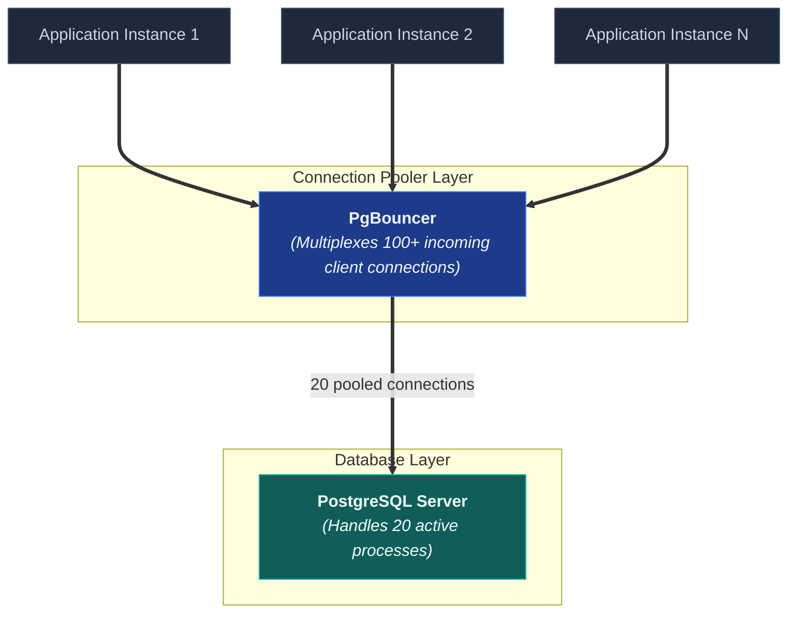
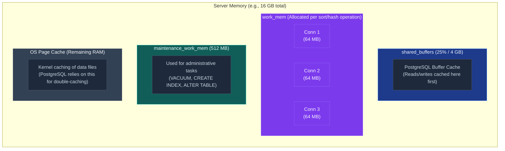
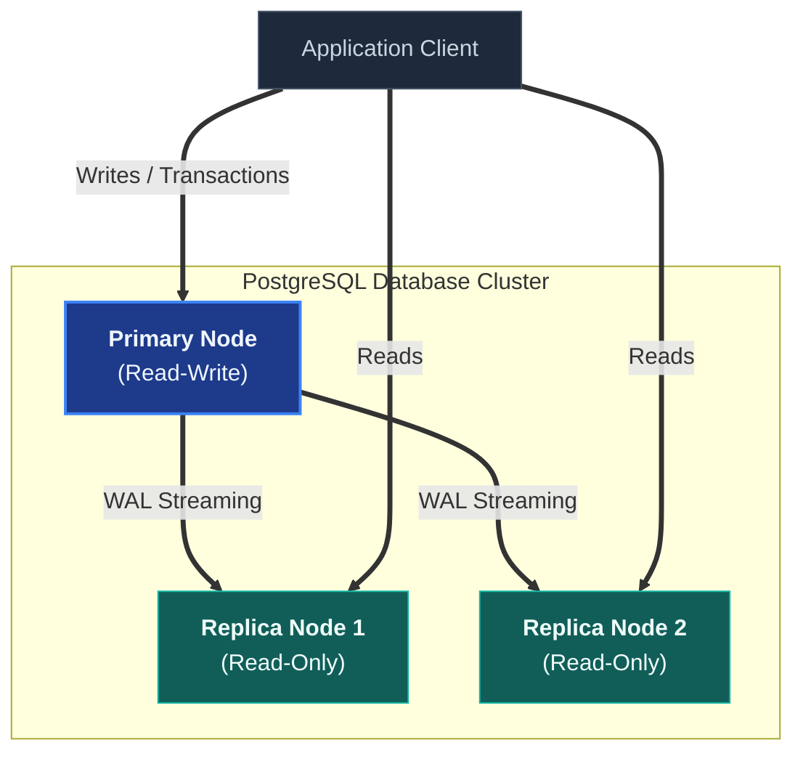

# Connection & Replication

A deep-dive into PostgreSQL connection management and replication: connection pool sizing, PgBouncer external pooling, PostgreSQL memory configuration (`shared_buffers`, `work_mem`, `effective_cache_size`), streaming replication, logical replication, read replica routing, and the consistency implications of read replicas.

> _Part of the [Database Performance](PERFORMANCE-FOUNDATIONS.md) series. For consistency implications of replication, see [Eventual Consistency](../consistency/EVENTUAL-CONSISTENCY.md)._

---

## 1. Connection Pooling

> _Source: PostgreSQL Wiki, "Number of Database Connections." https://wiki.postgresql.org/wiki/Number_Of_Database_Connections_

### 1.1 Why Connection Pooling Matters

Each PostgreSQL connection consumes approximately **5-10 MB of memory** (backend process, shared buffer references, session state). PostgreSQL's maximum connections default (`max_connections = 100`) is conservative because:

1. Each connection is a **separate OS process** (process-per-connection, not threads).
2. Context switching between hundreds of processes degrades CPU cache performance.
3. Lock contention on shared structures increases with connection count.

> _"The optimal number of active database connections is typically: `connections = (2 × CPU cores) + number_of_disks`. More connections reduce throughput."_
> — PostgreSQL Wiki

### 1.2 Application-Level Pooling (TypeORM)

```typescript
{
  type: 'postgres',
  host: process.env.DB_HOST,
  port: 5432,
  extra: {
    max: 20,                        // Max clients in pool
    min: 5,                         // Min idle clients
    idleTimeoutMillis: 30000,       // Close idle clients after 30s
    connectionTimeoutMillis: 5000,  // Fail if no connection available in 5s
    statement_timeout: 30000,       // Kill queries longer than 30s
  }
}
```

### 1.3 Pool Sizing Guidelines

| Parameter                     | Guideline                                                  | Rationale                                                               |
| :---------------------------- | :--------------------------------------------------------- | :---------------------------------------------------------------------- |
| **`max`**                     | `(2 × DB CPU cores) + 1`, divided across all app instances | Beyond this, context-switching overhead exceeds parallelism benefit.    |
| **`min`**                     | 2-5                                                        | Keeps warm connections available (~10ms saved per new connection).      |
| **`idleTimeoutMillis`**       | 30,000-60,000ms                                            | Reclaims idle connections. Too short → churn; too long → wasted memory. |
| **`connectionTimeoutMillis`** | 3,000-10,000ms                                             | Fail fast under load. Prevents request queue buildup.                   |
| **`statement_timeout`**       | 10,000-60,000ms                                            | Kills runaway queries. Prevents connection starvation.                  |

---

## 2. External Connection Pooler (PgBouncer)

For high-connection deployments (many app instances, serverless), **PgBouncer** multiplexes application connections into fewer PostgreSQL connections:



### 2.1 Pooling Modes

| Mode            | Description                                                                  | Compatibility                                                                                          |
| :-------------- | :--------------------------------------------------------------------------- | :----------------------------------------------------------------------------------------------------- |
| **Session**     | One PgBouncer connection → one PostgreSQL connection for the entire session. | Full — all features work.                                                                              |
| **Transaction** | Connection returned to pool after each transaction.                          | High — incompatible with `SET`, session-level prepared statements, advisory locks across transactions. |
| **Statement**   | Connection returned after each statement.                                    | Limited — incompatible with multi-statement transactions.                                              |

> **Recommendation for TypeORM**: Use `transaction` mode. Set `prepareStatements: false` in TypeORM config. Avoid session-scoped `SET` commands.

---

## 3. PostgreSQL Memory Configuration

### 3.1 Key Memory Parameters



| Parameter                  | Default | Recommendation                                      | Notes                                                                                                                                                                                                                               |
| :------------------------- | :------ | :-------------------------------------------------- | :---------------------------------------------------------------------------------------------------------------------------------------------------------------------------------------------------------------------------------- |
| **`shared_buffers`**       | 128 MB  | **25% of total RAM** (e.g., 4 GB on a 16 GB server) | PostgreSQL's internal page cache. Beyond ~40% of RAM, returns diminish because the OS page cache becomes less effective.                                                                                                            |
| **`work_mem`**             | 4 MB    | **32-128 MB** for typical workloads                 | Memory for sorts, hashes, and bitmap operations. **Allocated per-operation, not per-connection** — a complex query with 5 sort nodes allocates 5 × `work_mem`. Set conservatively globally; increase per-session for heavy queries. |
| **`maintenance_work_mem`** | 64 MB   | **256 MB - 1 GB**                                   | Used by VACUUM, CREATE INDEX, ALTER TABLE. Higher = faster maintenance operations. Safe to set high because only a few maintenance operations run concurrently.                                                                     |
| **`effective_cache_size`** | 4 GB    | **75% of total RAM**                                | Not an allocation — just a hint to the planner about how much total cache (shared_buffers + OS page cache) is available. Affects planner decisions about index vs. sequential scans.                                                |

### 3.2 The `work_mem` Trap

```sql
-- work_mem is per-OPERATION, not per-connection
-- A query like this allocates work_mem TWICE (one per sort):
SELECT * FROM (
  SELECT * FROM orders ORDER BY created_at  -- Sort 1: allocates work_mem
) sub
ORDER BY total_amount;                      -- Sort 2: allocates work_mem

-- With work_mem = 64MB and 20 connections, worst case:
-- 20 connections × 5 sort nodes × 64MB = 6.4 GB
-- This can exhaust server memory!
```

**Rule of thumb**: `work_mem = total_RAM / (max_connections × expected_sorts_per_query × 2)`. For 16 GB RAM, 20 connections, 3 sorts: `16384 / (20 × 3 × 2) ≈ 136 MB` as an upper bound.

For specific heavy queries, set `work_mem` per-session:

```sql
SET work_mem = '256MB';
-- Run the heavy query
RESET work_mem;
```

---

## 4. Streaming Replication

> _Source: PostgreSQL Documentation, §27.2: Log-Shipping Standby Servers. https://www.postgresql.org/docs/current/warm-standby.html_

### 4.1 How It Works

Streaming replication sends WAL records from the **primary** to one or more **replicas** (standbys) in near-real-time:

```
Primary                              Replica(s)
───────                              ──────────
Writes data → WAL record created
              WAL record sent ──────► WAL record received
                                      WAL record replayed
                                      → Data visible on replica

Replication lag: typically 10-100ms (network + replay time)
```

### 4.2 Synchronous vs. Asynchronous

| Mode                       | Behaviour                                                                        | Durability                                                     | Latency                                         |
| :------------------------- | :------------------------------------------------------------------------------- | :------------------------------------------------------------- | :---------------------------------------------- |
| **Asynchronous** (default) | Primary commits without waiting for replica.                                     | Data may be lost if primary crashes before replica catches up. | Lowest write latency.                           |
| **Synchronous**            | Primary waits for at least one replica to confirm WAL receipt before committing. | Zero data loss (committed data exists on 2+ nodes).            | Higher write latency (adds network round-trip). |

### 4.3 Use Cases

| Use Case              | Recommendation                                                                                      |
| :-------------------- | :-------------------------------------------------------------------------------------------------- |
| **Read scaling**      | Route read queries to replicas, writes to primary. Reduces primary load.                            |
| **High availability** | Promote a replica to primary on failover. Near-zero downtime.                                       |
| **Disaster recovery** | Cross-region replica. Async replication is typical (sync adds cross-region latency to every write). |
| **Reporting**         | Run heavy analytical queries on a replica without impacting production write performance.           |

---

## 5. Logical Replication

> _Source: PostgreSQL Documentation, §31: Logical Replication. https://www.postgresql.org/docs/current/logical-replication.html_

### 5.1 Streaming vs. Logical Replication

| Aspect                  | Streaming Replication                   | Logical Replication                                |
| :---------------------- | :-------------------------------------- | :------------------------------------------------- |
| **Unit of replication** | Entire database cluster (all databases) | Specific tables or schemas                         |
| **Replica writability** | Read-only                               | Writable (independent database)                    |
| **Cross-version**       | Must be same major version              | Can replicate across different PostgreSQL versions |
| **Use case**            | HA failover, read replicas              | Selective data sharing, CDC, migration             |
| **Overhead**            | Lower (binary WAL shipping)             | Higher (logical decoding)                          |

### 5.2 Change Data Capture (CDC)

Logical replication enables **Change Data Capture** — streaming database changes to external systems:

```
PostgreSQL (logical replication slot)
     │
     ├── Debezium / pgoutput → Kafka → Analytics pipeline
     ├── Debezium / pgoutput → Kafka → Search index (Elasticsearch)
     └── Direct logical subscriber → Another PostgreSQL instance
```

---

## 6. Read Replica Routing

### 6.1 Architecture



### 6.2 TypeORM Read/Write Splitting

```typescript
const dataSource = new DataSource({
  type: 'postgres',
  replication: {
    master: {
      host: 'primary.db.example.com',
      port: 5432,
      username: 'app',
      password: '...',
      database: 'store',
    },
    slaves: [
      {
        host: 'replica1.db.example.com',
        port: 5432,
        username: 'app',
        password: '...',
        database: 'store',
      },
      {
        host: 'replica2.db.example.com',
        port: 5432,
        username: 'app',
        password: '...',
        database: 'store',
      },
    ],
  },
});

// TypeORM automatically routes:
//   - QueryBuilder with .getMany(), .getOne() → replica
//   - .save(), .update(), .delete() → primary
//   - Transactions → primary
```

### 6.3 Read-After-Write Consistency with Replicas

Replicas introduce **replication lag** — the user might not see their own writes. See [Eventual Consistency](../consistency/EVENTUAL-CONSISTENCY.md) §3.2 for strategies:

```typescript
// After a write, force reads from primary for this user briefly
await redis.set(`read-primary:${userId}`, '1', 'EX', 5); // 5s window

// Query handler checks this flag
const usePrimary = await redis.get(`read-primary:${userId}`);
const queryRunner = usePrimary
  ? dataSource.createQueryRunner('master')
  : dataSource.createQueryRunner('slave');
```

---

## 7. References

- PostgreSQL Wiki. "Number of Database Connections." https://wiki.postgresql.org/wiki/Number_Of_Database_Connections
- PostgreSQL Documentation. _§20.4: Resource Consumption_. https://www.postgresql.org/docs/current/runtime-config-resource.html
- PostgreSQL Documentation. _§27: High Availability, Load Balancing, and Replication_. https://www.postgresql.org/docs/current/high-availability.html
- PostgreSQL Documentation. _§31: Logical Replication_. https://www.postgresql.org/docs/current/logical-replication.html
- PgBouncer Documentation. https://www.pgbouncer.org/config.html
- Kleppmann, M. (2017). _Designing Data-Intensive Applications_. O'Reilly. Chapter 5: "Replication." Chapter 6: "Partitioning."
- TypeORM. _Read/Write Splitting (Replication)_. https://typeorm.io/multiple-data-sources#replication
