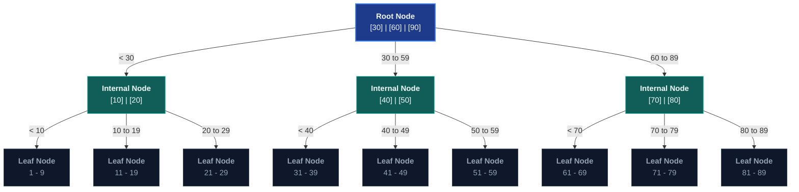

# Index Internals

A deep-dive into the internal structure and behaviour of PostgreSQL's index types: B-tree (the default), Hash, GIN (Generalised Inverted Index), GiST (Generalised Search Tree), and BRIN (Block Range INdex). Each type is examined in terms of its data structure, supported operations, time complexity, and appropriate use cases.

> _Part of the [Database Performance](PERFORMANCE-FOUNDATIONS.md) series. For index design strategy (column ordering, partial indexes, covering indexes), see [Index Design](INDEX-DESIGN.md)._

---

## 1. B-tree Indexes: Structure and Behaviour

> _Source: Comer, D. (1979). "The Ubiquitous B-Tree." ACM Computing Surveys, 11(2), pp. 121-137._

The B-tree (Balanced Tree) is PostgreSQL's default and most versatile index type. It maintains sorted data and allows searches, sequential access, insertions, and deletions in **O(log n)** time.

### 1.1 Structure



### 1.2 Properties

| Property                | Value                                                                                           |
| :---------------------- | :---------------------------------------------------------------------------------------------- |
| **Balanced**            | All leaf nodes at the same depth. Lookup cost is always O(log n).                               |
| **Fill factor**         | Default 90% for leaf pages. Configurable via `WITH (fillfactor = N)`.                           |
| **Sorted**              | Entries within leaf pages are in sort order. Adjacent leaves are linked for range scans.        |
| **Deduplication**       | Since PostgreSQL 13, duplicate keys share a single entry with a posting list of TIDs (§67.4.3). |
| **Supported operators** | `<`, `<=`, `=`, `>=`, `>`, `BETWEEN`, `IN`, `IS NULL`, anchored `LIKE 'prefix%'`                |

### 1.3 Operations Complexity

| Operation                                        | Complexity         | Explanation                                                       |
| :----------------------------------------------- | :----------------- | :---------------------------------------------------------------- |
| **Point lookup** (`WHERE id = 42`)               | O(log n)           | Root to leaf traversal. 10M rows ≈ 4 page reads.                  |
| **Range scan** (`WHERE price BETWEEN 10 AND 50`) | O(log n + k)       | O(log n) to find start, O(k) sequential leaf reads for k matches. |
| **Insert**                                       | O(log n) amortised | Leaf insert; page split on overflow (cascades rarely).            |
| **Delete**                                       | O(log n)           | Mark entry dead. Cleaned by VACUUM.                               |

### 1.4 Multi-Column B-tree Behaviour

A composite index on `(A, B, C)` sorts lexicographically. The **leftmost prefix rule** determines which queries can use the index:

| Query Predicate                   | Uses Index? | Explanation                          |
| :-------------------------------- | :---------- | :----------------------------------- |
| `WHERE A = ?`                     | ✅          | First column.                        |
| `WHERE A = ? AND B = ?`           | ✅          | First two columns.                   |
| `WHERE A = ? AND B = ? AND C > ?` | ✅          | All three (range on last).           |
| `WHERE B = ?`                     | ❌          | Skips the first column.              |
| `WHERE A = ? AND C > ?`           | ⚠️ Partial  | Uses A only; cannot skip B to use C. |

For composite index column ordering strategy, see [Index Design](INDEX-DESIGN.md) §1.

---

## 2. Hash Indexes

Hash indexes map key values to buckets via a hash function. They support **only equality** (`=`).

```sql
CREATE INDEX idx_sessions_token ON sessions USING hash (session_token);
```

| Aspect                  | Detail                                                                                         |
| :---------------------- | :--------------------------------------------------------------------------------------------- |
| **Supported operators** | `=` only. No range queries, no sorting, no pattern matching.                                   |
| **Crash safety**        | WAL-logged since PostgreSQL 10. Prior versions were unsafe after crashes.                      |
| **Size**                | Slightly smaller than B-tree for very large keys (long strings).                               |
| **When to use**         | Large, high-cardinality equality-only lookups (session tokens, API keys).                      |
| **When NOT to use**     | If any query needs `>`, `<`, `BETWEEN`, or `ORDER BY`. B-tree handles equality nearly as well. |

---

## 3. GIN (Generalised Inverted Index)

> _Source: PostgreSQL Documentation, §70: GIN Indexes. https://www.postgresql.org/docs/current/gin.html_

GIN indexes map each **element** (array member, JSON key, lexeme) to the set of rows containing that element. Designed for multi-valued columns.

```
Conceptual structure: GIN on a tags[] column:

  "electronics" → {row_1, row_3, row_7}
  "sale"        → {row_1, row_2}
  "premium"     → {row_3, row_5}
  "clearance"   → {row_2}
```

### 3.1 Use Cases

```sql
-- JSONB containment
CREATE INDEX idx_products_metadata ON products USING gin (metadata jsonb_path_ops);
-- Supports: WHERE metadata @> '{"category": "electronics"}'

-- Array containment
CREATE INDEX idx_products_tags ON products USING gin (tags);
-- Supports: WHERE tags @> ARRAY['sale', 'electronics']

-- Full-text search
CREATE INDEX idx_products_search
ON products USING gin (to_tsvector('english', name || ' ' || description));
-- Supports: WHERE ... @@ to_tsquery('laptop & gaming')

-- Trigram similarity (pg_trgm extension)
CREATE INDEX idx_products_name_trgm ON products USING gin (name gin_trgm_ops);
-- Supports: WHERE name ILIKE '%search%' (unanchored pattern matching)
```

### 3.2 Trade-Offs

| Aspect            | GIN                                       | B-tree                       |
| :---------------- | :---------------------------------------- | :--------------------------- | ------------------------------------------ |
| **Build time**    | Slower (index every element in every row) | Faster (one entry per row)   |
| **Insert time**   | Slower (element extraction per element)   | Faster (single insert)       |
| **Lookup time**   | Very fast for containment queries         | Very fast for equality/range |
| **Disk size**     | Larger (one entry per element)            | Smaller                      |
| **Supported ops** | `@>`, `<@`, `?`, `?&`, `?                 | `, `@@`                      | `=`, `<`, `>`, `BETWEEN`, `LIKE 'prefix%'` |

---

## 4. GiST (Generalised Search Tree)

> _Source: PostgreSQL Documentation, §71: GiST Indexes. https://www.postgresql.org/docs/current/gist.html_

GiST indexes support complex data types with non-trivial comparison semantics: geometric shapes, ranges, network addresses, and full-text search (as a GIN alternative).

```sql
-- Range overlap queries
CREATE INDEX idx_reservations_period ON reservations USING gist (reserved_period);
-- Supports: WHERE reserved_period && '[2024-01-01, 2024-02-01)' (overlap operator)

-- Nearest-neighbour queries
CREATE INDEX idx_stores_location ON stores USING gist (location);
-- Supports: ORDER BY location <-> point(40.7128, -74.0060) LIMIT 10
```

**Key difference from GIN**: GiST indexes are **lossy**: they may return false positives that are rechecked against actual data. GiST is better for insert-heavy workloads; GIN is better for read-heavy workloads.

---

## 5. BRIN (Block Range INdex)

> _Source: PostgreSQL Documentation, §72: BRIN Indexes. https://www.postgresql.org/docs/current/brin.html_

BRIN indexes store summary information (min/max values) for ranges of physical table blocks. They are extremely compact but only effective when physical row order correlates with the indexed column.

```sql
CREATE INDEX idx_audit_logs_created ON audit_logs USING brin (created_at);
-- Size: ~0.1% of equivalent B-tree
```

| Aspect              | Detail                                                                                                                         |
| :------------------ | :----------------------------------------------------------------------------------------------------------------------------- |
| **When to use**     | Append-only or time-series tables. Monotonically increasing columns (timestamps, serial IDs).                                  |
| **When NOT to use** | Tables with frequent updates or random inserts (physical order diverges from logical order).                                   |
| **How it works**    | Stores min/max per block range (default 128 pages). Eliminates ranges that can't contain matches, then scans remaining blocks. |
| **Size**            | Orders of magnitude smaller than B-tree. Typically 1-2 pages per 128 data pages.                                               |
| **Precision**       | Coarse-grained. BRIN eliminates obviously irrelevant blocks but doesn't pinpoint exact rows.                                   |

---

## 6. Index Type Selection Guide

| Query Pattern                        | Best Index Type               | Why                                                                    |
| :----------------------------------- | :---------------------------- | :--------------------------------------------------------------------- |
| Equality and range on scalar columns | **B-tree**                    | Default, most versatile. Handles `=`, `<`, `>`, `BETWEEN`, `ORDER BY`. |
| Equality-only on large keys          | **Hash**                      | Marginally smaller than B-tree for large keys.                         |
| JSONB containment (`@>`)             | **GIN** with `jsonb_path_ops` | Indexes JSON paths for containment queries.                            |
| Array containment (`@>`)             | **GIN**                       | Indexes individual array elements.                                     |
| Full-text search (`@@`)              | **GIN**                       | Indexes tsvector lexemes for fast text search.                         |
| Unanchored `LIKE '%pattern%'`        | **GIN** with `gin_trgm_ops`   | Trigram decomposition enables substring matching.                      |
| Geometric/range overlap (`&&`)       | **GiST**                      | Supports bounding-box containment and overlap operators.               |
| Nearest-neighbour (`<->`)            | **GiST**                      | Supports distance-ordered retrieval.                                   |
| Time-series / append-only timestamps | **BRIN**                      | Extremely compact for naturally ordered data.                          |

---

## 7. References

- Comer, D. (1979). "The Ubiquitous B-Tree." _ACM Computing Surveys_, 11(2), pp. 121-137. DOI: 10.1145/356770.356776
- Graefe, G. (2011). "Modern B-Tree Techniques." _Foundations and Trends in Databases_, 3(4), pp. 203-402.
- PostgreSQL Documentation. _Chapter 11: Indexes_. https://www.postgresql.org/docs/current/indexes.html
- PostgreSQL Documentation. _§67.4: B-Tree Implementation_. https://www.postgresql.org/docs/current/btree-implementation.html
- PostgreSQL Documentation. _§70: GIN Indexes_. https://www.postgresql.org/docs/current/gin.html
- PostgreSQL Documentation. _§71: GiST Indexes_. https://www.postgresql.org/docs/current/gist.html
- PostgreSQL Documentation. _§72: BRIN Indexes_. https://www.postgresql.org/docs/current/brin.html

