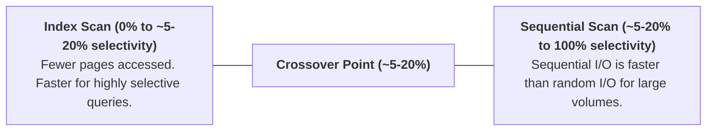
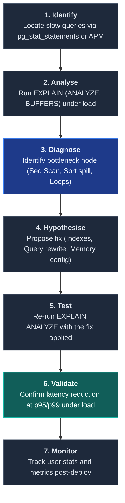
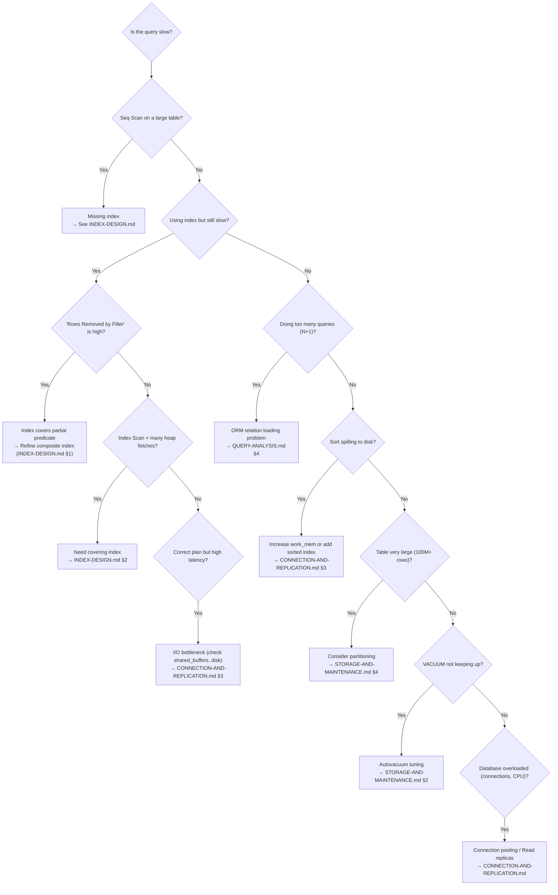

# Database Performance: Foundations

An introduction to the fundamental principles of database performance engineering: the I/O cost model, when indexes help (and when they don't), and the systematic query tuning workflow. This document serves as the hub for the performance deep-dive series.

> _This is a technology-agnostic primer. For PostgreSQL-specific internals, see the linked deep-dives._

---

## Deep-Dive Index

| Document                                                      | Scope                                                                                                                                     |
| :------------------------------------------------------------ | :---------------------------------------------------------------------------------------------------------------------------------------- |
| **[Index Internals](INDEX-INTERNALS.md)**                     | B-tree structure and complexity, Hash, GIN, GiST, and BRIN index types with trade-off analysis                                            |
| **[Index Design](INDEX-DESIGN.md)**                           | Composite column ordering, covering indexes (`INCLUDE`), partial indexes, write penalty, and applied index strategy per e-commerce module |
| **[Query Analysis](QUERY-ANALYSIS.md)**                       | `EXPLAIN ANALYZE` plan interpretation, plan node types, red flags, and the N+1 query problem                                              |
| **[Storage & Maintenance](STORAGE-AND-MAINTENANCE.md)**       | Write-Ahead Log (WAL), TOAST, autovacuum tuning, table partitioning, materialised views, and bulk operations                              |
| **[Connection & Replication](CONNECTION-AND-REPLICATION.md)** | Connection pool sizing, PgBouncer, PostgreSQL memory configuration, streaming and logical replication, and read replica routing           |

**Related series**: [Concurrency Foundations](../concurrency/CONCURRENCY-FOUNDATIONS.md) (locking and isolation: the correctness counterpart to performance)

---

## 1. The I/O Cost Model

> _Source: Ramakrishnan, R. & Gehrke, J. (2003). Database Management Systems (3rd ed.). McGraw-Hill, Chapter 8._

Database performance is fundamentally governed by the **I/O cost model**. Data resides on disk in fixed-size **pages** (typically 8 KB in PostgreSQL). The dominant cost of a query is the number of pages that must be read from disk into memory.

| Operation                             | Cost                                                                                                                                                |
| :------------------------------------ | :-------------------------------------------------------------------------------------------------------------------------------------------------- |
| **Sequential scan** (full table scan) | Reads every page of the table. Cost proportional to the number of pages: O(N/P) where N = rows and P = rows per page.                               |
| **Index scan**                        | Traverses the index tree (O(log n) pages) + reads data pages for matching rows. Cost proportional to matching rows, not total rows.                 |
| **Index-only scan**                   | Reads only index pages. The data table is not accessed. Only possible when all columns needed by the query are in the index (a **covering index**). |

> _"The single most important factor in query performance is whether the query can use an index to avoid a full table scan. The second most important factor is whether that index scan can be an index-only scan."_
> Source: Winand, M. (2012). SQL Performance Explained, p. 1.

---

## 2. When Indexes Help (and When They Don't)

| Scenario                                                   | Index Helpful? | Explanation                                                                                                  |
| :--------------------------------------------------------- | :------------- | :----------------------------------------------------------------------------------------------------------- |
| `WHERE id = 42` (equality on PK)                           | ✅ Yes         | B-tree traversal: O(log n) page reads.                                                                       |
| `WHERE status = 'ACTIVE'` (low selectivity: 80% match) | ❌ No | Planner prefers sequential scan because reading 80% via random I/O is slower than reading 100% sequentially. |
| `WHERE status = 'CANCELLED'` (high selectivity: 2% match) | ✅ Yes | Index narrows scan to a small fraction. |
| `WHERE name ILIKE '%search%'` (unanchored pattern)         | ❌ No\*        | B-tree cannot support leading-wildcard searches. Requires GIN/trigram.                                       |
| `ORDER BY created_at DESC LIMIT 10`                        | ✅ Yes         | B-tree provides pre-sorted output, avoiding a filesort.                                                      |
| `SELECT COUNT(*) FROM orders`                              | ❌ No          | Counting all rows requires visiting every live tuple (MVCC visibility check).                                |

> \*PostgreSQL's `pg_trgm` extension provides GIN trigram indexes for `LIKE '%pattern%'`. See [Index Internals](INDEX-INTERNALS.md) §3.2.

### 2.1 The Selectivity Threshold

The query planner decides between a sequential scan and an index scan based on **selectivity**: the fraction of rows the query is expected to return.

The exact crossover point depends on table size, correlation between indexed column and physical row order, and whether the data is cached in `shared_buffers`.

---

## 3. The Systematic Tuning Workflow

For each step's details: identifying slow queries (§7.2 of [Query Analysis](QUERY-ANALYSIS.md)), reading EXPLAIN plans (§1-4 of [Query Analysis](QUERY-ANALYSIS.md)), and monitoring index health (§5 of [Index Design](INDEX-DESIGN.md)).

---

## 4. Performance Decision Framework

When a query is slow, use this decision tree to identify the right deep-dive:

---

## 5. References

- Ramakrishnan, R. & Gehrke, J. (2003). _Database Management Systems_ (3rd ed.). McGraw-Hill. Chapters 8-10.
- Winand, M. (2012). _SQL Performance Explained_. Self-published. ISBN: 978-3-9503078-0-2. https://use-the-index-luke.com/
- Kleppmann, M. (2017). _Designing Data-Intensive Applications_. O'Reilly. Chapter 3: "Storage and Retrieval."

