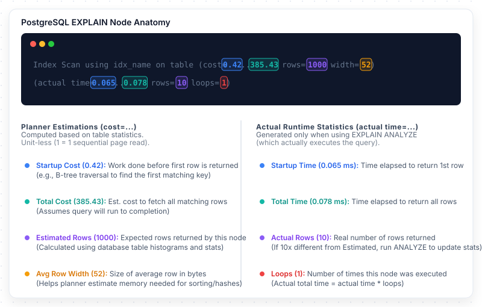

# Query Analysis

A deep-dive into PostgreSQL query execution plan interpretation: `EXPLAIN` vs `EXPLAIN ANALYZE`, reading plan trees, understanding plan node types, identifying performance red flags, and detecting the N+1 query problem in ORM-backed applications.

> _Part of the [Database Performance](PERFORMANCE-FOUNDATIONS.md) series._

---

## 1. EXPLAIN vs. EXPLAIN ANALYZE

> _Source: PostgreSQL Documentation, §14.1: Using EXPLAIN. https://www.postgresql.org/docs/current/using-explain.html_

| Command                                   | What It Does                                                   | Executes? |
| :---------------------------------------- | :------------------------------------------------------------- | :-------- |
| `EXPLAIN`                                 | Planner's **estimated** plan. Costs based on table statistics. | No        |
| `EXPLAIN ANALYZE`                         | **Actual** plan with real timing and row counts.               | Yes       |
| `EXPLAIN (ANALYZE, BUFFERS)`              | Adds shared buffer hits (cache) and reads (disk I/O).          | Yes       |
| `EXPLAIN (ANALYZE, BUFFERS, FORMAT JSON)` | Structured JSON for programmatic analysis.                     | Yes       |

> **Warning**: `EXPLAIN ANALYZE` **executes** the query. For mutations, wrap in a transaction:
>
> ```sql
> BEGIN;
> EXPLAIN ANALYZE UPDATE orders SET status = 'CANCELLED' WHERE id = 42;
> ROLLBACK;
> ```

---

## 2. Reading an EXPLAIN Plan

An `EXPLAIN` plan is a tree of **plan nodes**. Execution flows from leaf nodes (innermost) to the root (outermost).

```sql
EXPLAIN ANALYZE
SELECT o.id, o.status, u.email
FROM orders o
JOIN users u ON o.user_id = u.id
WHERE o.status = 'PENDING_PAYMENT'
ORDER BY o.created_at DESC
LIMIT 10;
```

```
Limit  (cost=0.71..12.45 rows=10 width=68) (actual time=0.089..0.134 rows=10 loops=1)
  ->  Nested Loop  (cost=0.71..1175.43 rows=1000 width=68) (actual time=0.087..0.131 rows=10 loops=1)
        ->  Index Scan Backward using idx_orders_status_created
              on orders o  (cost=0.42..385.43 rows=1000 width=52)
              (actual time=0.065..0.078 rows=10 loops=1)
              Filter: (status = 'PENDING_PAYMENT')
        ->  Index Scan using users_pkey
              on users u  (cost=0.29..0.79 rows=1 width=36)
              (actual time=0.004..0.004 rows=1 loops=10)
              Index Cond: (id = o.user_id)
Planning Time: 0.285 ms
Execution Time: 0.168 ms
```

### 2.1 Anatomy of a Plan Node



- **Estimated vs. actual rows**: When these diverge significantly (10x+), statistics are stale.
- **Loops**: For nested loops, `loops=10` means the inner node executed 10 times. Multiply `actual time × loops` for total time.

---

## 3. Plan Node Types

| Node Type             | Description                                               | Performance Implication                                                                                          |
| :-------------------- | :-------------------------------------------------------- | :--------------------------------------------------------------------------------------------------------------- |
| **Seq Scan**          | Reads every page of the table.                            | Acceptable for small tables or low selectivity. Red flag on large tables with selective predicates.              |
| **Index Scan**        | Traverses index, then fetches full row from heap.         | Good — query uses an index. Check if index-only scan is possible.                                                |
| **Index Only Scan**   | Satisfies query entirely from index.                      | Excellent — most efficient scan. Requires covering index + clean visibility map.                                 |
| **Bitmap Index Scan** | Builds TID bitmap from index, fetches in physical order.  | Good for medium selectivity (1-20%). Reduces random I/O via batching.                                            |
| **Nested Loop**       | For each outer row, scans inner input.                    | Efficient when outer is small + inner has index. Catastrophic when both are large: O(n × m).                     |
| **Hash Join**         | Builds hash table from smaller input, probes with larger. | Efficient for equi-joins. Requires enough `work_mem` for the hash table.                                         |
| **Merge Join**        | Merges two sorted inputs.                                 | Efficient when both are pre-sorted (from index scans).                                                           |
| **Sort**              | Sorts input rows.                                         | If unexpected, may indicate missing index. Check `Sort Method`: `quicksort` (memory) vs `external merge` (disk). |
| **Aggregate**         | Computes `COUNT`, `SUM`, `AVG`, etc.                      | Check input — if Seq Scan, the aggregate scans the entire table.                                                 |

---

## 4. Red Flags in Execution Plans

| Red Flag                                                | What It Means                                                        | Action                                                                                |
| :------------------------------------------------------ | :------------------------------------------------------------------- | :------------------------------------------------------------------------------------ |
| **Seq Scan on large table with selective WHERE**        | Missing index.                                                       | Create an appropriate index. See [Index Design](INDEX-DESIGN.md).                     |
| **Estimated rows ≠ actual rows (10x+)**                 | Stale statistics. Planner makes bad decisions.                       | Run `ANALYZE tablename;`                                                              |
| **Nested Loop with large outer input**                  | O(n × m) join on large datasets.                                     | Ensure inner has an index on join column. Check `work_mem` for Hash Join.             |
| **Sort with `external merge`**                          | Sort spills to disk — insufficient `work_mem`.                       | `SET work_mem = '64MB';` or add an index providing sort order.                        |
| **Bitmap Heap Scan with high "Rows Removed by Filter"** | Index covers partial predicate only.                                 | Add filter columns to the index (composite or `INCLUDE`).                             |
| **Index Scan with "Filter" removing many rows**         | Same as above — index used partially.                                | Refine index to cover all predicate columns.                                          |
| **`loops=N` with large N**                              | Inner node executes N times. If N is large, it dominates query time. | Verify N matches expected outer rows. If too high, add more selective index on outer. |

---

## 5. The N+1 Query Problem

The N+1 problem occurs when an ORM executes 1 query to fetch N parents, then N queries to fetch each parent's related children.

```
N+1 Problem — Order with OrderItems:

Query 1:   SELECT * FROM orders WHERE user_id = ?;          → 100 rows
Query 2:   SELECT * FROM order_items WHERE order_id = 'order_1'; → 3 rows
Query 3:   SELECT * FROM order_items WHERE order_id = 'order_2'; → 5 rows
...
Query 101: SELECT * FROM order_items WHERE order_id = 'order_100'; → 2 rows

Total: 101 queries instead of 1-2
```

### 5.1 Impact at Scale

| List Size | N+1 (3 relations) | Single JOIN | Overhead   |
| :-------- | :---------------- | :---------- | :--------- |
| 20 items  | 61 queries        | 1 query     | +75-150ms  |
| 50 items  | 151 queries       | 1 query     | +150-300ms |
| 100 items | 301 queries       | 1 query     | +300-600ms |

### 5.2 Detection

Enable TypeORM query logging (`logging: true`) and inspect for repeated identical queries with different parameters.

### 5.3 Solutions in TypeORM

| Solution           | Implementation                                        | Generated SQL                                                   |
| :----------------- | :---------------------------------------------------- | :-------------------------------------------------------------- |
| **Eager JOIN**     | `relations: ['orderItems']` or `.leftJoinAndSelect()` | `SELECT ... FROM orders LEFT JOIN order_items ON ...` — 1 query |
| **Subquery batch** | `@RelationId` or manual `IN` query                    | `SELECT ... WHERE order_id IN (?, ?, ...)` — 2 queries          |
| **QueryBuilder**   | `.leftJoinAndSelect('order.items', 'items')`          | Full control over columns fetched                               |

> **Recommendation**: For read-only list/search endpoints, use QueryBuilder with explicit `.leftJoinAndSelect()`. For write operations, load only the aggregate root. See also [CQRS.md](../../architecture/CQRS.md) §2.2.1.

---

## 6. Identifying Slow Queries with pg_stat_statements

```sql
CREATE EXTENSION IF NOT EXISTS pg_stat_statements;

-- Top 10 by total execution time
SELECT query, calls,
  round(total_exec_time::numeric, 2) AS total_ms,
  round(mean_exec_time::numeric, 2) AS mean_ms,
  rows
FROM pg_stat_statements
ORDER BY total_exec_time DESC LIMIT 10;

-- Top 10 by mean time (frequently called)
SELECT query, calls,
  round(mean_exec_time::numeric, 2) AS mean_ms,
  round((100.0 * shared_blks_hit /
    NULLIF(shared_blks_hit + shared_blks_read, 0))::numeric, 2) AS cache_hit_pct
FROM pg_stat_statements
WHERE calls > 100
ORDER BY mean_exec_time DESC LIMIT 10;
```

---

## 7. Common Tuning Patterns

| Problem                | Symptom                                          | Solution                                                          |
| :--------------------- | :----------------------------------------------- | :---------------------------------------------------------------- |
| Missing index          | Seq Scan on large table with selective WHERE     | Add B-tree index.                                                 |
| Wrong column order     | Index scan with "Rows Removed by Filter"         | Reorder: equality first, range last.                              |
| Stale statistics       | Estimated ≠ actual by 10x+                       | Run `ANALYZE tablename;`                                          |
| Missing covering index | Index Scan + Heap Fetch for SELECT columns       | Add `INCLUDE (columns)`.                                          |
| N+1 queries            | Repeated identical queries in app logs           | Use JOIN or batch load.                                           |
| Oversized index        | Large index, only small subset queried           | Replace with partial index.                                       |
| Sort spill to disk     | `external merge` in EXPLAIN                      | Increase `work_mem` or add sorted index.                          |
| Lock contention        | `wait_event_type = 'Lock'` in `pg_stat_activity` | See [Pessimistic Locking](../concurrency/PESSIMISTIC-LOCKING.md). |

---

## 8. References

- PostgreSQL Documentation. _§14.1: Using EXPLAIN_. https://www.postgresql.org/docs/current/using-explain.html
- PostgreSQL Documentation. _§28.2: pg_stat_statements_. https://www.postgresql.org/docs/current/pgstatstatements.html
- Winand, M. (2012). _SQL Performance Explained_. https://use-the-index-luke.com/
- Selinger, P.G. et al. (1979). "Access Path Selection in a Relational Database Management System." _Proceedings of ACM SIGMOD_, pp. 23–34. DOI: 10.1145/582095.582099
