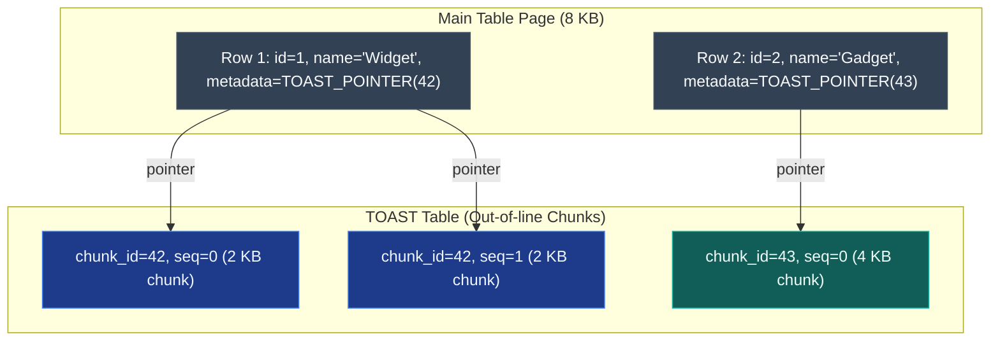

# Storage & Maintenance

A deep-dive into PostgreSQL's write-path internals and maintenance operations: the Write-Ahead Log (WAL), TOAST for oversized attributes, autovacuum tuning, table partitioning, materialised views, and bulk operation optimisation.

> _Part of the [Database Performance](PERFORMANCE-FOUNDATIONS.md) series. For read-path optimisation (indexes, EXPLAIN), see [Index Internals](INDEX-INTERNALS.md) and [Query Analysis](QUERY-ANALYSIS.md)._

---

## 1. Write-Ahead Log (WAL)

> _Source: PostgreSQL Documentation, §30: Reliability and the Write-Ahead Log. https://www.postgresql.org/docs/current/wal.html_

### 1.1 What is WAL?

The **Write-Ahead Log** (WAL) is PostgreSQL's durability mechanism. Every change to data files is first recorded in the WAL before the actual data page is modified. This ensures that committed transactions survive crashes: on recovery, PostgreSQL replays the WAL to reconstruct any changes that were committed but not yet flushed to the data files.

```
Transaction commits:
  1. Write change record to WAL buffer
  2. Flush WAL buffer to disk (fsync)  ← This is the durability guarantee
  3. Return "COMMIT OK" to client
  4. Eventually, checkpoint writes dirty data pages to disk (background)

Crash recovery:
  1. Read WAL from the last checkpoint
  2. Replay all committed changes not yet in the data files
 3. Database is consistent: no committed data lost
```

### 1.2 Why WAL Matters for Performance

| Aspect                  | Impact                                                                                                                                                                                  |
| :---------------------- | :-------------------------------------------------------------------------------------------------------------------------------------------------------------------------------------- |
| **Write amplification** | Every change is written twice: once to WAL, once to data files. This is the cost of durability. |
| **Sequential writes**   | WAL writes are **sequential** (append-only), which is fast on both SSDs and spinning disks. Data page writes are random I/O.                                                            |
| **Checkpoint pressure** | Checkpoints flush all dirty pages to disk, causing I/O spikes. Tuning `checkpoint_completion_target` (default 0.9) spreads the I/O.                                                     |
| **Replication** | WAL is the foundation of PostgreSQL streaming replication: replicas receive and replay WAL records from the primary. See [Connection & Replication](CONNECTION-AND-REPLICATION.md) §4. |

### 1.3 Key WAL Configuration Parameters

| Parameter                      | Default   | Recommendation                                                    | Impact                                                                                                               |
| :----------------------------- | :-------- | :---------------------------------------------------------------- | :------------------------------------------------------------------------------------------------------------------- |
| `wal_level`                    | `replica` | `replica` (sufficient for streaming replication)                  | `logical` adds overhead but enables logical replication/CDC                                                          |
| `max_wal_size`                 | `1GB`     | `2-4GB` for write-heavy workloads                                 | Controls checkpoint frequency. Larger = less frequent checkpoints = smoother I/O                                     |
| `min_wal_size`                 | `80MB`    | `512MB-1GB`                                                       | Prevents WAL segment recycling churn                                                                                 |
| `checkpoint_completion_target` | `0.9`     | `0.9` (keep default)                                              | Spreads checkpoint I/O over 90% of the checkpoint interval                                                           |
| `synchronous_commit` | `on` | `on` for data integrity; `off` for non-critical write-heavy paths | `off` allows the commit to return before WAL is flushed: faster but risks losing the last ~10ms of commits on crash |

---

## 2. Autovacuum Tuning

> _Source: PostgreSQL Documentation, §25.1: Routine Vacuuming. https://www.postgresql.org/docs/current/routine-vacuuming.html_

### 2.1 Why Autovacuum Matters

PostgreSQL's MVCC creates dead tuples on every UPDATE and DELETE (see [MVCC & Isolation](../concurrency/MVCC-AND-ISOLATION.md) §3). Autovacuum is the background process that:

1. **Reclaims dead tuple space**: prevents table and index bloat
2. **Updates planner statistics** (`ANALYZE`): prevents bad query plans from stale cardinality estimates
3. **Prevents transaction ID wraparound**: PostgreSQL's 32-bit transaction IDs wrap after ~4 billion transactions; VACUUM freezes old XIDs

**Consequence of insufficient autovacuum**:

| Symptom                                                    | Cause                                 | Impact                                                           |
| :--------------------------------------------------------- | :------------------------------------ | :--------------------------------------------------------------- |
| Table and index sizes grow continuously                    | Dead tuples not reclaimed             | Disk usage grows; queries slow down (more pages to scan)         |
| Query plans suddenly change                                | Statistics not updated                | Planner chooses wrong join/scan strategy                         |
| Index-only scans stop working                              | Visibility Map not updated            | Falls back to regular index scans with heap fetches              |
| `WARNING: database must be vacuumed within X transactions` | Transaction ID wraparound approaching | If ignored, PostgreSQL **shuts down** to prevent data corruption |

### 2.2 Key Autovacuum Parameters

| Parameter                         | Default   | When to Change                          | Impact                                                                                                                                 |
| :-------------------------------- | :-------- | :-------------------------------------- | :------------------------------------------------------------------------------------------------------------------------------------- |
| `autovacuum_vacuum_threshold`     | 50        | Rarely                                  | Minimum dead tuples before triggering vacuum                                                                                           |
| `autovacuum_vacuum_scale_factor` | 0.2 (20%) | **Lower for large tables** (e.g., 0.01) | Fraction of table that must be dead before vacuum triggers. For a 10M row table, 20% = 2M dead rows before vacuum runs: far too late. |
| `autovacuum_analyze_threshold`    | 50        | Rarely                                  | Minimum changes before triggering ANALYZE                                                                                              |
| `autovacuum_analyze_scale_factor` | 0.1 (10%) | Lower for large tables                  | Fraction of table that must change before statistics are refreshed                                                                     |
| `autovacuum_vacuum_cost_delay`    | 2ms       | Lower for faster vacuum (e.g., 0)       | Delay between vacuum I/O operations. Lower = vacuum runs faster but uses more I/O bandwidth.                                           |
| `autovacuum_max_workers`          | 3         | Increase if many tables need vacuuming  | Number of parallel autovacuum workers                                                                                                  |

### 2.3 Per-Table Autovacuum Tuning

For high-update tables (e.g., inventory, sessions, order_status_history), apply aggressive per-table settings:

```sql
ALTER TABLE inventory SET (
  autovacuum_vacuum_scale_factor = 0.01,    -- Trigger at 1% dead rows instead of 20%
  autovacuum_analyze_scale_factor = 0.005,  -- Refresh stats at 0.5% changes
 autovacuum_vacuum_cost_delay = 0 -- No throttling: vacuum as fast as possible
);
```

---

## 3. TOAST (The Oversized-Attribute Storage Technique)

> _Source: PostgreSQL Documentation, §73: TOAST. https://www.postgresql.org/docs/current/storage-toast.html_

### 3.1 What is TOAST?

PostgreSQL pages are fixed at 8 KB. When a row contains a column value larger than ~2 KB, PostgreSQL transparently moves it to a separate **TOAST table**: a companion table that stores oversized values in chunks.



### 3.2 TOAST Strategies

| Strategy                         | Behaviour                                              | Used For                                                                            |
| :------------------------------- | :----------------------------------------------------- | :---------------------------------------------------------------------------------- |
| `PLAIN`                          | No TOAST. Value must fit in a single page.             | Fixed-length types (`integer`, `boolean`)                                           |
| `EXTENDED` (default for varlena) | Compress first, then move to TOAST if still too large. | `text`, `varchar`, `jsonb`, `bytea`                                                 |
| `EXTERNAL`                       | Move to TOAST without compression.                     | Pre-compressed data, or when you want fast access to large values                   |
| `MAIN`                           | Compress but avoid TOAST if possible.                  | Values that benefit from compression but are usually accessed together with the row |

### 3.3 Performance Implications

| Scenario                                           | Impact                                                                                                                                   |
| :------------------------------------------------- | :--------------------------------------------------------------------------------------------------------------------------------------- |
| `SELECT *` on a table with TOAST columns           | Each row requires additional I/O to fetch the TOAST chunks. Use `SELECT specific_columns` to avoid fetching large columns unnecessarily. |
| `SELECT id, name FROM products` (no TOAST columns) | TOAST table is not accessed. Fast.                                                                                                       |
| Large JSONB metadata columns | Stored in TOAST. Indexing the JSONB with GIN doesn't require detoasting the entire value: the GIN index stores extracted keys. |
| `UPDATE` on a non-TOAST column                     | If TOAST columns are unchanged, PostgreSQL can use HOT updates (no TOAST table modification).                                            |

---

## 4. Table Partitioning

> _Source: PostgreSQL Documentation, §5.11: Table Partitioning. https://www.postgresql.org/docs/current/ddl-partitioning.html_

### 4.1 What is Partitioning?

Table partitioning divides a large table into smaller physical **partitions** that are logically a single table. Queries that filter on the partition key can skip irrelevant partitions entirely (**partition pruning**).

### 4.2 Partition Types

| Type      | Partition Key                       | Example                                                             | Use Case                                                      |
| :-------- | :---------------------------------- | :------------------------------------------------------------------ | :------------------------------------------------------------ |
| **Range** | Contiguous ranges of a column value | Monthly: `orders_2024_01`, `orders_2024_02`, ...                    | Time-series data, audit logs, orders by date                  |
| **List**  | Explicit list of values             | By status: `orders_active`, `orders_archived`                       | Categorical data with a small, fixed set of values            |
| **Hash**  | Hash of the column value            | By user_id hash: `orders_p0`, `orders_p1`, `orders_p2`, `orders_p3` | Even distribution across N partitions for parallel processing |

### 4.3 Range Partitioning Example

```sql
-- Parent table (no data stored here directly)
CREATE TABLE orders (
  id UUID NOT NULL,
  user_id UUID NOT NULL,
  status VARCHAR(50) NOT NULL,
  total_amount DECIMAL(10, 2) NOT NULL,
  created_at TIMESTAMPTZ NOT NULL
) PARTITION BY RANGE (created_at);

-- Monthly partitions
CREATE TABLE orders_2024_01 PARTITION OF orders
  FOR VALUES FROM ('2024-01-01') TO ('2024-02-01');

CREATE TABLE orders_2024_02 PARTITION OF orders
  FOR VALUES FROM ('2024-02-01') TO ('2024-03-01');
-- ...
```

### 4.4 Benefits

| Benefit                    | Explanation                                                                                                                              |
| :------------------------- | :--------------------------------------------------------------------------------------------------------------------------------------- |
| **Partition pruning**      | `WHERE created_at BETWEEN '2024-06-01' AND '2024-06-30'` scans only the June partition, skipping all others.                             |
| **Efficient bulk deletes** | `DROP TABLE orders_2024_01` is instant vs. `DELETE FROM orders WHERE created_at < '2024-02-01'` (scanning + vacuuming millions of rows). |
| **Independent vacuuming**  | Each partition is vacuumed independently. Hot partitions (current month) get frequent vacuum; cold partitions (older months) need none.  |
| **Parallel query**         | PostgreSQL can scan multiple partitions in parallel.                                                                                     |

### 4.5 When to Partition

| Factor                                     | Partition?                                              |
| :----------------------------------------- | :------------------------------------------------------ |
| Table < 10M rows | ❌ Usually not: B-tree indexes handle this efficiently |
| Table > 100M rows, time-series queries     | ✅ Range partition by date                              |
| Need to DROP old data efficiently          | ✅ Partition + DROP partition                           |
| All queries filter on the partition key    | ✅ Maximum pruning benefit                              |
| Queries rarely filter on the partition key | ❌ No pruning benefit; overhead of managing partitions  |

---

## 5. Materialised Views

A **materialised view** stores the result of a query as a physical table. Unlike a regular view (which re-executes the query on each access), a materialised view is pre-computed and must be explicitly refreshed.

```sql
-- Create a materialised view for a dashboard summary
CREATE MATERIALIZED VIEW mv_order_summary AS
SELECT
  date_trunc('day', created_at) AS order_date,
  status,
  COUNT(*) AS order_count,
  SUM(total_amount) AS total_revenue
FROM orders
GROUP BY date_trunc('day', created_at), status;

-- Create an index on the materialised view for fast lookups
CREATE INDEX idx_mv_order_summary_date ON mv_order_summary (order_date);

-- Refresh the view (blocks reads during refresh)
REFRESH MATERIALIZED VIEW mv_order_summary;

-- Refresh concurrently (allows reads during refresh, requires a UNIQUE index)
REFRESH MATERIALIZED VIEW CONCURRENTLY mv_order_summary;
```

| Aspect                 | Detail                                                                                                             |
| :--------------------- | :----------------------------------------------------------------------------------------------------------------- |
| **When to use**        | Complex aggregation queries (dashboards, reports) that are expensive to compute on every request.                  |
| **Consistency**        | The view is stale until refreshed. This is **eventual consistency** at the database level.                         |
| **Refresh strategies** | Cron-based (every N minutes), event-driven (refresh on domain event), or on-demand (API trigger).                  |
| **Concurrent refresh** | `REFRESH MATERIALIZED VIEW CONCURRENTLY` allows reads during refresh but requires a unique index and takes longer. |

---

## 6. Bulk Operations

### 6.1 `COPY` vs. `INSERT`

For loading large datasets, PostgreSQL's `COPY` command is orders of magnitude faster than individual `INSERT` statements:

| Method                                     | Speed (100K rows) | Why                                                          |
| :----------------------------------------- | :---------------- | :----------------------------------------------------------- |
| Individual `INSERT` in a loop              | ~30-60 seconds    | 100K round trips, 100K transaction commits, 100K WAL flushes |
| Batched `INSERT` (1000 rows per statement) | ~2-5 seconds      | 100 round trips, 100 WAL flushes                             |
| `COPY FROM`                                | ~0.5-1 second     | Single command, bulk WAL write, minimal overhead             |

```sql
-- COPY from a CSV file (server-side)
COPY products (id, name, price, category_id)
FROM '/path/to/products.csv'
WITH (FORMAT csv, HEADER true);

-- COPY from stdin (client-side: used by ORMs and pg drivers)
COPY products (id, name, price, category_id) FROM STDIN WITH (FORMAT csv);
```

### 6.2 `INSERT ... ON CONFLICT` (UPSERT)

Atomic create-or-update in a single statement:

```sql
-- Insert if not exists, update if exists (keyed by unique column)
INSERT INTO products (id, name, price, updated_at)
VALUES ($1, $2, $3, NOW())
ON CONFLICT (id) DO UPDATE SET
  name = EXCLUDED.name,
  price = EXCLUDED.price,
  updated_at = NOW();
```

### 6.3 Bulk Operation Best Practices

| Practice                                                            | Rationale                                                                                                   |
| :------------------------------------------------------------------ | :---------------------------------------------------------------------------------------------------------- |
| **Disable indexes before bulk load, rebuild after**                 | Indexes are updated on every insert. Dropping + rebuilding is faster for large loads.                       |
| **Use `COPY` instead of `INSERT` loops**                            | Dramatically less overhead.                                                                                 |
| **Wrap in a single transaction**                                    | Avoids per-statement commit overhead.                                                                       |
| **Increase `maintenance_work_mem` for index rebuild**               | Larger memory = faster index build. `SET maintenance_work_mem = '512MB';`                                   |
| **Disable autovacuum during load, run manual VACUUM ANALYZE after** | Prevents autovacuum from interfering with the load.                                                         |
| **Use `UNLOGGED` tables for staging**                               | No WAL writes = faster inserts. Data is lost on crash, but this is acceptable for temporary staging tables. |

---

## 7. References

- PostgreSQL Documentation. _§30: Reliability and the Write-Ahead Log_. https://www.postgresql.org/docs/current/wal.html
- PostgreSQL Documentation. _§25.1: Routine Vacuuming_. https://www.postgresql.org/docs/current/routine-vacuuming.html
- PostgreSQL Documentation. _§73: TOAST_. https://www.postgresql.org/docs/current/storage-toast.html
- PostgreSQL Documentation. _§5.11: Table Partitioning_. https://www.postgresql.org/docs/current/ddl-partitioning.html
- PostgreSQL Documentation. _§14.4: Populating a Database_. https://www.postgresql.org/docs/current/populate.html
- Kleppmann, M. (2017). _Designing Data-Intensive Applications_. O'Reilly. Chapter 3: "Storage and Retrieval": LSM-trees, B-trees, and WAL.

