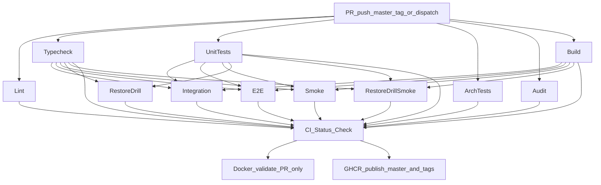

# CI/CD Project Pipeline — GitHub Actions Guide

This document describes the CI/CD pipeline for the E-Commerce Store API: job graph, secrets, fork behavior, container validation, and GHCR release.

---

## 1. Pipeline architecture

The pipeline uses a **fan-out / fan-in** pattern. Parallel static checks run first; integration, E2E, smoke, and restore-drill jobs run after typecheck and unit tests succeed (smoke / restore-drill-smoke also need build). A single **CI Status Check** aggregator gates branch protection, Docker validation, and GHCR publish.

Triggers: `pull_request`, `push` to `master` / semver tags, and `workflow_dispatch`. Nightly restore verification is a **separate thin workflow** ([`nightly-restore-drill.yml`](../../../.github/workflows/nightly-restore-drill.yml), `0 3 * * *` UTC) — build + restore-drill + restore-drill-smoke only.



---

## 2. Job breakdown

All jobs run on `ubuntu-latest` with **Node.js 24**. Each job runs `npm ci` with `actions/setup-node` npm cache (no shared `node_modules` artifact).

| Job                     | Command / action                                                                     | Purpose                                        |
| ----------------------- | ------------------------------------------------------------------------------------ | ---------------------------------------------- |
| **lint**                | `lint:check`, `format:check`                                                         | ESLint + Prettier                              |
| **typecheck**           | `typecheck`                                                                          | TypeScript compile check                       |
| **unit-tests**          | `test:ci`                                                                            | Jest unit tests                                |
| **arch**                | `test:arch`                                                                          | Hexagonal architecture boundaries              |
| **audit**               | `npm audit --omit=dev --audit-level=high`                                            | Blocks high/critical vulnerabilities           |
| **dependency-review**   | `dependency-review-action`                                                           | PR supply-chain review (PRs only)              |
| **build**               | `build` + upload `dist-app` artifact                                                 | Compile + artifact for smoke                   |
| **integration-tests**   | `test:integration`                                                                   | Testcontainers Postgres 18.4 (no GHA services) |
| **e2e-tests**           | Postgres 18.4 + Redis → `prepare-test-env` → migrations → `test:e2e`                 | Full-stack E2E including IDOR suite            |
| **smoke-test**          | Same infra + `dist` → start app → `smoke-test`                                       | HTTP runtime probes                            |
| **restore-drill**       | `prepare-db-env` → `migration:run:test` → `db:restore:drill` (marker + known tables) | Backup/restore ops check                       |
| **restore-drill-smoke** | `master` push: drill `--keep-dump` → app on restored DB → smoke                      | Full recovery DoD                              |
| **ci**                  | Aggregator                                                                           | Required branch protection check               |
| **docker-validate**     | `docker build` (no push)                                                             | PR container recipe validation                 |
| **docker-publish**      | Build + push to GHCR                                                                 | `master` push and `v*.*.*` tags only           |

---

## 3. Postgres version policy

`POSTGRES_IMAGE` and `POSTGRES_CONTAINER_NAME` are defined once in **`.env.example`** (validated by Nest, used by Compose and dump/restore scripts).

CI cannot load `.env` before GHA service containers start, so a `resolve-env` job reads those keys from `.env.example` and passes them via job outputs into service `image:` and job env. Bump the image only in `.env.example`.

Integration Testcontainers keep a separate alpine tag in `test/integration/harness/integration-test.constants.ts`.

---

## 4. Test environment composites

### 4.1 `prepare-test-env` (E2E / smoke / restore-drill-smoke)

Composite action: [`.github/actions/prepare-test-env/action.yml`](../../.github/actions/prepare-test-env/action.yml)

1. Waits for Postgres and Redis (hard fail after 30 retries).
2. Validates required GitHub secrets.
3. Writes `.env.test` using the **ecommerce env contract** (`DB_*`, `REDIS_*`, not CRM `POSTGRES_*`).
4. Decodes `CI_JWT_PRIVATE_KEY` from base64 when needed.

Generate secrets locally:

```bash
npm run env:init:secrets -- --overwrite
```

### 4.2 `prepare-db-env` (schema-only restore-drill)

Composite action: [`.github/actions/prepare-db-env/action.yml`](../../.github/actions/prepare-db-env/action.yml)

1. Installs `postgresql-client` and waits for Postgres only (Redis stubs satisfy `validateEnv` for TypeORM CLI; Redis need not be running).
2. Writes `.env.test` with `DB_*`, Redis stubs, and JWT for `migration:run:test`.

The restore drill inserts a marker `products` row, dumps, restores into `ecommerce_restore_drill`, asserts required tables (`users`, `products`, `orders`, `payments`, `reservations`) plus the marker, then cleans the marker from the source DB. See [RELEASE-BACKUP-RECOVERY.md](../RELEASE-BACKUP-RECOVERY.md).

Baseline schema is created by [`src/migrations`](../../../src/migrations/) (`InitialBaseline`). CI does not use `schema:sync`.

Copy values from `.secrets` into GitHub **Settings → Secrets and variables → Actions**.

| Secret               | Required | Notes                               |
| -------------------- | -------- | ----------------------------------- |
| `CI_JWT_PRIVATE_KEY` | Yes      | RSA-4096 PKCS#8 PEM, base64-encoded |
| `CI_METRICS_API_KEY` | Yes      | Hex key for `/metrics` smoke probe  |
| `CI_DB_USERNAME`     | No       | Defaults to `postgres`              |
| `CI_DB_PASSWORD`     | No       | Defaults to `postgres`              |
| `CI_DB_DATABASE`     | No       | Defaults to `test_db`               |
| `CI_REDIS_PASSWORD`  | No       | Empty = no Redis auth               |
| `CI_REDIS_KEYPREFIX` | No       | Defaults to `ecom:test:`            |

---

## 5. Fork PR security

Service jobs (integration, E2E, smoke) run only when:

```yaml
if: github.event_name != 'pull_request' || github.event.pull_request.head.repo.full_name == github.repository
```

Fork PRs skip these jobs (no repository secrets). The aggregator treats `skipped` as acceptable for those jobs.

---

## 6. Health probes

| Endpoint                | Checks                                 |
| ----------------------- | -------------------------------------- |
| `GET /health/liveness`  | Process viability (event loop, memory) |
| `GET /health/readiness` | PostgreSQL + Redis                     |
| `GET /health`           | Composite (postgres, redis, websocket) |

Dockerfile `HEALTHCHECK` uses **liveness**. Compose production healthcheck uses **readiness**.

---

## 7. Release (GHCR)

After **CI Status Check** passes on `push` to `master` or semver tag `v*.*.*`:

- Registry: `ghcr.io/raouf-b-dev/ecommerce-store-api`
- Tags: `sha-<commit>`, semver on tag push
- SBOM + provenance enabled
- PRs never push images

**Release invariant:** `docker-publish` has `needs: [ci]` — images cannot bypass the CI gate.

---

## 8. Branch protection

Require a single status check: **CI Status Check**.

---

## 9. Local automation

- **Husky + lint-staged**: pre-commit lint/format on staged files
- **Smoke test**: `npm run build && npm run start:test` then `npm run smoke-test`
- **Restore drill**: `npm run db:restore:drill` (marker + known tables; see [RELEASE-BACKUP-RECOVERY.md](../RELEASE-BACKUP-RECOVERY.md))
- **act**: `act -j lint` or `act pull_request` (requires Docker)

---

## 10. References

- [GitHub Actions service containers](https://docs.github.com/en/actions/using-containerized-services/about-service-containers)
- [Dependency Review Action](https://github.com/actions/dependency-review-action)
- [Publishing Docker images to GHCR](https://docs.github.com/en/actions/tutorials/publish-packages/publish-docker-images)
