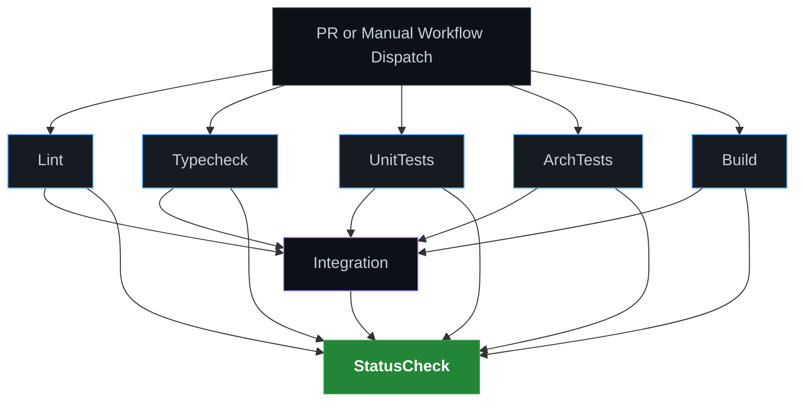

# CI/CD Project Pipeline — Applied GitHub Actions Guide

This document describes the concrete, applied CI/CD pipeline implemented for the E-Commerce Store API. It serves as a direct guide for developers working on this codebase to understand how verification, testing, and branch protection are executed.

---

## 1. Pipeline Architecture

The pipeline is designed using the **Fan-out/Fan-in** pattern. Five lightweight, independent check jobs run in parallel without services. Once they all pass, the pipeline fans in to run the integration job (which boots PostgreSQL and Redis containers) followed by a final status aggregator.

### Pipeline Flow Diagram



---

## 2. Job Breakdown

All parallel jobs run on the `ubuntu-latest` runner and reuse Node.js 20 with dependency caching enabled via `actions/setup-node@v4`.

| Job Name        | Script Run                                          | Purpose                                                                            | Key Reason for Separation                                                                   |
| :-------------- | :-------------------------------------------------- | :--------------------------------------------------------------------------------- | :------------------------------------------------------------------------------------------ |
| **lint**        | `npm run lint:check`<br/>`npm run format:check`     | Enforces ESLint rules and Prettier formatting standard.                            | Prevents formatting/style issues from reaching merge stage.                                 |
| **typecheck**   | `npm run typecheck`                                 | Compiles the project using `tsc --noEmit` to find TypeScript compilation errors.   | Catches type safety issues early before compilation.                                        |
| **unit-tests**  | `npm run test -- --ci`                              | Executes the unit tests in parallel using Jest.                                    | Isolates pure domain and business logic testing from external dependencies.                 |
| **arch**        | `npm run test:arch`                                 | Runs architecture rules using `ts-arch` to enforce DDD/Hexagonal boundaries.       | Ensures developers do not violate layer boundaries (e.g., Domain importing Infrastructure). |
| **build**       | `npm run build`                                     | Compiles the NestJS application into the production `dist` directory.              | Verifies that the codebase is build-ready for container creation or deployment.             |
| **integration** | `npm run migration:run:test`<br/>`npm run test:e2e` | Starts PostgreSQL + Redis containers and runs database integrations and E2E tests. | Verifies correct data mapping, transaction handling, and API routing.                       |
| **ci**          | Custom shell logic                                  | Aggregates the statuses of all jobs and reports a single result.                   | Simplifies GitHub Branch Protection rules.                                                  |

---

## 3. Dynamic Environment & Service Bootstrapping

The `integration` job requires a database (PostgreSQL 16) and a cache (Redis 7.2 stack). To keep the pipeline clean and robust, we bootstrap this environment dynamically during execution:

### 3.1 GHA Service Containers

Service containers are declared in the workflow YAML and mapped to local host ports (`5432:5432` and `6379:6379`).

- **Postgres health check**: Uses `pg_isready -q` with retries to prevent tests starting before the database is listening.
- **Redis health check**: Uses `redis-cli ping` to verify readiness.

### 3.2 Dynamic `.env.test` Creation

Instead of committing a static `.env.test` containing hardcoded secrets, the runner constructs the configuration file dynamically in memory at runtime:

```bash
# Write .env.test using GHA runner variables and fallback defaults
cat > .env.test << ENVEOF
NODE_ENV=test
PORT=3000

DB_HOST=localhost
DB_PORT=5432
DB_USERNAME=${DB_USER}
DB_PASSWORD=${DB_PASS}
DB_DATABASE=${DB_NAME}

REDIS_HOST=localhost
REDIS_PORT=6379
REDIS_PASSWORD=${REDIS_PASS}
REDIS_KEYPREFIX=${REDIS_KEYPREFIX}
REDIS_DB=0

JWT_PRIVATE_KEY="${CI_JWT_PRIVATE_KEY}"
JWT_ACCESS_TOKEN_TTL=15m
JWT_REFRESH_TOKEN_TTL=7d
ENVEOF
```

### 3.3 Test Database Migrations

Before executing E2E tests, the runner installs `netcat`, `redis-tools`, and `postgresql-client` to probe service ports, waits until ports respond, and then executes migrations:

```bash
npm run migration:run:test
```

This ensures the schema inside the container matches the codebase migrations exactly.

---

## 4. Fork-PR Security

Workflows triggered by PR forks (`pull_request` from an external repository) do **not** have access to the repository secrets (e.g. `CI_DB_PASSWORD`, `CI_JWT_PRIVATE_KEY`).

To prevent the pipeline from failing on external forks (which lack secrets) and to protect secrets from being exfiltrated via malicious PR code changes, the `integration` job uses a strict security conditional:

```yaml
integration:
  runs-on: ubuntu-latest
  needs: [lint, typecheck, unit-tests, arch, build]
  if: ${{ github.event.pull_request.head.repo.full_name == github.repository }}
```

**Outcome**:

- Fork PRs will skip the `integration` job entirely.
- The parallel verification checks (lint, typecheck, unit-tests, arch, build) still run, providing feedback on code correctness.
- Maintainers can review the PR and run the integration tests in their own local environment or inside a secure branch before merging.

---

## 5. Aggregator Job Pattern (CI Status Check)

When using multiple parallel jobs in a workflow, configuring Branch Protection Rules in GitHub presents a challenge: if you require individual job names (e.g., `lint`, `typecheck`), adding or renaming a job requires updating repository configuration.

To solve this, we implement the **Aggregator Job Pattern**:

```yaml
ci:
  name: CI Status Check
  runs-on: ubuntu-latest
  needs: [lint, typecheck, unit-tests, arch, build, integration]
  if: always()
  steps:
    - name: Check all jobs status
      run: |
        # Retrieve results of upstream jobs using needs context
        lint_status="${{ needs.lint.result }}"
        ...

        # Fail status check if any required job failed or was cancelled
        for status in "$lint_status" "$typecheck_status" "$unit_status" "$arch_status" "$build_status"; do
          if [ "$status" = "failure" ] || [ "$status" = "cancelled" ]; then
            exit 1
          fi
        done
```

### GitHub Branch Protection Setup

Instead of requiring 6 separate checks, configure the branch protection to require only:

- `CI Status Check`

This status check represents the unified health of the entire pipeline. If a developer refactors the testing jobs, the Branch Protection rules remain completely untouched.

---

## 6. Local Automation & Git Hooks

Automated verification is not useful if it only runs in CI — developers discover failures too late, resulting in slow feedback loops. We enforce verification locally before code is committed to Git.

### 6.1 Husky & lint-staged

This project uses **Husky** to intercept Git commits. The pre-commit hook runs **lint-staged**, which runs fast, local checks _only on files staged for commit_:

- Staged `.ts` files: `eslint --fix` and `prettier --write`.
- All other files: `prettier --write`.

If formatting or linting fails, Husky aborts the `git commit` immediately. The developer must resolve the issues locally, preventing broken styles from ever reaching GitHub.

### 6.2 Running CI Locally with `act`

To run the GitHub Actions workflow locally on your machine without pushing to a branch, you can use `nektos/act`. It uses local Docker daemons to execute the jobs exactly as GitHub would.

1. **Install `act`** (via Homebrew, Chocolatey, or direct download):
   ```bash
   choco install act-cli
   ```
2. **Run the parallel checks**:
   ```bash
   act -j lint
   ```
3. **Run the entire pipeline (requires Docker running)**:
   ```bash
   act pull_request
   ```

---

## 7. References

1. GitHub Actions Docs — [Service Containers](https://docs.github.com/en/actions/using-containerized-services/about-service-containers).
2. GitHub Actions Docs — [Contexts (Needs context)](https://docs.github.com/en/actions/learn-github-actions/contexts#needs-context).
3. Husky Documentation — [Git hooks made easy](https://typicode.github.io/husky/).
4. Nektos Act Repository — [Run your GitHub Actions locally](https://github.com/nektos/act).
