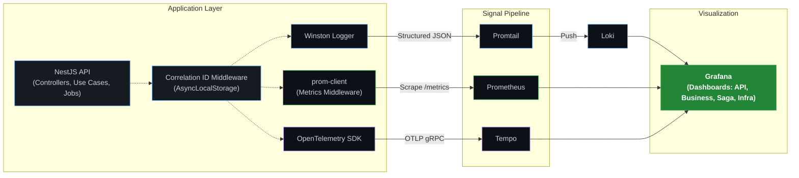

# Observability Architecture

This diagram illustrates the observability pipeline implemented in the E-commerce Store API, capturing logs, metrics, and distributed traces.

### Context Propagation

- **HTTP Requests**: `X-Request-Id` header is captured and stored in `AsyncLocalStorage`.
- **Background Jobs (BullMQ)**: Correlation ID is extracted from `AsyncLocalStorage` and embedded into the job's `data` payload before enqueueing.
- **Job Handlers**: The worker extracts the Correlation ID from the job data and wraps the execution in a new `AsyncLocalStorage` context.
- **Result**: A single trace/correlation ID links the original HTTP request to all subsequent asynchronous background processing steps.
