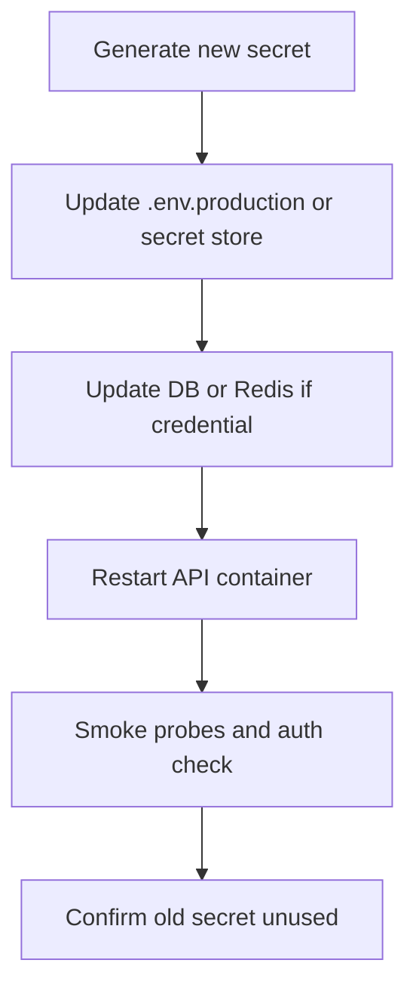

# Production Secret Rotation Procedures

Operational runbook for rotating production secrets on a **single-instance** E-Commerce Store API deployment (Compose + `.env.production` or host/platform secret injection). Secrets are loaded **once at process boot**: every rotation ends with an API (or dependent service) restart.

Companion docs: [SECRETS-MANAGEMENT.md](SECRETS-MANAGEMENT.md) (lifecycle & injection), [JWT-RSA-JWKS.md](JWT-RSA-JWKS.md) (RS256 / JWKS theory), [REDIS.md](../infrastructure/REDIS.md), [RELEASE-BACKUP-RECOVERY.md](../infrastructure/RELEASE-BACKUP-RECOVERY.md) (smoke), [METRICS.md](../observability/metrics/METRICS.md).

---

## 1. Purpose & assumptions

| Assumption  | Detail                                                                                                                    |
| :---------- | :------------------------------------------------------------------------------------------------------------------------ |
| Topology    | One API container; managed or Compose PostgreSQL + Redis                                                                  |
| Config load | Env validated at startup (`validate-env.ts` → `EnvConfigService`); no runtime secret reload                               |
| JWT         | Single RSA private key (`JWT_PRIVATE_KEY`) → one JWKS entry; verifier uses that public key only                           |
| CI secrets | `CI_JWT_PRIVATE_KEY`, `CI_DB_PASSWORD`, etc. are **test/CI only**: rotate via GitHub Secrets independently of production |

**Not in this ship gate:** dual-key JWKS overlap (keep previous public key until access-token TTL expires). That pattern is documented conceptually in [JWT-RSA-JWKS.md §3.5](JWT-RSA-JWKS.md#35-key-rotation) but is **not implemented** (`JwksService` exposes one key). Until it ships, JWT rotation requires a maintenance window and forces re-login.



---

## 2. Inventory & schedule

| Secret                                    | Tier            | Cadence                                                 | Restart              | Primary impact                                                                  |
| :---------------------------------------- | :-------------- | :------------------------------------------------------ | :------------------- | :------------------------------------------------------------------------------ |
| `JWT_PRIVATE_KEY`                         | T1              | 90 days, or immediately on compromise / staff departure | API                  | All RS256 JWTs (access, refresh, cart session) fail verify → users **re-login** |
| `DB_PASSWORD`                             | T1              | 90 days, or on incident                                 | API + backup scripts | Wrong cutover order → readiness / migrate failure                               |
| `REDIS_PASSWORD`                          | T1              | 90 days, or on incident                                 | API                  | Cache, carts, idempotency, queues, Socket.IO reconnect                          |
| `METRICS_API_KEY`                         | T1              | 90 days, or on leak                                     | API                  | Scrapers / `GET /metrics` get 401 until updated                                 |
| `GRAFANA_ADMIN_PASSWORD`                  | T1              | 90 days, or on leak                                     | Grafana              | Ops UI only                                                                     |
| Stripe / email / outbound webhook secrets | T1 (when wired) | Per provider policy, or on leak | API | Phase 17: see §8 |

Rotate **immediately** when: suspected breach, secret in logs/git, or team member with production access departs.

---

## 3. Pre-flight checklist

Before any production rotation:

1. **Backup**: `npm run db:backup` (see [RELEASE-BACKUP-RECOVERY.md](../infrastructure/RELEASE-BACKUP-RECOVERY.md)).
2. **Maintenance window**: required for `JWT_PRIVATE_KEY`; recommended for DB/Redis (brief API restart).
3. **Record current JWT kid**: from boot logs (`RSA JWT keys imported... kid=...`) or:
   ```bash
   curl -sS "$BASE_URL/v1/authentication/.well-known/jwks.json"
   ```
4. **Smoke env ready**: `SMOKE_TEST_BASE_URL` (or `--base-url=`), `METRICS_API_KEY` matching the value the API will use after restart.
5. **Announce**: operators and clients: short API restart; JWT rotations force re-authentication.

---

## 4. JWT signing key (`JWT_PRIVATE_KEY`)

### Impact (current single-key design)

Access, refresh (`typ=refresh`), and cart-session JWTs are all signed and verified with the **same** RSA key. After swap:

- Outstanding Bearer tokens and refresh cookies fail signature verification.
- Refresh cannot silently recover sessions (signature is checked before the session store).
- DB `session_token` rows remain until expiry/cleanup but are unreachable with old cookies: treat as effective logout for all clients.
- Guest cart session cookies become invalid.

### Steps

```bash
# 1. Generate RSA-4096 PKCS#8 PEM (same strength as scripts/generate-envs.js)
openssl genpkey -algorithm RSA -pkeyopt rsa_keygen_bits:4096 -out jwt-new.pem

# 2. Put the PEM into the secret store / .env.production as JWT_PRIVATE_KEY.
#    Multi-line values must stay valid dotenv (quoted / escaped like env:init output).
#    Do not commit the PEM.

# 3. Restart the API so boot re-imports the key and rebuilds JWKS
#    Example (Compose prod):
npm run d:up:full:prod
# or: docker compose -f docker-compose.yaml -f docker-compose.prod.yml --env-file .env.production up -d api
```

### Verify

1. Boot log shows a **new** `kid=...`.
2. `GET /v1/authentication/.well-known/jwks.json`: single key, `kid` matches the log.
3. Login succeeds; old refresh cookie returns 401.
4. Run smoke: `npm run smoke-test` (register/login probes).

### Compromise path

1. Rotate `JWT_PRIVATE_KEY` as above (invalidates forged and legitimate JWTs).
2. Optionally purge sessions (admin `logout-all` where still possible, or clear `session_token` rows) so stolen refresh material cannot be reused if a dual-key verifier is added later.
3. Audit application, Postgres, and Redis logs for the exposure window.
4. Continue with [SECRETS-MANAGEMENT.md §12](SECRETS-MANAGEMENT.md#12-incident-response--compromised-secrets).

### Future enhancement (not ship-gate)

Dual-key JWKS: publish old + new public keys, sign with new private key only, remove old after `JWT_ACCESS_TOKEN_TTL` (+ clock skew). See [JWT-RSA-JWKS.md §3.5](JWT-RSA-JWKS.md#35-key-rotation).

---

## 5. PostgreSQL password (`DB_PASSWORD`)

Postgres accepts one password per role. Cutover is a short coordinated window: change the role password, then the app env, then restart before clients pile up auth failures.

### Steps

```bash
# 1. Generate
openssl rand -base64 32

# 2. Alter the role on the running database (use current credentials)
#    Replace DB_USERNAME with the value from .env.production
docker exec -it postgres-db \
  psql -U "$DB_USERNAME" -d "$DB_DATABASE" \
  -c "ALTER USER \"${DB_USERNAME}\" WITH PASSWORD 'NEW_PASSWORD';"

# 3. Update DB_PASSWORD in .env.production (or secret store) immediately

# 4. Restart API (and any host jobs that use DB_*)
npm run d:up:full:prod
```

**Failure mode:** If the role password changes while the API still has the old env value, readiness fails (Postgres required) and entrypoint migrations abort. Minimize the gap between steps 2-4. Prefer stop → alter → update env → start if you need a hard freeze.

### Verify

1. `GET /health/readiness` → healthy.
2. `npm run db:backup` succeeds with the new password.
3. `npm run smoke-test`.

---

## 6. Redis password (`REDIS_PASSWORD`)

Compose starts Redis with `--requirepass` from env. Live rotation uses `CONFIG SET` (or ACL) then an API restart so all clients (ioredis cache, BullMQ, throttler, Socket.IO) reconnect with the new password.

### Steps

```bash
# 1. Generate
openssl rand -base64 32

# 2. Set on the live Redis (authenticate with the current password first)
docker exec -it <redis-container> \
  redis-cli -a "$OLD_REDIS_PASSWORD" CONFIG SET requirepass "NEW_PASSWORD"

# 3. Update REDIS_PASSWORD in .env.production / secret store

# 4. Restart API
npm run d:up:full:prod
```

**Notes:**

- Existing TCP sessions may remain authenticated briefly; **new** connections need the new password.
- Persist `requirepass` across Redis restarts (Compose `REDIS_ARGS` / ACL file / `CONFIG REWRITE` as appropriate for your image).
- Expect brief disruption to cache, RedisJSON carts, idempotency locks, and queues; see [REDIS.md](../infrastructure/REDIS.md) for per-concern degradation.

### Verify

1. `GET /health`: Redis reported healthy (or degraded only if intentionally empty password in non-prod).
2. No sustained `NOAUTH` / auth errors in Redis or API logs.
3. `npm run smoke-test`.

---

## 7. Metrics API key & Grafana admin

### `METRICS_API_KEY`

```bash
# 1. Generate (32-byte hex matches generate-envs.js)
openssl rand -hex 32

# 2. Update METRICS_API_KEY in .env.production
# 3. Restart API
# 4. Update Prometheus scrape / operator tooling that sends X-Metrics-Api-Key
```

Verify: `GET /metrics` with the new header succeeds; old key returns 401. See [METRICS.md](../observability/metrics/METRICS.md).

### `GRAFANA_ADMIN_PASSWORD`

Update the monitoring stack env / Compose secret, restart Grafana, confirm login. Does not affect API traffic.

---

## 8. Third-party secrets (Phase 17: when adapters land)

These are **not** required env vars for the current ship gate. Use this pattern when Stripe, email, or outbound webhooks are enabled.

| Secret                 | Typical env (planned)      | Rotation pattern                                                                            |
| :--------------------- | :------------------------- | :------------------------------------------------------------------------------------------ |
| Stripe webhook signing | `STRIPE_WEBHOOK_SECRET`    | Prefer Stripe dual-secret roll: add new endpoint secret → deploy API → remove old           |
| Stripe secret API key  | `STRIPE_SECRET_KEY`        | Roll in Stripe dashboard → update env → restart → confirm PaymentIntent / test charge       |
| Email provider API key | Provider-specific          | Rotate in provider → update env → restart → send test notification                          |
| Outbound webhook HMAC  | Per-subscription or global | Generate new secret → update store → restart delivery workers → verify signed test delivery |

Always: generate → configure provider → update app secret → restart → one successful test event before retiring the old value.

---

## 9. Post-rotation verification

After every production rotation, run the same process-alive probes as a release:

```bash
npm run smoke-test
# or: node scripts/smoke-test.js --base-url=https://api.example.com
```

| #   | Probe                      | Asserts                                  |
| :-- | :------------------------- | :--------------------------------------- |
| 1   | `GET /health/liveness`     | Process up                               |
| 2   | `GET /health/readiness`    | PostgreSQL ready                         |
| 3   | `GET /health`              | Composite (Postgres + Redis + WebSocket) |
| 4   | `GET /metrics`             | Prometheus + current `METRICS_API_KEY`   |
| 5   | Register + login           | Auth + JWT with **new** signing key      |
| 6   | Authenticated profile read | DB path with current `DB_PASSWORD`       |

Full contract: [RELEASE-BACKUP-RECOVERY.md §7](../infrastructure/RELEASE-BACKUP-RECOVERY.md#7-post-deploy-smoke-tests).

---

## 10. Incident response

If a secret was exposed (logs, git, chat, departed staff):

1. Rotate that secret using the matching section above: **first**.
2. For `JWT_PRIVATE_KEY`, assume all tokens are hostile until rotation completes.
3. Follow the full playbook in [SECRETS-MANAGEMENT.md §12](SECRETS-MANAGEMENT.md#12-incident-response--compromised-secrets) (scope assessment, log audit, history scrub if committed, notify, post-mortem).

Do not delay rotation waiting for a perfect forensic picture.

